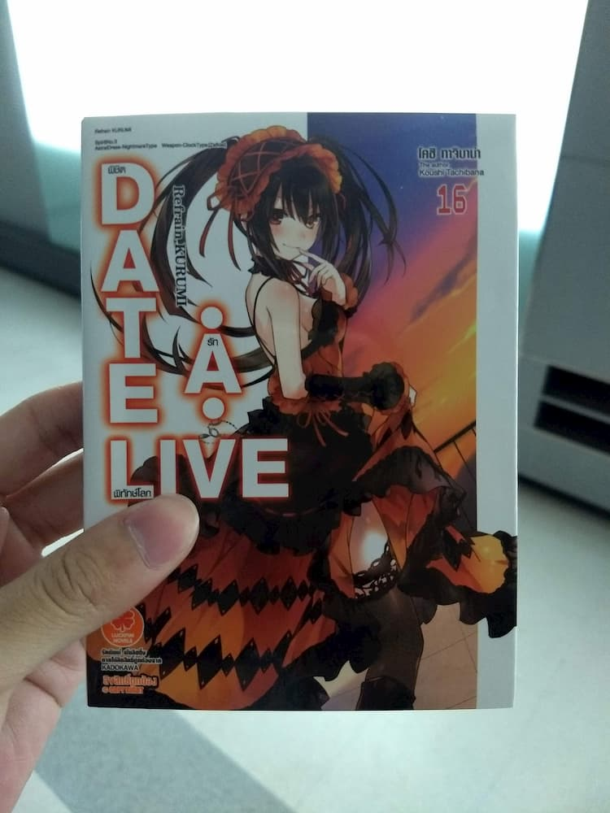
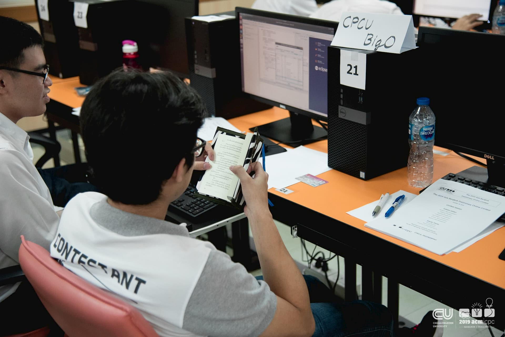

เนื่องจากในบล็อกของผมไม่ค่อยมีเรื่องเกี่ยวกับ Programming ซักเท่าไหร่ ยิ่งแนวแข่งขันยิ่งไม่มีเลย ก็เลยถือโอกาสมาเล่าเรื่องการแข่งขัน The 2019 Asia Bangkok Preliminary Online Contest ที่เพิ่งผ่านไปเมื่อวันที่ 18/10/2019 ซะหน่อย

# Intro

เรื่องมันมีอยู่ว่ามีรุ่นน้องสองคนในชมรมอยากลงแข่ง แต่ยังขาดอีกคนถึงจะสมัครได้ ก็เลยมาชวนเราซึ่งเคยแข่งสนามนี้มาหลายครั้ง (เคยแข่งตั้งแต่ ม.ปลายจนถึงปีสองเลย) ตอนแรกก็ไม่ได้อยากจะแข่งหรอกเพราะอยากเป็นสตาฟช่วยงานมากกว่า แต่ไหน ๆ น้อง ๆ ก็ชวนแล้วลงอีกปีคงไม่เป็นไรมั้ง ว่าแล้วก็เลยตกลงไปในชื่อทีม CPCU BigO (อย่าถามแรงบันดาลใจ)

# ACM-ICPC คืออะไร?

สำหรับคนที่ไม่เคยได้ยินชื่อรายการนี้ ACM-ICPC เป็นการแข่งขันเขียนโปรแกรมเพื่อแก้ปัญหาแนว Algorithm ระดับมหาลัย โดยแข่งกันเป็นทีมสามคน ช่วยกันแก้โจทย์ภายในเวลาที่กำหนด การแข่งขันมีหลายรอบ ตั้งแต่ Local, Regional และ World Finals

สำหรับรอบนี้เป็นรอบ Local จัดที่คณะวิศวะจุฬานั่นเอง

ซึ่งในกติกาสามารถนำตำราและเอกสารเข้าห้องแข่งได้ด้วย (มีลิมิตอยู่แต่จำไม่ได้เพราะไม่เคยเอาเข้า) และด้วยประสบการณ์ที่แข่งมาหลายปีทำให้รู้ว่าสิ่งที่จำเป็นที่สุดก็คือ...

จริงจังตั้งแต่ยังไม่เริ่ม...

# เริ่มแข่งแล้วจ้า

เมื่อถึงเวลาแข่งซึ่งโดนเลื่อนมา 30 นาที ทีมเราก็เริ่มเปิดโจทย์แบ่งกันอ่าน บอกเลยว่าแค่ชื่อคนออกโจทย์ก็หนาวแล้ว เพราะคนออกโจทย์โหดเหรอ? เปล่า! ใครเร่งแอร์วะ!! (หลอก)

จากการอ่านผ่านคร่าว ๆ ก็รู้สึกว่ามีข้อที่ทำได้แบบง่ายมาก ๆ อยู่ 2-3 ข้อ มีข้อที่น่าคิดอยู่ 2-3 ข้อ และที่เหลือคือไม่น่าแตะเลยซักนิด (และหนึ่งในนี้เป็นข้อง่ายที่น่าเสียดายที่สุดด้วย)

ชั่วโมงแรกมาก็เก็บข้อง่ายที่ว่าทั้งสองข้อแบบสบาย ๆ หลังจากนั้นก็นั่งหาข้อต่อ ๆ ไปกันอยู่ซักพัก จนมาเก็บได้อีกสองข้อในชั่วโมงที่สอง หลังจากนั้นก็ปล่อยแล้วปล่อยเลย...

นิยายที่เอาเข้ามามันมีประโยชน์ตอนนี้นี่เอง สมแล้วที่มีประสบการณ์มาก่อน...

แต่ถึงแม้จะมีประสบการณ์ในสนามนี้มา 6 ปีก็ยังมีเรื่องสุดพีคในห้องที่ไม่เคยเจอมาก่อน นั่นก็คือเกรดเดอร์ล่มจนทำให้ส่งโค้ดไม่ได้ช่วงนึงเลย (พี่สตาฟที่รู้จักบอกก็ปกติดีนะ!)

แต่แค่นั้นยังไม่เท่าไหร่ จุดพีคมันอยู่ตรงที่ว่ามีสตาฟมาประกาศว่ามีสองข้อที่จะตรวจหลังแข่งเสร็จ ซึ่งในนั้นมีข้อที่เรามั่นใจมากว่าจะถูกอยู่ ได้ยินแบบนั้นแล้วก็สตั๊นไปซักพักเหมือนกัน (สุดท้ายก็ตรวจเสร็จในห้องแหละ แล้วก็ถูกตามคาด)

# สรุป

หลังจากแข่งเสร็จก็มั่นใจอยู่แล้วแหละว่าจะได้ไปต่อรอบ Asia Regional แต่ก็แอบรู้สึกว่าถ้าได้เยอะกว่านี้อีกซักข้อสองข้อคงจะดี ผลการแข่งขันสามารถดูได้[ที่นี่](http://icpc-scoreboard.eng.chula.ac.th/) สรุปก็คือได้ที่ 8 และได้ไปต่อนะครับทุกคน

หลังจากไม่ได้แข่งแบบนี้มานานก็รู้สึกคิดถึงสนามแข่งเหมือนกัน แต่ขณะเดียวกันก็รู้สึกเสียดายและหนักอึ้งอยู่เหมือนกัน เพราะผมรู้อยู่แล้วว่าไปต่อสายนี้ไม่ไหวแล้วแหละ (มีเรื่องผิดหวังจากค่ายโอลิมปิกและอื่น ๆ อีกเลยหมดความมั่นใจมั้ง)

ยังไงก็ตาม การแข่งครั้งนี้ก็เหมือนเปลี่ยนบรรยากาศจากที่นั่งเขียนเว็บเครียด ๆ มาแก้โจทย์เครียด ๆ มันก็ไม่ได้แย่เท่าไหร่นะ

จบไปแล้วครับสำหรับเรื่องเล่าคร่าว ๆ ในการแข่ง The 2019 Asia Bangkok Preliminary Online Contest หวังว่าคนที่ไม่เคยได้รู้จัก ACM-ICPC น่าจะได้เปิดโลกกันไปบ้าง ส่วนบล็อกต่อ ๆ ไปก็คงจะพูดถึงโจทย์ที่น่าสนใจ (และทำได้) ตั้งแต่เริ่มอ่านโจทย์จนถึงคำตอบกันเลย

ไปให้สุดแล้วหยุดตายที่ Asia Regional!!