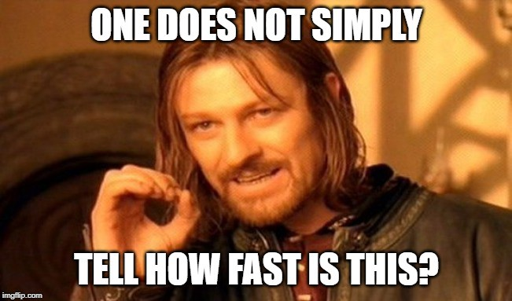

สำหรับคนที่เคยอ่านและศึกษาเกี่ยวกับ Algorithm น่าจะต้องเคยเห็นเจ้าสัญลักษณ์ตัวโอใหญ่มาบ้าง (อย่าคิดเยอะ เดี๋ยวไม่โอ!) แต่อาจจะไม่เข้าใจว่ามันคืออะไร ทำไมต้องมี แล้วมันบอกอะไรได้บ้าง ยิ่งคนที่ไม่เคยพบเจอ Algorithm ยิ่งแล้วใหญ่ ทั้ง ๆ ที่เป็น concept ที่เข้าใจง่ายและมีประโยชน์มากเลยทีเดียว


ดังนั้น บทความนี้จะช่วยอธิบายที่มาที่ไปตั้งแต่ Basic ยัน Advance เลยทีเดียว ซึ่งอาจจะอาศัยพลังแห่งคณิตศาสตร์เล็กน้อย ถ้าใครไม่ชอบคณิตฯ ก็ทำใจร่ม ๆ เข้าไว้นะครับ

เนื้อหาแบ่งเป็น 3 parts

- Part 1: Why Big-O? [Easy]
- Part 2: What is Big-O? [Hard]
- Part 3: How to find “good” Big-O? [Medium]

ถ้าพร้อมแล้วก็ไปกันเลย…

---

# Part 1: Why Big-O?



สมมติเรามี algorithm อันนึง หากเราต้องการจะวัดว่าอัลกอนี้เร็วแค่ไหน วิธีนึงก็คือ implement อัลกอนี้แล้วจับเวลาซะ
สมมติว่าลองใส่ input 1,000 ตัว รันแล้วจับเวลาได้เวลา 0.31 วินาที เยี่ยมเลย! แค่นี้ก็รู้แล้วว่าอัลกอทำงานเร็วแค่ไหน ไหนลองรันอีกทีซิ อ้าว! ไหงรอบนี้ได้ 0.5s ล่ะ พอลองรันอีกหลายรอบก็รู้สึกว่าทำไมเวลาไม่เคยตรงกันซักครั้ง

นั่นก็เพราะว่าปัจจัยที่ส่งผลต่อเวลาการทำงานไม่ได้มีแต่ตัวอัลกอน่ะสิ แต่ยังมีความแรงของ CPU จำนวน process ที่ทำงานอยู่ตอนนั้น ภาษาที่ใช้เขียน (เทียบภาษา C กับ Python สิ) และยังมีอีกหลาย factor ที่ทำให้ไม่สามารถวัดเวลาได้เท่ากันตลอด ทำให้การจับเวลาดูจะไม่เวิร์คซะแล้ว

แล้วจะทำยังไงล่ะ?

คำตอบก็คือ**การนับจำนวนครั้งในการทำงานออกมาเป็นฟังก์ชัน**ไงล่ะ

ลองดูตัวอย่างโค้ดข้างล่าง (ใช้ภาษา `cpp`)

```cpp
int findSum(int arr[], int n) {
  int sum = 0;
  for (int i = 0; i < n; i++) {
    sum += arr[i];
  }
  return sum;
}
```

เราลองมาเขียนฟังก์ชันนับจำนวนครั้งการทำงานของ `findSum` กัน

$$
f(n) = 1 + n + 1 = n + 2
$$

ฟังก์ชัน `findSum` ทำงาน $n+2$ ครั้ง เมื่อ $n$ แทนจำนวน element ใน `arr` โดย
- 1 ครั้งแรกคือการกำหนดค่า `sum = 0`
- n ครั้งต่อมาคือการวน loop ใน `forEach` $n$ ครั้ง
- และ 1 ครั้งสุดท้ายคือ `return sum` นั่นเอง

ดูไม่ยากใช่มั้ย? แต่สมมติว่าฟังก์ชันที่เราได้มีหน้าตาแบบนี้ล่ะ

$$
f(n) = \frac{1}{3} n^3 + \frac{1}{5} n^2 \log_2{n} + 21n \sqrt{n} + 100n + 13
$$

ไม่ขำแน่นอน…

ที่สำคัญ ถ้า $n$ มีค่ามาก ๆ นั่นคือ input มีขนาดใหญ่มาก (ซักล้านล้านตัวงี้) จะ $n^3$ หรือ $10n^3$ ก็ไม่ได้ต่างกันมาก

และนี่คือที่มาของ Big-O Notation นั่นเอง…

> Big-O Notation ช่วยให้เราสามารถประมาณเวลาการทำงานได้ง่ายลงโดยสนใจแค่พจน์ที่จำเป็น

ตัวอย่างเช่นฟังก์ชันที่สอง เราสามารถพูดอย่างง่าย ๆ ว่า
$$
f(n) \in O(n^3)
$$

เป็นไงครับ ง่ายลงไปเยอะ!

---

# Part 2: What is Big-O?

แล้ว Big-O คืออะไรล่ะ? พูดแบบง่ายสุด ๆ คือ

> Big-O เป็นขอบเขตบน (Upper bound) ของฟังก์ชัน

นั่นคือ ถ้า $f(n) \in O(g(n))$ แล้วฟังก์ชัน $f(n)$ จะไม่โตเร็วกว่า $g(n)$ แน่นอน หรือพูดว่า $g(n)$ เป็น upper bound ของ $f(n)$ นั่นเอง เราใช้คำว่า “โตเร็ว” เพราะเรากำลังพิจารณาเมื่อ $n \to \infty$ ($n$ มีค่ามาก ๆ) นั่นเอง

นิยามทางคณิตศาสตร์ของ Big-O ที่ดูแล้วอ่านยากมากกกก คือ

$f(n) \in O(g(n))$ ก็ต่อเมื่อ มีจำนวนจริงบวก $c$ และจำนวนจริง $n_0$ ที่ทำให้
$$
|f(n)| \le c \cdot g(n)
$$
สำหรับทุก $n \ge n_0$

ถ้าไม่เข้าใจ ไม่ต้องตกใจครับ เพราะครั้งแรกที่อ่านผมก็ไม่เข้าใจเหมือนกัน

มาดูรูปกันดีกว่า


จากรูปจะเห็นว่าถ้า $n$ มีค่ามาก ๆ ($n \ge n_0$) แล้ว $f(n) \le c \cdot g(n)$ เสมอ โดยที่ค่า $c$ นี้จะเป็นเท่าไหร่ก็ได้ (ให้มีค่ามาก ๆ ไปเลยก็ได้) และจากรูปก็จะเห็นได้ชัดเลยว่า $g(n)$ เป็น upper bound ของ $f(n)$

---

# Part 3: How to find “good” Big-O?

ถ้าลองนึกดูดี ๆ ก็จะพบว่าฟังก์ชันนึงมี upper bound ได้หลายตัว แล้วตัวไหนจะดีที่สุดล่ะ ?

คำตอบก็คือพจน์ที่ดูโตที่สุดใน f(n) นั่นแหละ ลองกลับมาดูตัวอย่างนี้ใหม่กัน

$$
f(n) = \frac{1}{3} n^3 + \frac{1}{5} n^2 \log_2{n} + 21n \sqrt{n} + 100n + 13
$$

จากตัวอย่างนี้จะเห็นว่าพจน์ที่โตที่สุดก็คือ $n^3$ ดังนั้น $f(n) \in O(n^3)$

เหตุผลก็คือเราสามารถหาค่าคงที่ $c$ ที่ใหญ่มาก ๆ ได้ หลังจากนั้นค่อยไปแก้หา $n_0$ ทีหลังก็ได้ (เป็นการแอบทดเพื่อเอาไปอ้างในการพิสูจน์ได้) เช่นกรณีนี้ถ้าให้ $c = 10$ เราจะได้ว่า $f(n) \le 10n^3$ เมื่อ $n \ge 4$ ([กระดาษทด ?](https://www.wolframalpha.com/input/?i=10+*+n%5E3+%3E%3D+1%2F3+n%5E3+%2B+1%2F5+n%5E2+log_2%28n%29+%2B+21n+sqrt%28n%29+%2B+100n+%2B+13))

ในที่นี้จะยกตัวอย่างฟังก์ชันที่เห็นบ่อย ๆ จากโตช้าไปโตเร็วดังนี้

| Big-O | name | examples |
|-------|------|-------|
|$O(1)$|constant|Arithmetic operations|
|$O(\log{n})$|logarithmic|Binary search|
|$O(\sqrt{n})$|square root|Primality test|
|$O(n)$|linear|Finding min/max, Maximum contiguous sum|
|$O(n\log{n})$|linearithmic or "$n\log{n}$"|Fastest comparison sorts, LIS|
|$O(n^2)$|quadratic|Bubble sort, LCS|
|$O(n^3)$|cubic|Matrix chain multiplication, Floyd-Warshall alogirithm|
|$O(n^c), c\gt 1$|polynomial|-
|$O(c^n), c\gt 1$|exponential|Finding the exact solution of Traveling salesman problem
|$O(n!)$|factorial|Permutation

และถ้าสังเกตจะพบว่าแม้พจน์จะมีสัมประสิทธิ์อยู่ แต่เมื่อหา Big-O สัมประสิทธิ์จะหายไป เพราะมันก็แค่การเปลี่ยนค่า $c$ เท่านั้นเอง

โดยหลักปฏิบัติ การใช้เครื่องหมาย "$\in$" ทำให้รู้สึกอ่านยาก เลยชอบใช้เครื่องหมาย "$=$" มากกว่า เช่น $f(n) = O(n^3)$ แต่ให้เข้าใจว่ามันไม่ได้เท่ากันจริง ๆ นะ!!

---

# สรุป

Big-O คือเซตของฟังก์ชันที่มีขอบเขตบนอันเดียวกัน ซึ่งฟังก์ชันอันนึงจะมี Big-O หลายอัน แต่เราจะหยิบอันที่ใกล้เคียงที่สุดมาใช้ในการประมาณค่าฟังก์ชันนั่นเอง

ส่วนสาเหตุที่เค้าใช้ Big-O กันก็เพราะโดยปกติเราจะสนใจกรณีที่แย่ที่สุดของ algorithm กัน ยิ่งกรณีเลวร้ายที่สุดเร็วแค่ไหนก็ยิ่งดี

คราวหน้าถ้าอยากรู้ว่าอัลกอไหนโอไม่โอ ลองใช้ Big-O ช่วยดูนะครับ