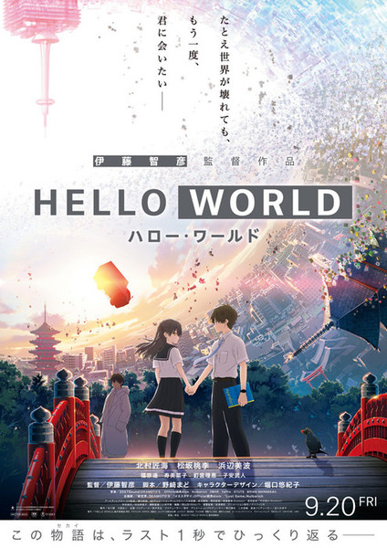

ทีแรกได้ยินเกี่ยวกับเรื่องนี้มาบ้างแต่ก็ไม่ได้คิดจะดู แค่คิดว่าน่าสนใจเพราะชื่อเรื่อง Hello World นี่มันถูกจริตโปรแกรมเมอร์อย่างเรามาก ๆ จนเพื่อนเก่าสมัย ม.ปลาย นัดว่าจะไปดูก็เลยไปดูด้วยแบบไม่ได้ดู Trailer หรืออะไรไปก่อนเลย

และไหน ๆ ก็ไม่ได้เขียนอะไรลงบล็อกนานแล้วก็เลยว่าจะรีวิวหนังเรื่องนี้แบบไม่สปอยล์ซะเลย

# เนื้อเรื่อง

เหตุการณ์ในเรื่องเกิดขึ้นในโตเกียวปี 2027 เทคโนโลยีพัฒนาไปไกลมาก พระเอก คาตางากิ นาโอมิ (堅書直実 Katagaki Naomi) เด็กหนุ่มขี้อายและเหลาะแหละวัย 16 ปีที่อยากเปลี่ยนแปลงตัวเอง ได้พบกับตัวเองในอีก 10 ปีข้างหน้าที่ย้อนเวลามาเพื่อช่วยนางเอก อิจิเกียว รูริ (一行瑠璃 Ichigyō Ruri) เด็กสาวผู้เย็นชาและตรงไปตรงมา ให้รอดพ้นจากอุบัติเหตุหลังจากคบกับพระเอก 3 เดือน แต่การย้อนเวลานี้จะส่งผลกับโลกอย่างเลี่ยงไม่ได้ไปตลอดกาล

อันนี้ไม่ได้สปอยล์ เพราะมันก็อยู่ใน Trailer นั่นแหละ

`youtube: https://www.youtube.com/watch?v=shoWFRnNoWw&feature=emb_logo`

# ความเห็น

เรื่องนี้มีความ Sci-fi ในแบบที่ไม่คาดคิดว่าจะมีแบบนี้ด้วย เพราะหนังเรื่องนี้เล่นกับโลกเสมือนได้แบบว้าวมาก คือต้องเล่าก่อนว่าโลกปัจจุบันที่ดำเนินในเรื่องอยู่เป็นแค่ข้อมูลของโตเกียวในปี 2027 เท่านั้น และตัวละครทุกตัวในโลกนี้ก็เป็นแค่ข้อมูลเหมือนกัน (ไม่ได้สปอยล์เพราะอยู่ใน Trailer)

ทีแรกคิดว่าเราเดาพล็อตเรื่องได้ง่าย ๆ และคิดว่าเรื่องนี้มันเป็นเส้นตรงมาก ๆ ซึ่งตอนแรกก็เป็นอย่างงั้นแหละ จนมันเริ่มจะเดายากขึ้นเรื่อย ๆ และเลิกเดาไปเลย

สำหรับเรื่องตัวละครเรื่องนี้ไม่มีที่จะติ เพราะจริง ๆ ทั้งเรื่องก็โฟกัสอยู่แค่พระเอกกับนางเอกแค่นั้น ส่วนตัวประกอบอื่น ๆ ก็เป็นแค่ตัวประกอบจริง ๆ คือแทบไม่มีผลต่อเนื้อเรื่องเลยแม้แต่น้อย แต่เราก็ไม่ได้มีปัญหาอะไรกับเรื่องนั้นนะ

สิ่งที่ขัดใจตอนแรกคืออนิเมชั่นมันไม่ smooth ถ้าดูจาก Trailer ก็จะเห็นว่าโมเดลมันขยับแข็ง ๆ ไปหน่อย แต่พอดูไปเรื่อย ๆ ก็กลับชินไปเอง

ถ้าเรื่อง Tenki no ko เป็นเหมือน MV เพลงแล้วล่ะก็ เรื่องนี้ถือว่าตรงข้ามเลย ไม่ได้มีเพลงอะไรเยอะแยะแต่มาในจังหวะที่ถูกต้องและทำให้อินกับเนื้อเรื่องได้ดีเหมือนกันนะ

เพลงที่ชอบที่สุดก็คือเพลง 'Yesterday (イエスタデイ)' ของ Official髭男dism นั่นเอง

`youtube: https://www.youtube.com/watch?v=DuMqFknYHBs`

# สรุป

หนังเรื่องนี้ทำให้เห็นว่าความรักทำให้คนคนนึงพยายามได้มากมายขนาดไหน และทำให้เห็นว่าการได้เห็นรอยยิ้มของคนที่เรารักคือความสุขที่สุดแล้ว

> แม้จะเป็นได้แค่ตัวประกอบ แต่ก็อยากจะเห็นรอยยิ้มของเธอซักครั้งก็ยังดี

และอีกเรื่องที่หนังได้นำเสนอคือเรื่องของอนาคตไม่แน่นอน เราไม่รู้หรอกว่าวันพรุ่งเราหรือคนที่เรารักจะเป็นยังไง ดังนั้นเราควรให้ความสำคัญกับปัจจุบันมาก ๆ อยากทำอะไรให้รีบทำซะ

ผมคิดว่าเรื่องนี้เป็นหนังส่งท้ายปีที่ดีอีกเรื่อง จากที่ไม่รู้เรื่องและไม่ได้คาดหวังอะไรกับหนังกลายเป็นความประทับใจที่ให้ข้อคิดหลายอย่าง

ส่วนเรื่องที่ว่าทำไมชื่อเรื่องต้องเป็น Hello World นั้น ส่วนนึงคงเป็นเพราะเรื่องนี้เกี่ยวกับเทคโนโลยีมาก ๆ อีกสาเหตุนึงคงต้องรอให้หาคำตอบเอาเองในโรงหนังนะครับ ว่าแล้วก็อย่ารอช้า รีบจองตั๋วไปดูกันนะครับ
