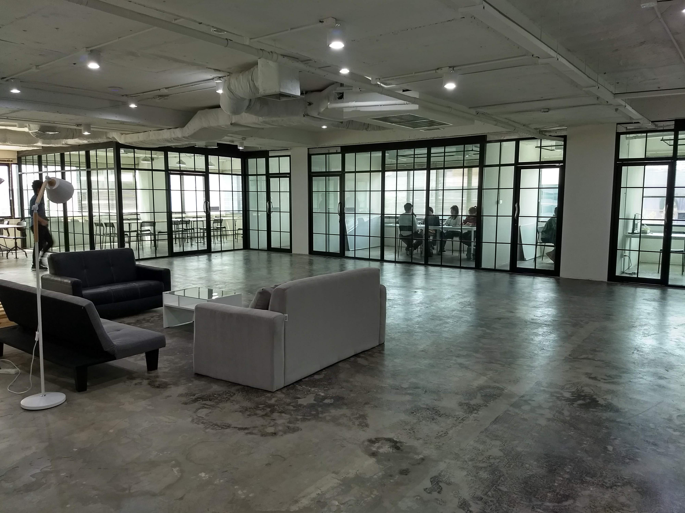

ย้อนกลับไปหลายเดือนก่อน ขณะกำลังนั่งทำงานกับเพื่อนอยู่ จู่ ๆ ก็มีคนติดต่อมาทาง Facebook บอกว่ามาจากบริษัท Donuts BKK เห็นฝีมือเราใน [SPOJ](https://www.spoj.com) (ซึ่งก็งง ๆ ว่าเจอได้ไง) ก็เลยอยากให้มาลองฝึกงาน ด้วยความที่ตอนนั้นเพิ่งเริ่มมาจับงานด้าน Web development เลยรู้สึกว่าน่าจะดีถ้าได้มาฝึกงาน (บวกกับเพื่อน ๆ และพี่ ๆ โหดจัดกันมากเลยไม่อยากแพ้) ก็เลยตอบตกลง และแล้วมหากาพย์การฝึกงานก็เริ่มขึ้น…

# ก่อนจะมาต้องทำอะไรบ้าง

แต่ก่อนจะเริ่มก็ต้องมีทดสอบอะไรนิดนึงล่ะนะ ข้อสอบเป็นแนวอัลกอริทึม 5 ข้อส่งมาให้ทาง email รูปแบบมีตั้งแต่แก้โจทย์ธรรมดาจนถึงแก้บั๊กในโค้ด และเป็นแบบ no feedback (ค่อนข้างคล้ายแนว Codeforces) ซึ่งบอกเลยว่าด้วยแนวข้อสอบที่เจอมาตลอดชีวิตค่ายโอลิมปิก (ความยากประมาณ สอวน. ค่ายสอง) ก็เลยเก็บเต็มอย่างไม่ยากเย็นอะไร (จริง ๆ แอบเสียวเพราะตอนทำข้อสอบคือสนิมเกาะอยู่)

หลังจากข้อสอบเสร็จทางบริษัท (พี่คนเดิมที่ติดต่อมาแหละ) ก็จะนัดเราไปกินข้าวกับหัวหน้า ในใจตอนนั้นคิดในใจว่าน่าจะเป็นการสัมภาษณ์แบบเนียน ๆ รึเปล่าก็เกร็ง ๆ นิดหน่อย แต่สุดท้ายก็นัดวันกินข้าวอะไรเรียบร้อย พอวันจริงกลับไม่ได้เครียดอะไรขนาดนั้น เหมือนนัดกินข้าวกลางวันสบาย ๆ ได้พูดคุยกันนิดหน่อย หลังจากนั้นก็มาฝึกงานได้เลย

# มาแล้วได้ทำอะไร

ที่ Donuts BKK ตอนนี้มีโปรเจคอยู่ 4 โปรเจค คือ Sistacafe, Estopolis, Jobcan และ Vibie และมีอีกหลายตำแหน่งให้เลือกทำในแต่ละโปรเจค ตั้งแต่ front-end, back-end, UX/UI designer ยันนักเขียนและ marketing ตอนแรกเลือกจะทำ Jobcan แต่ตอนนี้ยังไม่มีงานอะไร เลยมาทำ Estopolis ซึ่งเป็น service เกี่ยวกับอสังหาริมทรัพย์ (ตอนนี้เน้นคอนโดเป็นหลัก) โดยที่เราเลือกมาทำตำแหน่ง back-end developer มีหน้าที่ช่วยออกแบบ database และ API ต่าง ๆ

# วันแรกก็เอาแล้ว…

ไม่รู้เป็นโชคดีหรือโชคร้ายของเราที่วันแรกที่เริ่ม (1/7/2561) คือวันแรกที่บริษัทย้ายมาออฟฟิศใหม่ บรรยากาศก็ชุลมุนมาก ๆ เพราะต้องจัดของใหม่ด้วยเลยยังไม่ได้เริ่มอะไร แต่ก็ได้รับรู้ความโชคดี (หรือโชคร้าย?) อีกอย่างคือฟีเจอร์ที่กำลังทำต้องปล่อยช่วงสิ้นเดือน ซึ่งก็เป็นวันสุดท้ายที่มาฝึกงานด้วย (31/7/2561)

ความรู้สึกแรกที่ได้สัมผัสคือบริษัทเล็กกว่าที่คิด (มโนบริษัทไว้อลังการมากเลยแอบเกร็งเหมือนกัน) แต่ก็ชอบแบบนี้มากกว่าแหละ คนน้อย ๆ อยู่กันสบาย ๆ พี่ ๆ น่ารักทุกคนเลยนะ คุยง่าย เป็นกันเอง แล้วก็พยายามสอนงานให้ตั้งแต่วันแรกเลย รู้สึกดีใจเหมือนกันที่พี่ ๆ เอาใจใส่เด็กฝึกงานเป็นอย่างดี

# หลังจากนั้น…

ความเกร็งมลายหายหมด แค่วันที่สองก็รู้สึกชินอย่างน่าประหลาด ด้วยความที่บรรยากาศสบาย ๆ ทำให้ไม่ค่อยเครียดเท่าไหร่
เข้าวันที่สองก็จะได้งานมาละ แล้วความยากก็ค่อย ๆ เพิ่มขึ้นเรื่อย ๆ เวลาทำงานก็ต้องเปิด docs และ Stackoverflow (เทพเจ้าของเหล่าโปรแกรมเมอร์) หาความรู้เอาเรื่อย ๆ แต่วิธีที่คิดว่าดีที่สุดคือเรียนรู้จากโค้ดเก่าของพี่ที่มีอยู่แล้ว อันนี้เป็น skill ที่คนทำงานสายนี้ต้องมีเลย

ที่นี่มีประชุมแทบทุกวัน เนื่องจากงานมันเดือดมาก ๆ (ขณะที่เขียนอยู่งานยังไม่เสร็จ) บางวันก็ประชุมทีม บางวันก็ประชุมกับโปรเจค บางวันประชุมกับหัวหน้า บางวันมาเพื่อประชุมอย่างเดียวก็มี วันแรก ๆ เราก็ไม่ได้พูดอะไรมาก พอเข้าประชุมเรื่อย ๆ ก็รู้สึกปกติ เริ่มออกไอเดียบ้างค้านบ้าง คิดว่าถึงจุดนี้ค่อนข้างชินกับงานแล้วแหละ

# ประทับใจอะไรใน Donuts BKK

## 1. บรรยากาศโล่งโปร่งสบาย
บรรยากาศการทำงานไม่กระจุกกันมากจนเกินไป มีทางเดินสะดวก อากาศถ่ายเท

## 2. น้ำฟรี ขนมฟรี ครัวฟรี (แต่หมดเร็วมากกก)
ถ้าฝึกงานจบแล้วน้ำหนักขึ้น 4–5 โลจะไม่แปลกใจเลย เพราะที่นี่มีน้ำและขนมฟรี สต็อคมาลงทุก ๆ ครึ่งเดือน งานนี้บอกเลยว่าความเร็วเป็นของปีศาจ ใครดีใครได้จริง ๆ

## 3. พี่ ๆ ใจดี เป็นกันเองมาก ๆ
เกริ่นไปตั้งนานละ พี่ ๆ ไม่ว่าจะในทีมหรือนอกทีมพูดคุยกันแบบสบาย ๆ มีอะไรถามได้หมด บางทีก็เอาขนมมาให้ (เหตุแห่งความอ้วนชัด ๆ)

## 4. มาเป็น intern แต่ทำงานเป็นทีมจริง
ถึงจะมา intern แต่งานที่ได้รับก็จะเหมือนว่าเราเป็นหนึ่งในทีมจริง ๆ อาจจะเพราะบริษัทไม่ใหญ่มากเลยไม่ได้แบ่ง scope ของ intern กับ part-time/full-time ซักเท่าไหร่ แต่ก็แน่ล่ะว่างานที่ได้เป็นงานส่วนน้อยเพราะอยู่ในช่วงเรียนรู้

# แล้วอะไรที่ไม่ชอบล่ะ

## 1. ห้องน้ำ
ความออฟฟิศใหม่ทำให้ห้องน้ำยังไม่เสร็จดีเลยต้องขึ้นไปใช้ชั้นบน

## 2. ฝุ่นเยอะมาก ๆๆๆๆ
ด้วยความออฟฟิศใหม่เช่นกัน ฝุ่นจะเยอะไปไหนเนี่ยยยยย !!!

## 3. จอแยก
ของเก่าของแก่ แม้แต่สียังเพี้ยน อ่านโค้ดบนจอก็จะปวดตาหน่อย
มาแล้วได้อะไรบ้าง

ข้อนี้น่าจะสำคัญสุดแล้ว เพราะมันคือเหตุผลหลักที่มาฝึกงานเลย ไล่เป็นข้อ ๆ ละกัน…

## 1. Developer skills
อันนี้ชัดสุดแล้ว และก็ Technical สุดแล้วเหมือนกัน ก่อนมาฝึกงานกับตอนนี้ต่างกันมาก ทั้งคอนเซปต์ใหม่ ๆ Framework ใหม่ ๆ ทำให้เอาไปใช้กับงานอื่นได้ด้วย ลิสต์ไว้เลยละกันเผื่อจะเข้าไปอ่านกัน

- [MVC คืออะไร มีประโยชน์ยังไง](http://www.tutorialsteacher.com/mvc/mvc-architecture)
- [Laravel](https://laravel.com) ส่วนตัวเน้นอ่านเรื่อง **Database** และ **Eloquent ORM**
- [Database normalization](https://www.studytonight.com/dbms/database-normalization.php) ที่แนะนำคือแบบ **3NF**
- การทำ API docs ด้วย Postman

ทั้งนี้ทั้งนั้น framework ล้ำ ๆ ภาษาดี ๆ ก็ไม่มีประโยชน์ ถ้า concept พื้นฐานไม่แน่น อันนี้เป็นกับตัวเองเลย พอได้ concept แล้วที่เหลือมันไปเองเลย

> คอนเซปต์เป็นพื้นฐานสำคัญของทุกอย่าง

## 2. Communication skills
เป็นทักษะที่ได้มาตอน review code กับพี่ คือเราต้องอธิบายให้ได้ว่าเราทำฟีเจอร์นี้เพื่ออะไร โค้ดตรงนี้มีไว้ทำไม ตัดออกได้มั้ย จะมีบั๊กมั้ย รองรับการขยายตัวในอนาคตมั้ย มันสำคัญมากเวลาทำงานใหญ่และเป็นทีม เพราะจะได้รู้ว่ามีอะไรที่เรายังไม่เข้าใจมั้ย พี่จะได้ช่วยถูกจุดและไม่เสียเวลาทำงานพี่ ๆ (อย่างว่าแหละงานมันเดือด)

## 3. รู้ว่าการทำอะไรซักอย่างต้องคิดรอบด้านและรอบคอบขนาดไหน
ถ้าฟีเจอร์ที่เพิ่มเข้ามาไม่มี impact ต่อโปรเจค ก็ไม่ควรเสียเงินและเวลาในการพัฒนา ไม่เฉพาะกับโปรแกรมนะ แต่หมายถึงเรื่องอื่น ๆ เช่น การตลาด การ PR ด้วย ต้องคิดว่าทำออกไปแล้วใครใช้ ใช้เยอะมั้ย จะดึงลูกค้าให้อยู่กับเราได้มั้ย มีอะไรต้องปรับปรุงมั้ย เพราะฉะนั้น ทำอะไรต้องคิดรอบด้าน

## 4. ได้เจอคนเก่ง ๆ และมีประสบการณ์
เงินซื้อได้หลายอย่าง แต่ซื้อความรู้และประสบการณ์ไม่ได้ วิธีที่จะได้มาคือต้องลงมือทำกับหาคนที่มี และที่นี่ก็มีคนที่พร้อมจะแลกเปลี่ยนความรู้และประสบการณ์กับเรา (ส่วนใหญ่จะเป็นผู้ฟังที่ดี เพราะยังไม่ค่อยรู้เรื่องเท่าไหร่)

## 5. ได้รู้ว่า BTS มันห่วยแตกขนาดไหน
อันนี้ขอบ่น ตอนเช้า ๆ ต้องรีบตื่นเพราะไม่งั้นจะมาไม่ทัน BTS คนเยอะมาก ๆๆๆๆๆๆ และเอาแน่เอานอนกับมันไม่ได้เลย จะเสียตอนไหนก็ไม่รู้ จะมาตอนไหนก็ไม่รู้

สุดท้าย…

## 6. ได้ฝึกงานครั้งแรก (ก็แน่ล่ะ)
ได้รู้ว่าถ้าจะเป็นพนักงานบริษัทจะมีชีวิตเป็นยังไง (ไม่ใช่ว่าไม่ดีนะ) ช่วยในการตัดสินใจเส้นทางอนาคตได้ดีเลย ได้รู้ว่าจุดแข็งจุดอ่อนเราคืออะไร แล้วก็ได้น้ำหนักเพิ่มขึ้นด้วย…

สรุปว่า ถ้าอยากได้ประสบการณ์แปลกใหม่ ออกจาก comfort zone ของตัวเอง แนะนำให้มาลองหาที่ฝึกงานดูนะ

> เพราะประสบการณ์คือสิ่งที่ได้จากการลงมือทำ

# แถม!! อยากได้โอกาสแบบนี้ต้องทำยังไง (สำหรับชาวโอลิมปิกคอม)

เราคิดว่าเหตุผลที่เราได้โอกาสนี้คือการทำโจทย์ตาม online judge ต่าง ๆ (กรณีเราคือเจอจาก SPOJ) เพราะฉะนั้นให้**หว่านทำโจทย์ไปหลาย ๆ เว็บเลยครับ** ทำเยอะ ๆ เพราะนอกจากจะช่วยฝึก skill ของเราแล้วยังเปิดโอกาสให้ recruiter จากบริษัทต่าง ๆ เจอตัวเราง่ายขึ้น และสำหรับที่ Donuts BKK อย่างที่บอกไปว่าข้อสอบเป็นแนวอัลกอ เพราะงั้นไม่ต้องกลัวว่าทำไม่ได้ แค่จะต้องเพิ่ม skill ด้าน web development ด้วย

อ้อ อย่าลืมใส่ข้อมูลติดต่อไว้ใน profile ด้วยล่ะ เดี๋ยวเจอแล้วตามตัวไม่ได้

ส่วนใครที่อยากฝึกงานกับ Donuts Bangkok ก็ลองไปอ่านรายละเอียดที่ donuts-bkk.com/jobs แล้วสมัครผ่านเว็บไซต์หรืออีเมล hr@donuts-bkk.com ได้เลย
