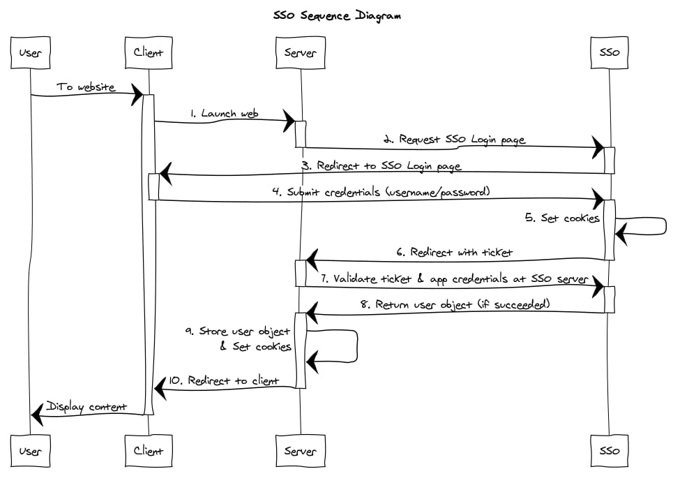
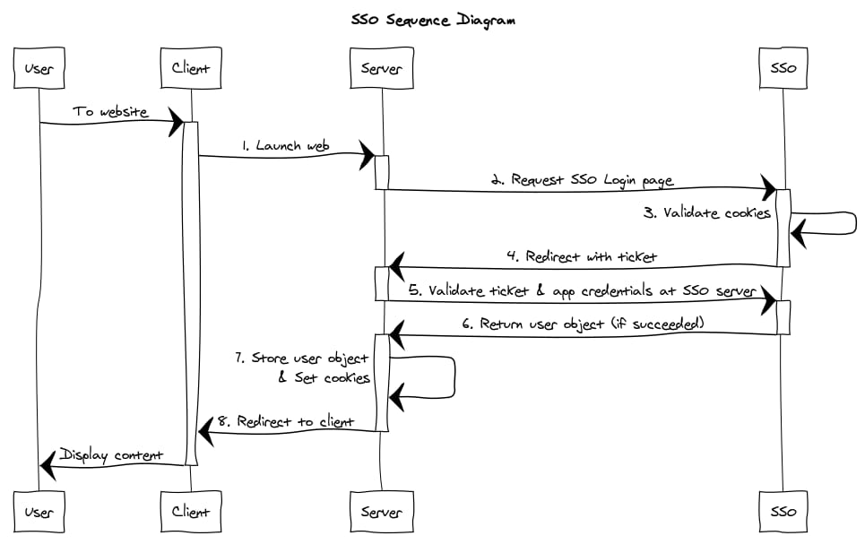

ลองจินตนาการถึงองค์กรองค์กรหนึ่งที่มี service อยู่หลายตัว เช่น ถ้าเป็นระบบของมหาลัยก็จะมีระบบลงทะเบียนรายวิชา ระบบจัดการภายในสำหรับบุคลากรในมหาลัย ระบบประเมินหลังจบเทอม และอื่น ๆ อีกมากมาย ซึ่งแต่ละระบบก็ต้อง login เพื่อเข้าใช้งาน ไม่งั้นจะรู้ได้ไงว่าเป็นนิสิต/นักศึกษาหรือบุคลากรของมหาลัยจริงหรือเปล่า

ปัญหาก็คือการ register และ login ที่ซ้ำซ้อน เช่น นักเรียนเคย login เพื่อลงทะเบียนเรียนไปแล้วยังต้อง login ซ้ำตอนประเมินซึ่งเป็นคนละ service อีก ยิ่งถ้า service ใหม่เปิดขึ้นมาก็ต้องสมัคร account ใหม่กับ service นั้นอีก ทั้งที่จริง ๆ แล้วข้อมูลมันก็อันเดิมนี่แหละ

ด้วยเหตุนี้ จึงเป็นที่มาของระบบ SSO นั่นเอง

# SSO คืออะไร?

SSO (Single Sign-On) คือ service ตัวนึงที่ทำหน้าที่เป็นตัวกลางสำหรับ authentication ด้วย credentials อันเดียวกัน (username และ password) ทำให้ user ไม่จำเป็นต้อง login ซ้ำถ้าใช้ SSO ตัวเดียวกัน

# SSO ทำงานยังไง?

## แบบง่าย ๆ

SSO มี step การทำงานง่าย ๆ ตามนี้:
1. เว็บไซต์จะเช็คก่อนว่า user authenticated หรือยัง ถ้าทำแล้วก็จะใช้ได้เลย
2. ถ้ายังไม่ได้ authenticated ก็จะ redirect ไปที่หน้า login ของ SSO
3. user login ใน SSO
4. SSO verify user แล้วส่งข้อมูล authentication กลับมาที่เว็บไซต์
5. เว็บไซต์เก็บข้อมูลของ user เอาไว้เพื่อใช้ในการ authenticate (เช่น generate token) สำหรับการเข้าเว็บครั้งต่อ ๆ ไป

ง่าย ๆ แค่นี้แหละครับ

## แบบยากหน่อย

จริง ๆ แล้วในแต่ละ step มีขั้นตอนย่อย ๆ ซ่อนอยู่ ซึ่งก็ขึ้นอยู่กับการออกแบบระบบด้วยกัน แต่หลัก ๆ ก็ตามข้างบนแหละ

อันนี้เป็น flow ที่เป็นไปได้แบบนึง

### First access to website

### First access to another website

ในตัวอย่างที่จะใช้ในบล็อกนี้ เว็บหรือแอปจะต้อง register กับระบบ SSO ก่อนใช้งาน โดยจะมี `appId` และ `appSecret` ที่ SSO ออกให้เพื่อใช้ verify ว่าสามารถใช้งาน SSO ได้หรือไม่

# สรุป

SSO คือระบบ authentication กลางที่สามารถใช้ร่วมกันได้หลาย service ซึ่งจะลดปัญหาการ register และ login ซ้ำซ้อนของ user ได้

ใน part นี้เราได้พูดถึงเบสิกของ SSO คร่าว ๆ แล้ว ต่อไปเราจะเริ่ม implement ระบบ SSO กันจริง ๆ แล้ว ดังนั้นโปรดติดตามตอนต่อไปนะครับ