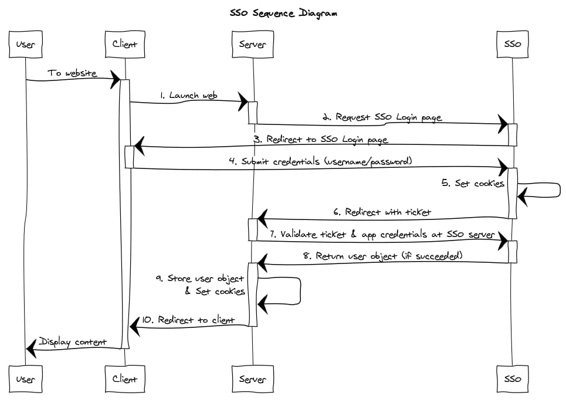
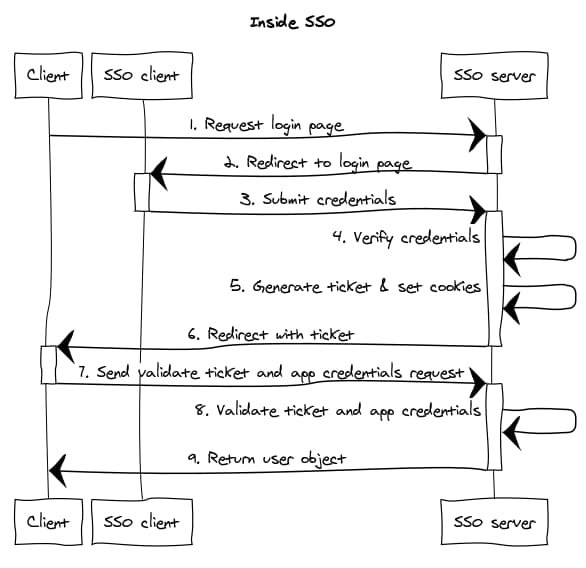
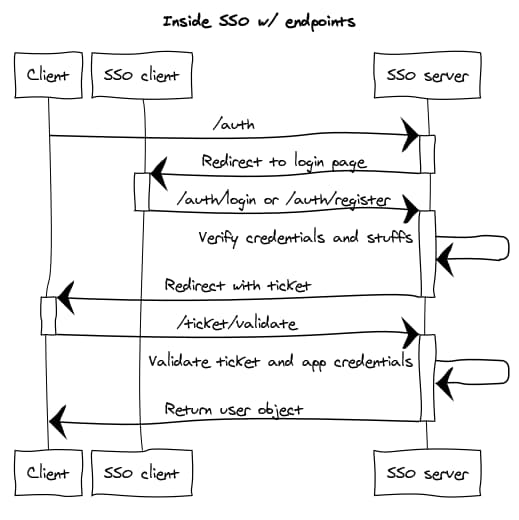

หลังจาก [part ที่แล้ว](https://blog.utopiabeam.dev/make-sso-part-1/)ได้เกริ่นเกี่ยวพื้นฐานของ SSO แล้ว ใน part นี้เราจะมาลองสร้าง SSO ของตัวเองกันจริง ๆ แล้ว

Stack ที่ใช้ในบล็อกนี้คือ [NestJS](https://nestjs.com/) + [MongoDB](https://www.mongodb.com/) + [React](https://reactjs.org/) เหตุผลที่ใช้ NestJS เพราะเป็น framework ที่พัฒนาบน ExpressJS ซึ่งตัว framework รองรับภาษา TypeScript มาด้วย และมี library อื่น ๆ ที่ใช้้ง่ายแถมมาด้วย เช่น [`@nestjs/mongoose`](https://github.com/nestjs/mongoose)

ส่วน React ไม่มีอะไรมาก อยากลองใช้เฉย ๆ...

ถ้าพร้อมแล้วก็เริ่มกันเลยครับ

---

# มาดู SSO กันอีกที

ลองมาดู diagram นี้กันอีกที



จะเห็นว่ารูปนี้แสดง flow ของฝั่ง client ที่เรียกใช้ SSO แต่ยังไม่ได้อธิบายการทำงานข้างใน SSO เลย

เพราะงั้น เราจะลงลึกกว่าเดิมว่าใน SSO ต้องมี flow ยังไงบ้าง (เหมือนเดิมครับ มีได้หลายแบบ อันนี้เป็นแบบนึงเท่านั้น)



สรุปคือส่วน frontend มีแค่หน้า login และ register ก็พอแล้ว ซึ่ง flow การ register ก็คล้ายกันมาก ๆ และส่วน backend มี API 4 ตัว คือ
1. Register app
2. Request login/register page
3. Validate login/register credentials
4. Validate ticket & app credentials

ปูบทมาพอละ ลงมือกันเลยดีกว่า

# Backend

เราจะเริ่มทำส่วน API กันก่อน เพราะว่าผมเป็น backend dev ไงล่ะ...

ก่อนอื่น เราต้อง setup project ของเราก่อน เนื่องจากบล็อกนี้ไม่ได้จะมาสอนใช้ NestJS ดังนั้นรายละเอียดให้ลองไป[อ่านในนี้](https://docs.nestjs.com/first-steps)ดูนะครับ

หลังจากสร้าง project แล้ว เราจะต้องลง `@nestjs/mongoose`, `mongoose` และ `@types/mongoose` เพื่อใช้งาน MongoDB ด้วย โดย run
```
yarn add @nestjs/mongoose mongoose
yarn add -D @types/mongoose
```

เสร็จแล้วในไฟล์ `app.module.ts` ให้เพิ่ม `MongooseModule` เข้าไปด้วยตามนี้
```ts
import { Module } from '@nestjs/common';
import { MongooseModule } from '@nestjs/mongoose';
import { ClientModule } from './client/client.module';

@Module({
    imports: [
        MongooseModule.forRoot(process.env.MONGO_URL, {
            useNewUrlParser: true,
            useFindAndModify: false,
        }),
        ClientModule,
    ],
})
export class AppModule {}
```

ถ้าจะใช้ config จาก module อื่นก็สามารถทำได้ตามนี้ (ในตัวอย่างเอา config มาจาก `ConfigModule`)

```ts
import { Module } from '@nestjs/common';
import { MongooseModule } from '@nestjs/mongoose';
import { ConfigModule } from './config/config.module';
import { ConfigService } from './config/config.service';
import { ClientModule } from './client/client.module';

@Module({
    imports: [
        ConfigModule,
        MongooseModule.forRootAsync({
            imports: [ConfigModule],
            useFactory: async (configService: ConfigService) => ({
                uri: configService.mongoUrl,
                useNewUrlParser: true,
                useFindAndModify: false,
            }),
            inject: [ConfigService],
        }),
        ClientModule,
    ],
})
export class AppModule {}
```

## Client API

อันดับแรก เราจะทำ API สำหรับลงทะเบียน client ก่อน โดย run คำสั่งตามลำดับนี้เลย

```
nest g module client
nest g controller client
nest g service client
```

เสร็จแล้วเราก็จากได้ folder เพิ่มตามนี้

```
src
└── client
    ├── client.controller.ts
    ├── client.module.ts
    └── client.service.ts
```

ส่วนไฟล์ `.spec.ts` ทั้งหลายก็ช่างมัน เราคนจริง test on production ครับ... (จริง ๆ ก็ควรจะ test แหละครับ แต่เพื่อความง่ายในการอธิบายก็จะขอไม่ test นะครับ)

ก่อนอื่นให้สร้างไฟล์ `client.schema.ts` สำหรับใช้เก็บ schema สำหรับ mongoose จะเอาไว้ที่ไหนก็ได้แต่ในที่นี้จะเอาไว้ใน folder `client/` นั่นแหละ

ในไฟล์ `client.schema.ts` ก็สร้าง schema ตามนี้

```ts
import { Schema } from 'mongoose';

export const ClientSchema = new Schema({
    callbackUrl: String,
    secret: String,
});

export const ClientModel = 'Client';
```

หลังจากนั้นเราจะ inject model เข้าไปใน Client module โดยไปแก้ไฟล์ `client.module.ts` ตามนี้

```ts
import { Module } from '@nestjs/common';
import { ClientController } from './client.controller';
import { ClientService } from './client.service';
import { MongooseModule } from '@nestjs/mongoose';
import { ClientModel, ClientSchema } from './client.schema';

@Module({
    imports: [
        MongooseModule.forFeature([
            { name: ClientModel, schema: ClientSchema },
        ]),
    ],
    controllers: [ClientController],
    providers: [ClientService],
    exports: [ClientService],
})
export class ClientModule {}
```

ตรงนี้เรา export `ClientService` เพื่อให้สามารถ inject `ClientService` เข้าไปใน module อื่นได้

เสร็จแล้วก็จะเริ่มเขียน API ละ เริ่มด้วยการสร้างไฟล์ `client.interface.ts` เพื่อเก็บ interface ต่าง ๆ ใน module

```ts
import { Document } from 'mongoose';

export interface Client extends Document {
    callbackUrl: string;
    secret: string;
}

export interface ClientDto {
    callbackUrl: string;
}
```

ทีนี้มาถึงพระเอกของเรา ในไฟล์ `client.controller.ts` จะเก็บ endpoints ทั้งหมดของ module นี้ โดยจะเรียกผ่าน `/client/*`

```ts
import { Controller, Post, Body, Patch, Param, Delete } from '@nestjs/common';
import { ClientDto } from './client.interface';
import { ClientService } from './client.service';

@Controller('client')
export class ClientController {
    constructor(private readonly service: ClientService) {}

    @Post()
    create(@Body() clientDto: ClientDto) {
        return this.service.create(clientDto);
    }
}
```
สังเกตตรง `constructor` ว่ามีการ inject `ClientService` เข้ามา ไม่งั้นเราจะเรียก `ClientService` ไม่ได้

ถ้ามันขึ้น error ว่าไม่มี `create` ใน `service` ไม่ต้องตกใจ เพราะเรายังไม่ได้เขียนอะไรใน `ClientService`

ก่อนอื่น เนื่องจากระบบนี้จะ generate secret ให้กับ app ที่มาลงทะเบียนกับเรา ก็เลยอยากให้มัน random หน่อย ในที่นี้เลือกใช้ library ชื่อ `uuid` ว่าแล้วก็ลงซะ

```
yarn add uuid
yarn add -D @types/uuid
```

เสร็จแล้วก็เปิดไฟล์ `client.service.ts` ขึ้นมาแล้วเขียนตามนี้เลย

```ts
import { Injectable } from '@nestjs/common';
import { InjectModel } from '@nestjs/mongoose';
import { ClientModel } from './client.schema';
import { Model } from 'mongoose';
import { Client, ClientDto } from './client.interface';
import { v4 as uuid } from 'uuid';
import { hashSync } from 'bcryptjs';

@Injectable()
export class ClientService {
    constructor(
        @InjectModel(ClientModel) private readonly model: Model<Client>,
    ) {}

    private hashSecret(secret: string) {
        return hashSync(secret, process.env.SECRET);
    }

    async create({ callbackUrl }: ClientDto) {
        const secret: string = uuid();
        const client = new this.model({
            callbackUrl,
            secret: this.hashSecret(secret),
        });
        await client.save();
        return { callbackUrl, secret };
    }
}
```

ในไฟล์นี้เรา inject mongoose model เข้ามาเพื่อจัดการกับ database เหมือนกัน

เท่านี้ API ส่วนจัดการ client ก็ใช้ได้แล้ว

## User API

ต่อมาคือ API ที่เกี่ยวกับ user นั่นเอง

ว่าแล้วก็ลงมือสร้าง module ซะเลย

```
nest g mo user
nest g s user
```

อาจจะรู้สึกว่า command มันสั้นลง นั่นก็เพราะเราใช้ตัวย่อนั่นเอง (`mo = module`, `co = controller` และ `s = service`)
และถ้าสังเกตดี ๆ จะพบว่า module user ของเราไม่มี controller เนื่องจากใน module ของ user ต้องการแค่ function สำหรับ user แต่ไม่จำเป็นต้องมี endpoint นั่นเอง

ก็เหมือนเดิมครับ สร้าง user schema แล้ว inject model เข้าไปใน module อแล้วก็อย่าลืมพวก interface ด้วยล่ะครับ

```ts
// user.schema.ts
import { Schema } from 'mongoose';

export const UserSchema = new Schema({
    username: String,
    password: String,
});

export const UserModel = 'User';
```

```ts
// user.interface.ts
import { Schema } from 'mongoose';

export const UserSchema = new Schema({
    username: {
        type: String,
        unique: true,
    },
    password: String,
});

export const UserModel = 'User';
```

```ts
// user.module.ts
import { Module } from '@nestjs/common';
import { UserService } from './user.service';
import { MongooseModule } from '@nestjs/mongoose';
import { UserModel, UserSchema } from './user.schema';

@Module({
    imports: [
        MongooseModule.forFeature([{ name: UserModel, schema: UserSchema }]),
    ],
    providers: [UserService],
    exports: [UserService],
})
export class UserModule {}
```

สุดท้ายก็เพิ่ม function ต่าง ๆ ลงไปใน `user.service.ts`

```ts
import { Injectable } from '@nestjs/common';
import { InjectModel } from '@nestjs/mongoose';
import { UserModel } from './user.schema';
import { Model } from 'mongoose';
import { User, UserDto } from './user.interface';
import { hashSync } from 'bcryptjs';

@Injectable()
export class UserService {
    constructor(@InjectModel(UserModel) private readonly model: Model<User>) {}

    private hashPassword(password: string): string {
        return hashSync(password, process.env.SECRET);
    }

    findById(id: string, fields?: string): Promise<User> {
        if (fields) {
            return this.model.findById(id, fields).exec();
        }
        return this.model.findById(id).exec();
    }

    findByName(username: string): Promise<User> {
        return this.model.findOne({ username }).exec();
    }

    create({ username, password }: UserDto): Promise<User> {
        const user = new this.model({
            username,
            password: this.hashPassword(password),
        });
        return user.save();
    }

    async verify(username: string, password: string): Promise<User> {
        const user = await this.findByName(username);
        return user.password === hashSync(password) ? user : null;
    }
}
```

เป็นอันเสร็จ User API

## Ticket API

ต่อมาเราจะมาทำส่วนของ Ticket API เอาไว้ generate และ validate ticket ซึ่งมันก็จะเป็นภาพจำอีกนั่นแหละ

```
nest g mo ticket
nest g co ticket
nest g s ticket
```

```ts
// ticket.schema.ts
import { Schema } from 'mongoose';
import { ClientModel } from '../client/client.schema';
import { UserModel } from '../user/user.schema';

export const TicketSchema = new Schema({
    code: String,
    clientId: {
        type: Schema.Types.ObjectId,
        ref: ClientModel,
    },
    userId: {
        type: Schema.Types.ObjectId,
        ref: UserModel,
    },
});

export const TicketModel = 'Ticket';
```

ทีนี้เนื่องจาก `TicketModule` ต้องใช้ service จาก module อื่น ก็ต้องอย่าลืม import module นั้น ๆ มาด้วย

```ts
// ticket.module.ts
import { Module } from '@nestjs/common';
import { TicketController } from './ticket.controller';
import { TicketService } from './ticket.service';
import { MongooseModule } from '@nestjs/mongoose';
import { TicketModel, TicketSchema } from './ticket.schema';
import { ClientModule } from '../client/client.module';
import { UserModule } from '../user/user.module';

@Module({
    imports: [
        MongooseModule.forFeature([
            { name: TicketModel, schema: TicketSchema },
        ]),
        ClientModule,
        UserModule,
    ],
    controllers: [TicketController],
    providers: [TicketService],
    exports: [TicketService],
})
export class TicketModule {}
```

หลังจากนั้นก็ทำ controller กับ service ให้เรียบร้อย

```ts
// ticket.controller.ts
import {
    Controller,
    Get,
    Headers,
    UnauthorizedException,
} from '@nestjs/common';
import { TicketService } from './ticket.service';
import { ClientService } from '../client/client.service';
import { User } from '../user/user.interface';
import { UserService } from '../user/user.service';

@Controller('ticket')
export class TicketController {
    constructor(
        private readonly ticketService: TicketService,
        private readonly clientService: ClientService,
        private readonly userService: UserService,
    ) {}

    @Get('/validate')
    async validate(@Headers() { appId, appSecret, ticket }) {
        if (!(await this.clientService.verify(appId, appSecret))) {
            throw new UnauthorizedException('Invalid app id and/or secret');
        }
        const userId = await this.ticketService.validate(appId, ticket);
        const user: User = await this.userService.findById(
            userId,
            '_id username',
        );
        if (user) {
            return user;
        }
        throw new UnauthorizedException('Invalid ticket');
    }
}
```

```ts
// ticket.service.ts
import { Injectable } from '@nestjs/common';
import { InjectModel } from '@nestjs/mongoose';
import { TicketModel } from './ticket.schema';
import { Model } from 'mongoose';
import { Ticket } from './ticket.interface';
import { v4 as uuid } from 'uuid';

@Injectable()
export class TicketService {
    constructor(
        @InjectModel(TicketModel) private readonly model: Model<Ticket>,
    ) {}

    create(clientId: string, userId: string): Promise<Ticket> {
        const code = uuid();
        const ticket = new this.model({ clientId, userId, code });
        return ticket.save();
    }

    async validate(clientId: string, code: string) {
        const ticket = await this.model.findOne({ clientId, code }).exec();
        if (ticket) {
            await this.delete(ticket._id);
            return ticket.userId;
        }
    }

    private delete(id: string) {
        return this.model.findByIdAndDelete(id).exec();
    }
}
```

# Auth API

ก่อนหน้านี้เราแค่เตรียมการให้พร้อมก่อนจะมาถึงส่วนสุดท้ายและส่วนที่สำคัญที่สุดกัน นั่นก็คือส่วนจัดการ auth ที่แท้จริง

ก่อนอื่น เราจะลง `@nestjs/jwt` และ `cookie-parser` เพื่อเอาไว้จัดการกับ token และ cookies

```
yarn add @nestjs/jwt cookie-parser
yarn add -D @types/cookie-parser
```

หลังจากนั้นใน `main.ts` ก็ไปใส่ `cookieParser` แบบนี้

```ts
import { NestFactory } from '@nestjs/core';
import { AppModule } from './app.module';
import * as cookieParser from 'cookie-parser';

async function bootstrap() {
    const app = await NestFactory.create(AppModule);
    app.use(cookieParser());
    app.enableCors();
    await app.listen(3000);
}
bootstrap();
```

แล้วก็ inject `JwtModule` และ module อื่น ๆ เข้ามาตามนี้

```ts
// auth.module.ts
import { Module } from '@nestjs/common';
import { JwtModule } from '@nestjs/jwt';
import { AuthController } from './auth.controller';
import { AuthService } from './auth.service';
import { ClientModule } from '../client/client.module';
import { UserModule } from '../user/user.module';
import { TicketModule } from '../ticket/ticket.module';

@Module({
    imports: [
        JwtModule.register({ secret: process.env.SECRET }),
        ClientModule,
        TicketModule,
        UserModule,
    ],
    controllers: [AuthController],
    providers: [AuthService],
})
export class AuthModule {}
```

ที่เหลือก็ใส่ controller และ service นั่นเอง

```ts
// auth.controller.ts
import {
    Controller,
    Post,
    Body,
    Get,
    Res,
    UnauthorizedException,
    Headers,
    Req,
} from '@nestjs/common';
import { UserDto, User } from '../user/user.interface';
import { AuthService } from './auth.service';
import { UserService } from '../user/user.service';
import { Response, Request } from 'express';
import { RedirectAndToken } from './auth.interface';

@Controller('auth')
export class AuthController {
    private readonly MONTH_IN_MSEC = 30 * 24 * 3600 * 1000;

    constructor(
        private readonly authService: AuthService,
        private readonly userService: UserService,
    ) {}

    @Get()
    loginPage(@Res() res: Response, @Headers('appid') appId: string) {
        return res.redirect(this.authService.loginPageUrl(appId));
    }

    @Post('login')
    async login(
        @Headers('appid') appId: string,
        @Body() { username, password }: UserDto,
        @Res() res: Response,
        @Req() req: Request,
    ) {
        const user: User = req.cookies
            ? await this.userService.findById(
                  this.authService.getUserId(req.cookies),
              )
            : await this.userService.verify(username, password);
        if (!user) {
            throw new UnauthorizedException('Wrong username and/or password');
        }
        const {
            redirectUrl,
            token,
        }: RedirectAndToken = await this.authService.getRedirectAndToken(
            appId,
            user._id,
        );
        return res
            .cookie('token', token, { maxAge: this.MONTH_IN_MSEC })
            .redirect(redirectUrl);
    }

    @Post('register')
    async register(
        @Headers('appid') appId: string,
        @Body() userDto: UserDto,
        @Res() res: Response,
    ) {
        const user: User = await this.userService.create(userDto);
        const {
            redirectUrl,
            token,
        }: RedirectAndToken = await this.authService.getRedirectAndToken(
            appId,
            user._id,
        );
        return res
            .cookie('token', token, { maxAge: this.MONTH_IN_MSEC })
            .redirect(redirectUrl);
    }
}
```

```ts
// auth.service.ts
import { Injectable } from '@nestjs/common';
import { RedirectAndToken } from './auth.interface';
import { Client } from '../client/client.interface';
import { Ticket } from '../ticket/ticket.interface';
import { ClientService } from '../client/client.service';
import { TicketService } from '../ticket/ticket.service';
import { JwtService } from '@nestjs/jwt';

@Injectable()
export class AuthService {
    constructor(
        private readonly clientService: ClientService,
        private readonly jwtService: JwtService,
        private readonly ticketService: TicketService,
    ) {}
    loginPageUrl(appId: string): string {
        return `${process.env.FRONTEND_URL}?appid=${appId}`;
    }

    private redirectUrl(callback: string, ticket: string): string {
        return `${callback}?ticket=${ticket}`;
    }

    getUserId(cookie: string): string {
        return this.jwtService.verify(cookie).userId;
    }

    async getRedirectAndToken(
        appId: string,
        userId: string,
    ): Promise<RedirectAndToken> {
        const { callbackUrl }: Client = await this.clientService.findById(
            appId,
        );
        const { code }: Ticket = await this.ticketService.create(appId, userId);
        const redirectUrl = this.redirectUrl(callbackUrl, code);
        const token = this.jwtService.sign({ userId });
        return { redirectUrl, token };
    }
}
```

และก็จบลงด้วยประการฉะนี้...

# สรุป

สรุปแล้วที่เราทำมาทั้งหมดคือการเขียน API ของฝั่ง SSO นั่นเอง ซึ่งหน้าตาเวลาใช้งานก็จะเป็นแบบนี้



ในตอนต่อไปจะพาเขียนหน้า frontend ไปด้วยกัน อย่าลืมติดตามกันนะครับ

## Note

เนื่องจากตอนนี้ยังไม่มี frontend และ client อื่นทำให้ลองเทสไม่ได้ วิธีการง่าย ๆ ที่ผมใช้คือเปลี่ยนจาก redirect เป็น response `json` ธรรมดา เช่น `callbackUrl` หรือ `ticket` แต่อย่าลืมเปลี่ยนกลับล่ะครับ