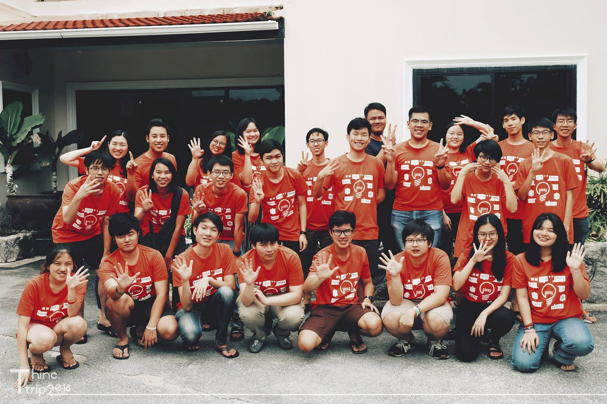

_[Note: บล็อกนี้มีไว้สำหรับขิงล้วน ๆ ไม่มีอย่างอื่นผสม อาจจะดูน่าหมั่นไส้นิดหน่อยโปรดให้อภัยนะครับ (ตัวจริงไม่ใช่คนขิง จริง ๆ นะ) ┐(´ ～｀)┌]_

มีคนเคยถามว่าทำยังไงถึงเก่งแบบนี้ หรือปกติคนเก่ง ๆ แบบนี้ใช้ชีวิตกันยังไง ถ้าท่านอยากรู้เรื่องราวให้กระจ่าง บล็อกนี้ก็พร้อมจะแถลงไข ตั้งแต่ก่อนเข้ามหาลัยจนเป็น Rank 1(?) ในปัจจุบันแบบขิง ๆ

แต่ก่อนอื่นขอแนะนำตัวก่อน ผมชื่อบีม ณัชพล ศรีสังข์ ครับ ชื่อในวงการคือ UtopiaBeam เป็น frontend sometimes, backend full time, กวนประสาท all the time ตอนนี้อยู่ปีสาม วิศวะคอม จุฬาฯ เพื่อน ๆ หลายคนเรียกผมว่า "จารย์บีม"

แหม่! ก็คนมันเก่งอ่ะครับ

# ก่อนจะเป็นเด็กมหาลัย

ก็เป็นเด็ก ม.ปลายมาก่อนไง... ปัดโถ่ววว!!

ดูจากรูปปกก็ชัดเจนว่าจบมาจากโรงเรีัยนมหิดลวิทยานุสรณ์ โรงเรียนวิทยาศาสตร์ Rank 1(?) ของประเทศ เรียกได้ว่าเริ่มใช้ชีวิตสไตล์ Rank 1(?) ก่อนขึ้นมหาลัยซะอีก

นอกจากนี้ผมยังเก่งเลขและคอมเอามาก ๆ ยังไม่เคยมีเทอมไหนในชีวิตที่ไม่ได้ 4 สองวิชานี้เลย อยากรู้จริง ๆ ว่าทำยังไงให้หลุดเกรด 4 พยายามหลายรอบแล้วก็ไม่สำเร็จซะที เฮ้อ... ก็ไม่ได้จะโม้ แต่ความเก่งของผมมันอยู่ในระดับผู้แทนศูนย์โอลิมปิกคอมสองปีซ้อนเลยทีเดียว

และด้วยความเก่งกาจนี้ บวกกับเกรดเฉลี่ย 3.80 แล้ว โควต้าโอลิมปิกคณะวิศวะคอม จุฬาฯ ก็ไม่ไกลเกินเอื้อม เห็นเพื่อนอ่าน GAT, PAT, 9 วิชากันเหรอ นั่งเล่นเกมให้เด็กมันดูสิครับ

เฮ้อ! ชีวิตคนเก่งนี่มันสบายจริง ๆ

# ขึ้นปี 1 — ชีวิตในทุ่งลาเวนเดอร์

แต่ไฟไหม้ทุ่งอ่ะ...

ปี 1 เป็นปีที่ใช้ชีวิตสบาย ๆ เพราะชีวิตเฟรชชี่มีได้ครั้งเดียว (ถ้าไม่ซิ่ว...) คนเก่งอย่างเราไม่ต้องอ่านหนังสือก็ยังชิล ๆ...

ซะเมื่อไหร่เล่าาา!!! ขนาดอ่านหนังสือจนไม่รับรู้โลกภายนอกแล้ว midterm ก็ยังยับเลย ทำไมฟิสิกส์กับเคมีมันถึงยากขนาดนั้น ออกให้เด็กโอลิมปิกทำใช่มั้ย!!! (โอลิมปิกคอมไม่ถูกใจสิ่งนี้) แล้ว drawing รูปมันจะยากไปไหน แล้วจะเรียน material ไปทำไมเนี่ย!!!

ถึงจะเข้าวิศวะคอมได้แบบชิล ๆ แต่ปี 1 ก็ยังเรียนรวมกับภาคอื่นอยู่ดี ทำให้เจอวิชาที่ไม่ได้เฉียดเด็กคอมหลายตัวมาก เอาจริง ๆ คือทุกตัวยกเว้น ComProg ที่สอนเขียน python วิชาที่ไม่ชอบที่สุดคือเคมีกับ material เพราะเป็นคนไม่เก่งเคมีเลยจริง ๆ แถมมันตัดเกรดอิงกลุ่มอ่ะ...

ที่น่าเจ็บใจมากคือรุ่นน้องภาคคอมตรงปีถัดมาไม่ต้องเรียน drawing กับ material แล้ว Oh shit!!! ทำไมไม่ทำให้เร็วขึ้นอีกปีว้าาาา

ยังไงก็ตาม ด้วยความเก่งกาจที่ฆ่าไม่ตาย เกรดเฉลี่ยปี 1 ก็ประมาณ 3.56 แบบไม่ยากเย็น

ส่วนเคมีกับ material ก็ปล่อยมันไปเนอะ!

มีเรื่องที่ตอนนี้ก็ยังง ๆ คือระหว่างนั่งทำอะไรเรื่อยเปื่อยก็มี inbox ใน Facebook ทักมาชวนไปฝึกงานช่วงปิดเทอม ด้วยความว่างก็เลยตกลงรับไปแบบงง ๆ ซึ่งเขียนรีวิวไว้แล้วที่ [[Internship] เมื่อเด็กวิศวะคอมฝึกงานครั้งแรก](https://medium.com/donuts-bangkok-family/internship-%E0%B9%80%E0%B8%A1%E0%B8%B7%E0%B9%88%E0%B8%AD%E0%B9%80%E0%B8%94%E0%B9%87%E0%B8%81%E0%B8%A7%E0%B8%B4%E0%B8%A8%E0%B8%A7%E0%B8%B0%E0%B8%84%E0%B8%AD%E0%B8%A1%E0%B8%9D%E0%B8%B6%E0%B8%81%E0%B8%87%E0%B8%B2%E0%B8%99%E0%B8%84%E0%B8%A3%E0%B8%B1%E0%B9%89%E0%B8%87%E0%B9%81%E0%B8%A3%E0%B8%81-a368489a457e) ตามไปอ่านกันได้นะครับ ><

# ปี 2 — เทพจุติ

เมื่อปีสองมีแต่วิชาภาค เวลาเทพจุติก็มาถึงแล้ว...

ปีสองจะเน้นเรียนวิชาปูพื้นทางคอมให้นิสิต เช่น Discrete math, Data Strucuture, Algo Design, Com Eng Math (ชื่อเล่น Linear algebra), Com Eng Ess, Prog Meth (ชื่อเล่น Java)

แค่เห็นชื่อวิชาก็ยิ้มมุมปากแล้ว หึหึ

เมื่อวิชาเข้าทางขนาดนี้ มีเหรอจะหลุด A นอกจากจะชิลในคาบแล้วยังติวให้เพื่อนได้อีก ก็คนเค้าเรียกผมว่า "จารย์บีม" อ่ะครับ ของแค่นี้จิ๊บจ๊อย

ส่วนวิชา Dig Logic กับ Lab ได้ A แบบงง ๆ เพราะฉะนั้นก็ช่างมันเนอะ...

ล้อเล่นครับ เดี๋ยวจะรีวิวแต่ละวิชาแบบสั้น ๆ
- **Discrete** - เรียนเลข ม.ปลาย ธรรมดา เช่น set, logic, number theory, combinatorics ที่ไม่ธรรมดาคือ Computational theory ได้แก่ Time complexity, computational model ต่าง ๆ
- **Data structure** - ก็ data ง่าย ๆ แหละ พวก list, queue, tree, graph ไรงี้
- **Prog Meth** - Java, Java, and f*cking Java มีได้ทำ UI ด้วยนะเออ
- **Com Eng Ess** - วิชาหว่านแหที่แท้ทรู ได้ทำทุกอย่างตั้งแต่ hack ram, Arduino ยัน ML
- **Algo Design** - Algo ธรรมดา ๆ ในค่ายโอลิมปิกนั่นแล ขี้เกียจไล่มันเยอะ
- **Com Eng Math** - Linear algebra ชัด ๆ ทุกอย่างเกี่ยวกับ vector และ matrix ถึงขนาดใด ๆ ในโลกล้วนเป็น vector subspace...
- **Dig Logic** - วงจรล้วน ๆ ตั้งแต่ basic logic ยัน register, RAM, และ logic ยาก ๆ เช่น หา ห.ร.ม. ควบคุมไฟจราจร
- **Dig Logic Lab** - Lab ของ Dig Logic ต่อวงจรในโปรแกรม จบ...

เนื่องจากชีวิตปีสองมันจะชิลเกินไป ทำให้มีเวลาไปงาน event และ Hackathon ต่าง ๆ มากมาย ซึ่ง fanboy Google อย่างเรามีเหรอจะพลาด

งานที่ชอบมาก ๆ คือ ["The Stupid Hackathon TH 3"](https://blog.utopiabeam.dev/stupid-hackathon-th3/) และ ["SCB Open Banking Hackathon"](https://blog.utopiabeam.dev/scb-hackathon/) ลองไปอ่านรีวิวกันได้ครับ

ที่สำคัญ รีวิวชีวิตปีสองนี้จะขาดชมรม [Thinc.](https://www.facebook.com/ThailandIncubator) ไปไม่ได้เลย เพราะเป็นประธานชมรมไงล่ะ (เฮ้อ! คนเก่งนี่มันลำบากจริง ๆ) ปีนี้ส่วนใหญ่ถ้าไม่เรียนก็ทำชมรมนี่แหละ เป็นปีที่ได้ทำอะไรหลายอย่างมาก ทั้ง backend, frontend นิดหน่อย, DevOps และสัพเพเหระ เช่น จัดทริป จัดกิจกรรม ทำเอกสารชมรม และกวนประสาทคนในชมรม

แหน่ะ!! ขายของดีขนาดนี้ยังไม่ไป Like [Facebook page](https://www.facebook.com/ThailandIncubator) กับ [Medium](https://medium.com/thinc-org) Thinc. อีก

ล่าสุดช่วงกลางเทอม 2 ก็ได้ทำ part-time แล้วล่ะครับ ทำที่กวดวิชาแห่งนึงในย่านสยามกิตติ์ (ใกล้ ม. ดี เดินไปยังได้) ทำตำแหน่ง IT ที่ทำทุกอย่างตั้งแต่เขียนเว็บยันเชื่อมหัวสาย LAN

# ปี 3...

ยังไม่ถึง midterm เลย จะรออ่านอะไรล่ะครับ!!!

# สรุป

สามปีในมหาลัย + ม. ปลาย มีทั้งเรื่องที่ ez และท้าทาย (ส่วนใหญ่จะ ez นะ ก็คนมันเก่งอ่ะ) แต่กว่าจะเก่งแบบนี้ก็ใช้ความพยายามเยอะอยู่เหมือนกัน

ถ้าอ่านถึงตรงนี้นี่น่าสงสัยมากว่าอ่านมาได้ยังไง (สงสัยจะว่างนะครับ 555) แต่ต้องบอกอีกทีว่าอย่าหาสาระเยอะจากบล็อกนี้ เพราะกะจะปั่นล้วน ๆ อาจจะดูขิงไปหน่อยแต่ตัวจริงไม่ได้อวดเก่งแบบนี้นะครับ (ส่วนเรื่องปากดีนี่ไม่เถียง)

สุดท้ายนี้ ถ้ามีคนถามผมว่าทำยังไงให้ตัวเองดูเก่งขึ้น ผมมีทริคเล็ก ๆ น้อย ๆ มาฝากครับ

ไปละครับ หมอเรียกกินยา...