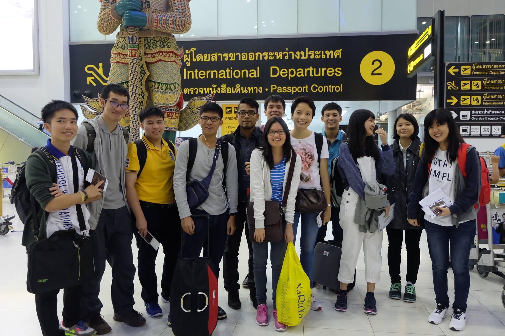
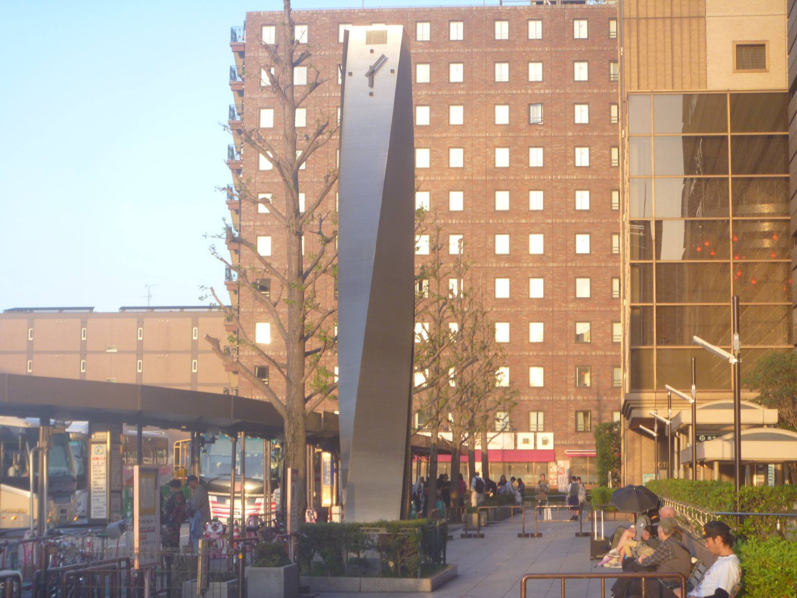
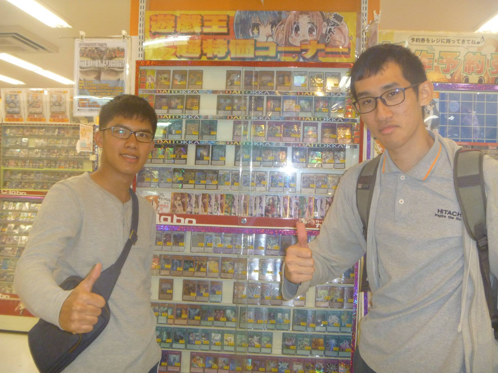

เคยตั้งโปรเจคไว้ตั้งแต่สมัยยังทำเว็บไม่เป็นว่าจะทยอยย้าย diary ที่เคยอยู่ใน Facebook มาลงบล็อกของตัวเอง จนตอนนี้มีบล้อกตัวเองละ ก็ได้เวลาเริ่มโปรเจคย้าย diary มาซักที

โดย diary นี้เป็นเรื่องราวเกี่ยวกับ Ritsumeikan Exchange Program ซึ่งเป็นโปรแกรมแลกเปลี่ยนระหว่างโรงเรียนมหิดลวิทยานุสรณ์และโรงเรียน [Ritsumeikan Junior and Senior School](http://www.ritsumei.ac.jp/fkc/eng/) ตั้งแต่ 17 - 30/4/2016 นั่นเอง

เนื่องจากพอเอามาลงบล็อกอย่างงี้แล้วมันก็ต้องเขียนใหม่หลายจุดอยู่ และเรื่องราวมันก็หลายปีมาแล้วคงจำได้ไม่หมด เอาเป็นว่าอันไหนจำไม่ได้ก็แต่งเอาเลยละกันนะ

และเนื่องจากตอนนั้นยังถ่ายรูปไม่เป็น บวกกับสเปคกล้องที่สุดน่าเอือมระอา ถ้ารูปไม่ชัดก็ขอให้ทำใจนะครับ เพราะผมก็ทำใจอยู่เหมือนกัน... (อยากจะย้อนเวลากลับไปตีมือตัวเองจริง ๆ ให้ตายสิ)

ว่าแล้วก็เริ่มกันเลยยย

---

# ออกเดินทาง

วันนี้วันดีที่จะได้ไปแลกเปลี่ยนที่ญี่ปุ่น ออกจากบ้านตั้งแต่ตอนตี 2 เพื่อไปสนามบินสุวรรณภูมิ พอไปถึงก็เจอคนฟิตที่มาถึงตั้งแต่เที่ยงคืนแล้ว บอกว่ากลัวมาสาย แต่แบบนี้มันก็เช้าไปนะ (หรือดึกนะ?) นั่งเครื่องตั้งแต่ 6 โมงครึ่ง แล้วลงเปลี่ยนเครื่องที่ฮ่องกงประมาณ 10 โมง

ตอนนั่งเครื่องบินก็ไม่ได้แปลกใหม่อะไร แต่ไม่รู้ทำไมเจ็บในหูมาก ๆ เพื่อน ๆ ก็ตามประสาคนบ้า นั่งคุยกันเจื้อยแจ้ว...ซะที่ไหนล่ะ ตื่นเช้า(?) กันขนาดนี้ขึ้นเครื่องได้ก็สลบกันหมดแล้ว

กว่าจะถึงญี่ปุ่นก็ประมาณ 4 โมงแล้ว

# ถึงญี่ปุ่นแล้วจ้า

ทุกคน (อาจจะเกือบทั้ง 12 คน) คาดหวังตั้งแต่ไทยว่าเราจะหนีร้อนมาพึ่งเย็นได้ แต่ความจริงแล้วมันน่าจะหนีมาพึ่งหนาวซะมากกว่า หลังจากถึงสนามบินโอซาก้าก็มีตัวแทนอาจารย์จาก Ritsumeikan มารับเราและพาเราไปพบกับโฮสต์ที่สถานีเกียวโต (ไม่ใช้โตเกียวนะครัช) ประมาณทุ่มนึง แต่เนื่องจากเรามาถึงก่อนเวลาก็เลยมีเวลาซื้อของ ทำให้เราได้พบกับร้านการ์ดในตำนาน(?) ทำให้รู้สึกตื่นตาตื่นใจมากจนอยากจะกลับไทยเลยทีเดียว (เดี๋ยว ๆ)

โฮสต์ของเราเป็นผู้ชายตัวสูง ๆ ดูไม่ค่อยพูด ชื่อว่า Fujii Shun รุ่นราวคราวเดียวกัน หลังจากที่โฮสต์มารับแล้วก็เลยไปกินข้าวที่ร้านอาหารใกล้ ๆ สถานีเกียวโต ซึ่งทุกคนดูตกใจมากตอนเราสั่งข้าวหน้าไข่มา ("ก็มันเป็นร้านโซบะไง" มีคนที่ตอนนี้ไปเรียนญี่ปุ่นแล้วกล่าวไว้) หลังจากนั้นก็แยกย้ายกลับบ้านด้วยรถไฟ บ้านของโฮสต์อยู่ในแมนชั่น ครอบครัวของโฮสต์ให้การต้อนรับอย่างดี ทำให้ความกังวลที่มีผ่อนคลายลง

# ปิดท้ายจากปัจุจบัน

จบไปแล้วครับกับวันที่ 0 ตอนนี้มองย้อนกลับไปคิดว่าเป็นวันแรกที่สบาย ๆ เพราะเพิ่งเดินทางเลยยังไม่ค่อยมีเรื่องอะไรให้เล่ามากนัก นอกจากความรู้สึกที่ว่า "นี่เราหลุดเข้ามาในอนิเมะแล้วสินะ..." ตามสไตล์คนชอบดูอนิเมะอ่ะนะ เดี๋ยววันต่อ ๆ มาจะมีเรื่องราวที่น่าสนใจอยู่หลายเรื่อง อย่าลืมติดตามตอนต่อไปนะครับ