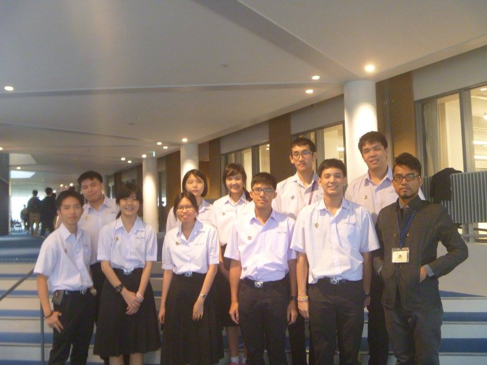

มาถึงตอนที่สองกันแล้วกับบันทึกแลกเปลี่ยนครั้งนี้ ถึงแม้นี่จะเพิ่งวันแรกก็ตาม ถ้าใครยังไม่ได้อ่านตอนแรกก็อ่านได้ที่ ["บันทึกแลกเปลี่ยนแดนอุทัย — Day 0 (17/4/2016)"](https://blog.utopiabeam.dev/rits-exchange-day-0)ได้เลย

ถ้าพร้อมแล้วก็ไปอ่านกันต่อเลย...

---

# ที่นี่ชมรมเป็นเรื่องจริงจังนะ

ที่ญี่ปุ่นนี่ชมรมสำคัญมากนะ เด็กทุกคนจริงจังกับชมรมมาก Shun ก็เหมือนกัน ทุกวันต้องซ้อมบอลตั้งแต่เช้า ก็เลยต้องตื่นเช้าไปโรงเรียนด้วย อาหารเช้าวันนี้เป็นข้าวปั้นสาหร่ายสองก้อนที่แม่ของ Shun ทำให้ บอกได้เลยว่าอร่อยมาก คุณแม่ชาวญี่ปุ่นนี่น่าจะทำอาหารอร่อยนะ (มโนเอาเอง) ส่วนใหญ่ก็จะทำอาหารกลางวันให้ลูกเอาไปกินที่โรงเรียนเรียกว่า เบนโตะ เราเองก็ได้มาเหมือนกัน แลดูน่าจะอร่อย

การมาแลกเปลี่ยนครั้งนี้ทำให้รู้เลยว่าการไปโรงเรียนนี่มันทรหดมาก อย่าง Shun นี่ต้องนั่งรถบัสไปสถานีรถไฟ นั่งรถไฟอีกสองต่อ เดินอีกประมาณ 15 นาที รวมประมาณชั่วโมงนิด ๆ ถึงโรงเรียนประมาณ 8 โมง อารมณ์แบบโอ้แม่จ้าววมาก ๆ!! กว่าจะถึงโรงเรียนนี่ก็เหนื่อยแล้ว

ตามตารางวันนี้มีปฐมนิเทศ มีอาจารย์ในโรงเรียนมาแนะนำตัวมากมาย หลังจากนั้นก็ทำสไลด์แนะนำตัวเองเพื่อเอาไปโชว์ในทีวีหน้าโรงเรียนเลย (น่าอับอายยิ่งนัก TT) หลังจากนั้นก็พบรอง ผอ แล้วก็กินข้าวกับ Shun และข้าวกลางวันก็อร่อยอย่างที่คาดหวังไว้จริง ๆ

อาจจะสงสัยว่าทำไมถึงใส่กางเกงขายาว เหตุผลก็เพราะชุดนักเรียนชายที่นั่นใส่กางเกงขายาวนั่นเอง

วันนี้มีเรียนภาษาญี่ปุ่นกับ Taketani sensei ซึ่งสอนได้สนุกมาก ๆ ได้ฝึกการพูดภาษาญี่ปุ่นจริง ๆ ด้วย

เพราะว่าชมรมฟุตบอลซ้อมกันจนถึงประมาณทุ่มนึงก็เลยกลับบ้านช้า ขากลับก็อารมณ์เหมือนขามา เพิ่มเติมคือความหิว พอกลับมาถึงบ้านแม่ Shun ก็เตรียมอาหารเย็นไว้ให้แล้ว ที่แปลกก็คือคุณแม่เค้าเริ่มพูดญี่ปุ่นกับเรามากขึ้น ก็ยังอุตส่าห์เข้าใจและตอบได้บางอย่าง รู้สึกขอบคุณอนิเมะจากใจมาก ๆ เลยนะที่ช่วยให้เรารู้จักคำศัพท์และประโยคบ้างเล็กน้อย

หลังจากนั้นแม่เค้าก็ให้เราอาบน้ำโดยมอบไอเท็มฟองฟู่ในอ่างน้ำให้ด้วย ก็เลยเป็นครั้งแรกที่ได้แช่อ่างน้ำร้อน แรก ๆ ก็รู้สึกร้อน แต่ซักพักกลับสบายตัวมาก ๆ เลย เป็นไปได้ก็อยากให้ไทยมีบ้างแหละ แต่แค่นี้ก็จะสุกอยู่แล้ว

พอแล้ว ง่วงแล้ว จะไปนอนแล้ว
