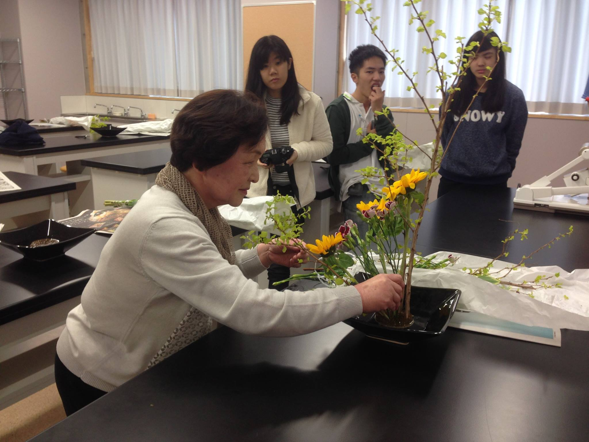
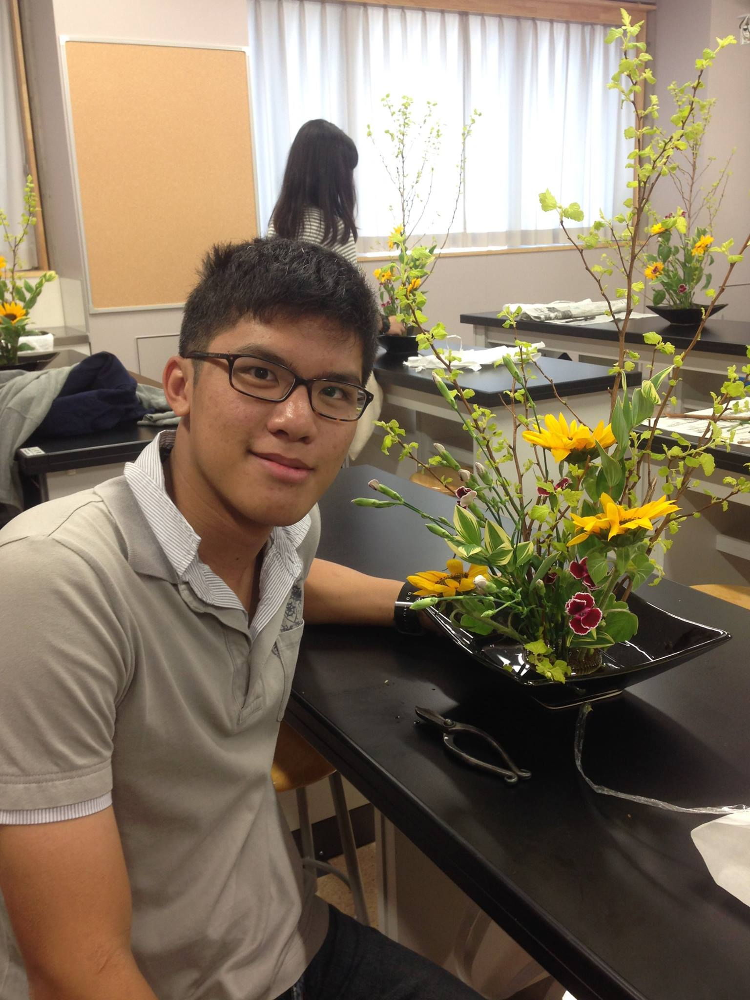
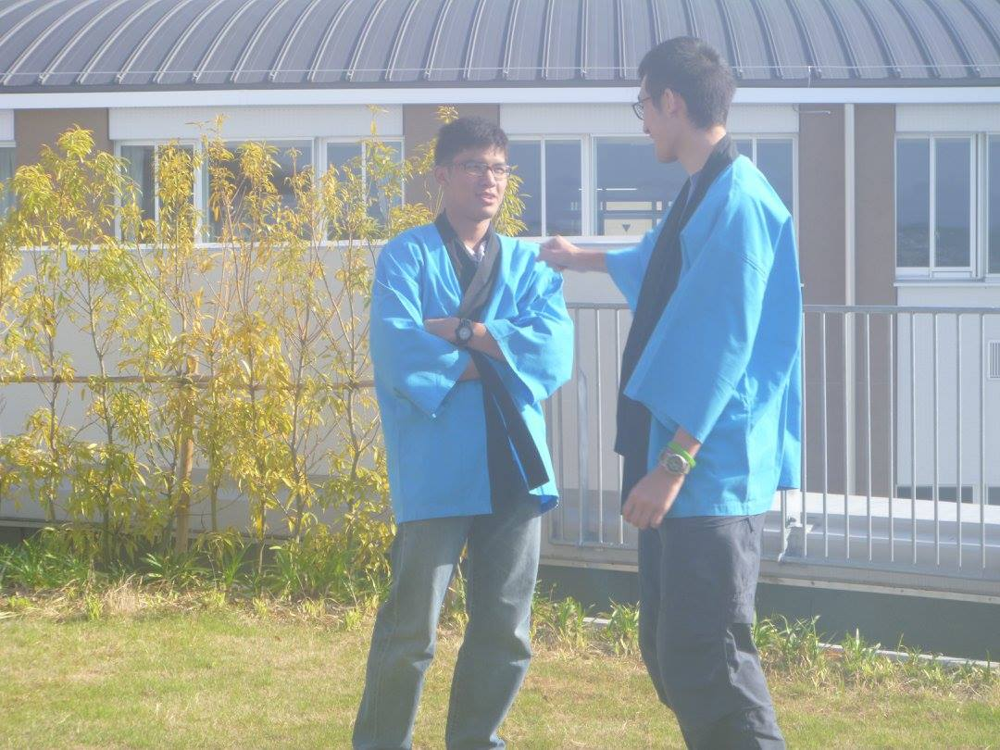
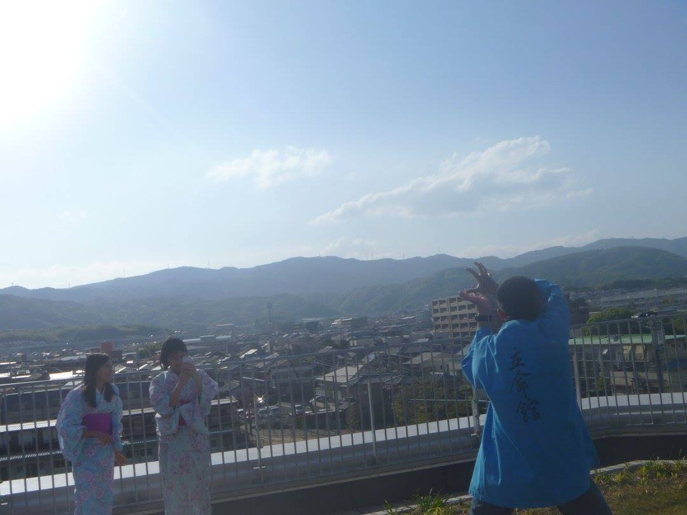
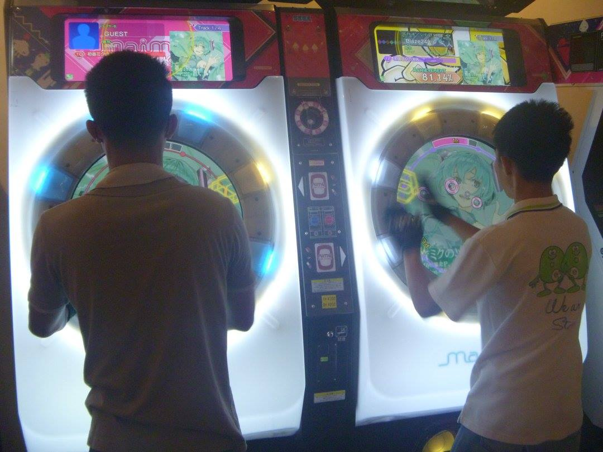
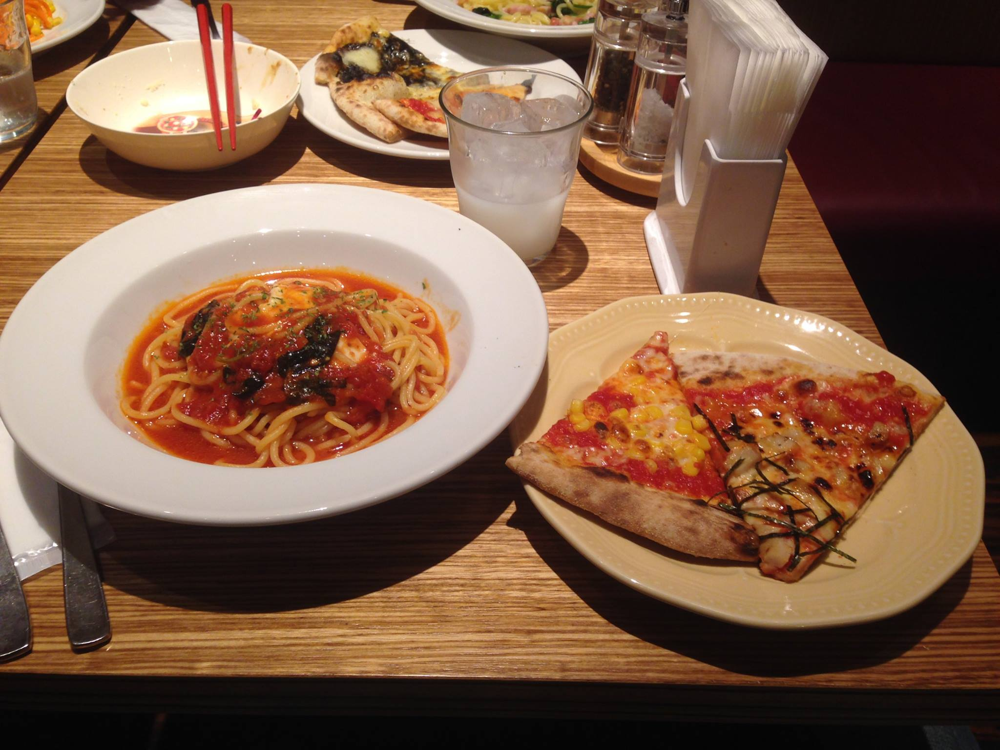

วันนี้เป็นวันแรกที่จะได้เข้าไปนั่งเรียนกับ Shun วิชาภาษาอังกฤษ อาจารย์ให้ตอบคำถามบ่งบอกว่าสมองของเราเหมือนผู้ชายหรือผู้หญิงมากกว่ากัน ผลที่ออกมาก็เหมือนผู้ชายมากกว่าอ่ะนะเป็นธรรมดา หลังจากนั้นก็เข้าเรียนวิชา Science English กับนักเรียนจาก Grade 11/7 มีกิจกรรมสนุก ๆ ให้ทำเยอะเลย เช่นพวกหาจุดร่วมของคนในกลุ่มหรือใบ้คำโดยใช้ท่าทาง  รู้สึกว่าได้เรียนรู้วัฒนธรรมที่น่าสนใจของญี่ปุ่นมามากเลยทีเดียว

แต่ยังไม่หมด เรายังมีโปรโมชั่นคอร์สเคมีก่อนพักเที่ยง และคอร์สจัดดอกไม้ตอนบ่ายฟรี พร้อมของสมมนาคุณอย่างชุดยูกาตะของสาว ๆ และชุด Happi ของหนุ่ม ๆ ด้วย

วันนี้ Shun และผองเพื่อนไม่มีชมรม ก็เลยไปเที่ยวห้างกับตุ่ย ฉัฏร วิสกี้และบัดดี้ ได้เดินเข้าร้านหนังสือแล้วก็พบว่ามี LN ที่อยากอ่านเต็มไปหมด แต่ดันเวลไม่ถึง (อ่านไม่ออก) ก็เลยไม่ได้ซื้อหนังสือมาซักเล่ม

หลังจากนั้นก็เข้าเกมเซนเตอร์ไปเล่น Maimai อย่างเหน็ดเหนื่อย (ฉัฏรนี่บอกจะไม่เล่นอีกแล้ว ผมนี่แอบเศร้าเล็ก ๆ เลย) หลังจากนั้นก็ไปกินพาสต้าบุฟเฟ่ต์กัน มีทั้งพิซซา สลัด ของหวานและเครื่องดื่มจุใจ

วันนี้เป็นวันแรกที่ได้เจอพ่อของ Shun ดูเป็นคนมีภูมิฐานค่อนข้างเก่งภาษาอังกฤษ แต่ก็เป็นกันเองดีมากเลย

