วันนี้ตอนเช้าก็คล้าย ๆ กับเมื่อวาน คือถึงโรงเรียนประมาณ 8 โมง แต่กำหนดการเริ่มตอน 10 โมง ก็เลยมีเวลานั่งเล่นเกมกระดานกันอีกแล้ว (ตกลงว่ามาญี่ปุ่นนี่คือมาเล่นเกมกระดานสินะ)

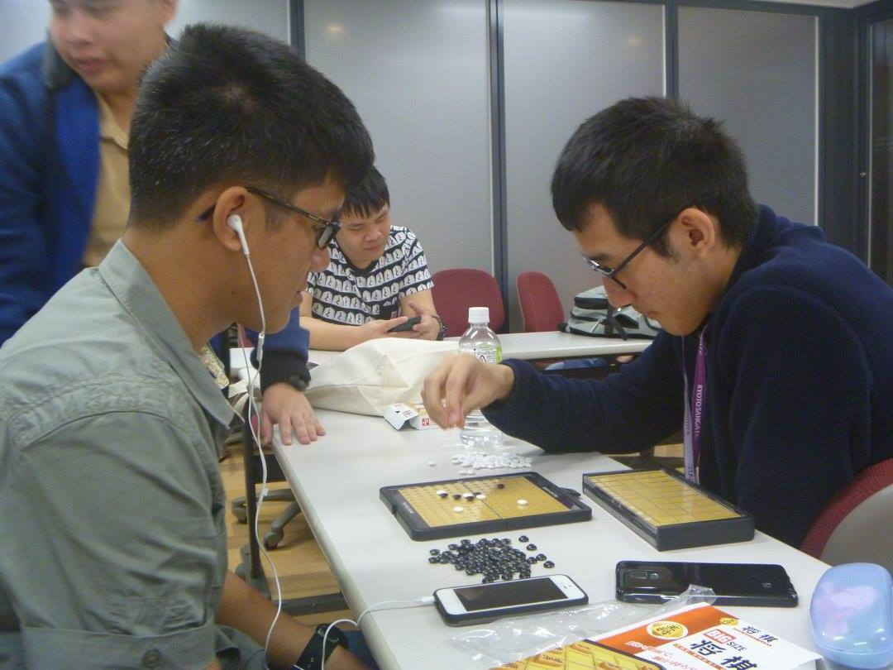

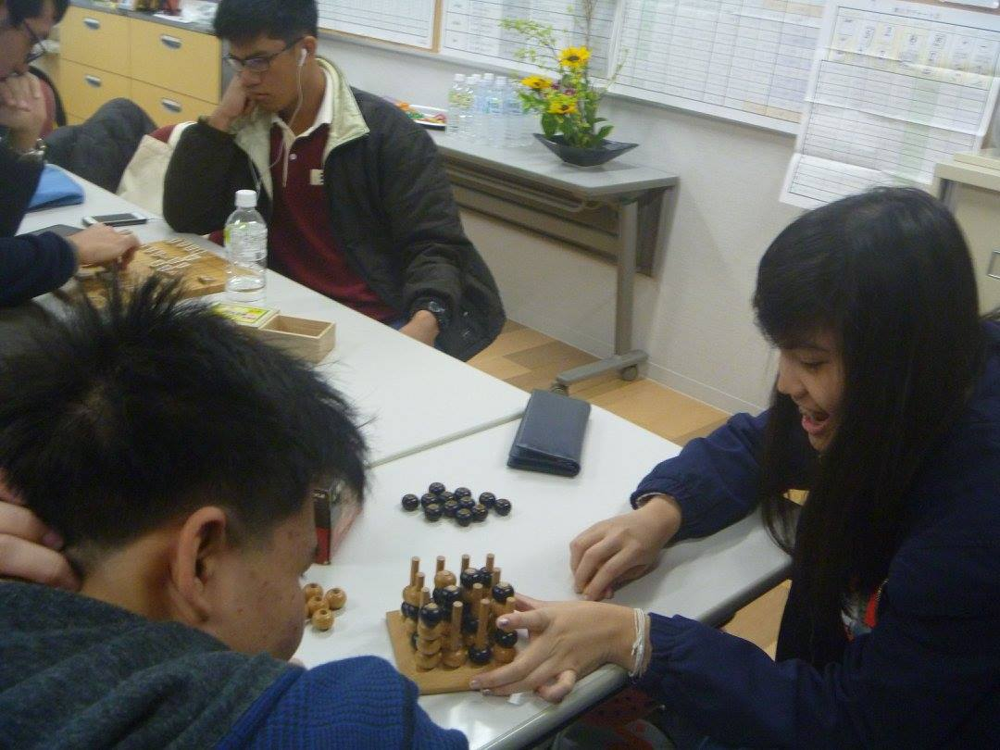

แต่ก่อนอื่น เอาภาพอาหารเช้ามาฝากครับ

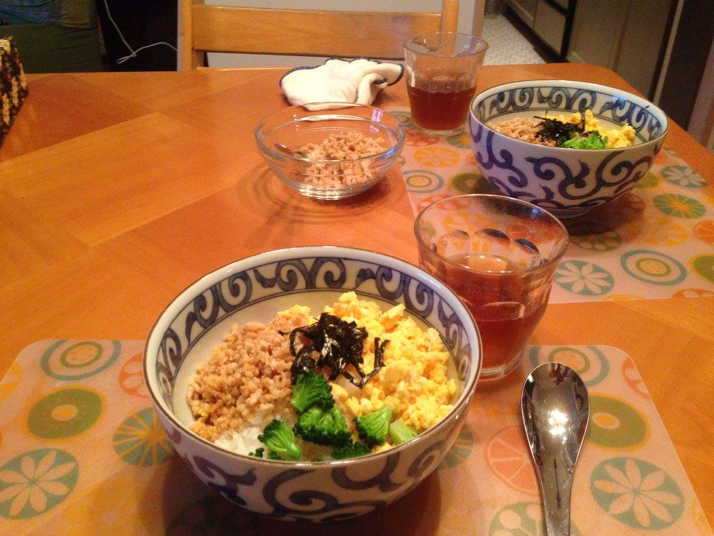

วันนี้มีแพลนจะไปที่ Ritsumeikan University เพื่อไปฟัง Lecture พิเศษจาก Prof. Takeshi Nakagawa ซึ่งเป็นผู้อำนวยการห้องปฏิบัติการศึกษาภัยภิบัติธรรมชาติ (มั้ง...ตรงนี้จำไม่ค่อยได้) หัวข้อการบรรยายก็คือ "How did mankind survive the period of misbehaving climate?" พูดถึงว่าความจริงแล้วภาวะโลกร้อนอาจจะไม่ใช่เรื่องเลวร้าย เพราะเป็นปรากฏการณ์ธรรมชาติที่เกิดขึ้นหลายครั้งแล้ว และยังพูดทำนองว่ายุคน้ำแข็งจะเกิดขึ้นทุก ๆ 100,000 ปี โชคดีที่เราอยู่ช่วง Post-glacial age ซึ่งเป็นช่วงหลังยุคน้ำแข็งไม่น่านานมาก
อาจารย์พูดภาษาอังกฤษเก่งมากเพราะเป็นนักเรียนนอก แล้วมีมุกที่ว่าให้ซื้อเครื่องซักผ้าแล้วลดภาวะโลกร้อนกันเถอะ (แกบอกว่าเอามาจากโฆษณาในอังกฤษล่ะมั้ง)

บรรยายเสร็จแล้วก็ได้เวลาข้าวเที่ยง เลยเก็บภาพมาฝากเล็กน้อย

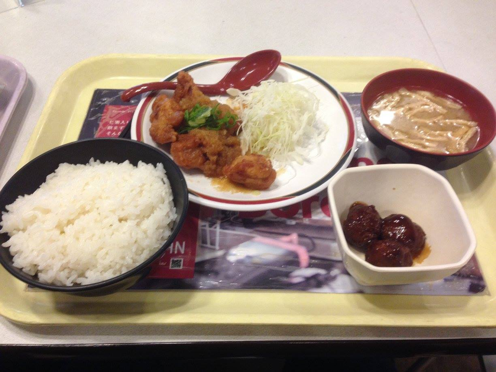

หลังจากนั้นเป็นของแถมจากตาราง คือการไปเยี่ยมชมห้องแล็บ Bio intellectual คือหุ่นยนต์ที่เลียนแบบพฤติกรรมของสัตว์เพื่อจุดประสงค์บางอย่าง เช่น ลอยน้ำ มุดท่อ บอกได้เลยว่าสุดยอดมาก ๆ (ถึงแม้จะรู้สึกว่า FIBO จะมีเยอะกว่าก็ตาม)

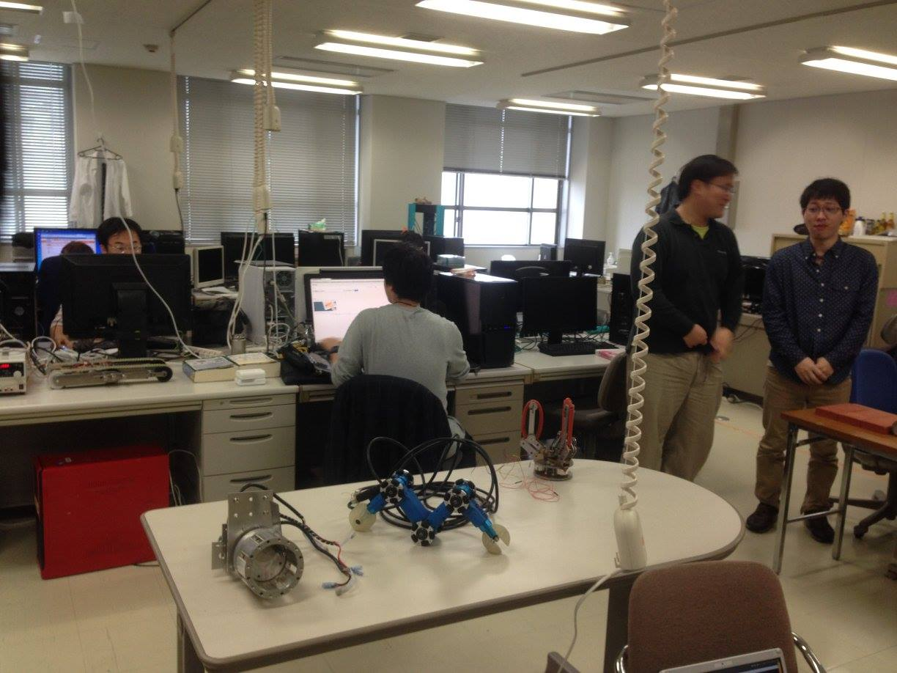

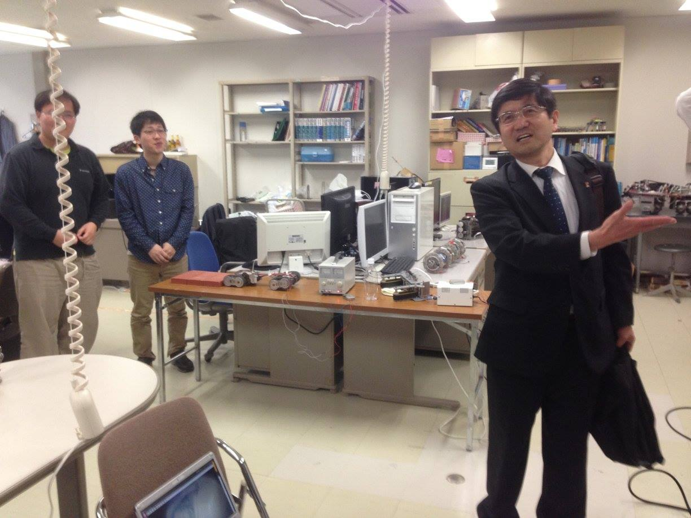

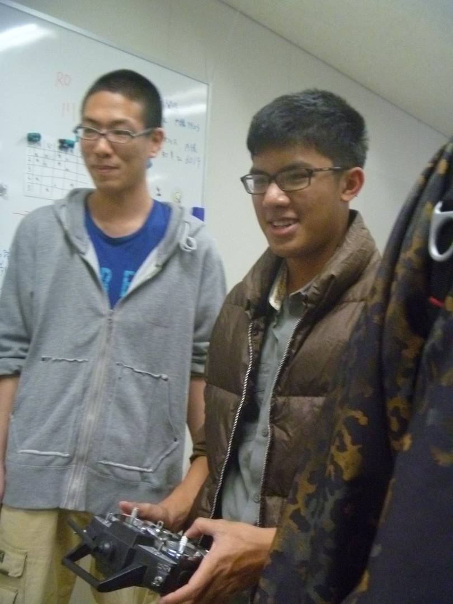

หลังจากนั้นแม่ Shun ก็มารับที่สถานีเกียวโตตอนประมาณ 5 โมง แล้วไปเดินห้างกับตุ่ย ฉัฏร และวิสกี้และแม่บัดดี้ดูอุปกรณ์ IT และหนังสือ และในที่สุดฉัฏรก็ได้หนังสือที่ตามหามาตลอดชีวิต (มั้ง...ยินดีด้วยนะครับ 555)

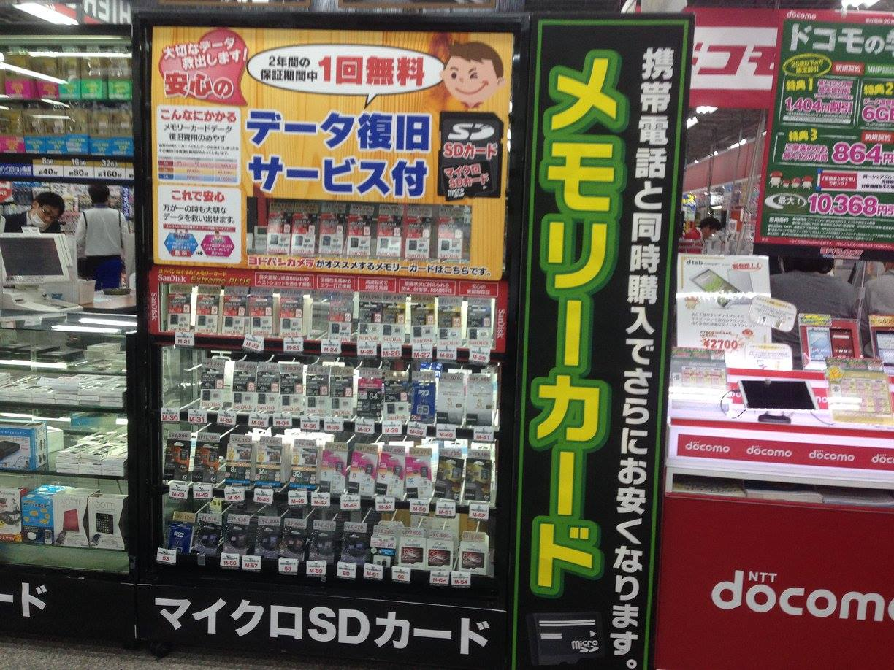

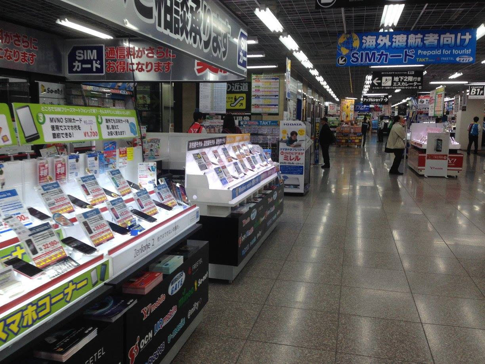

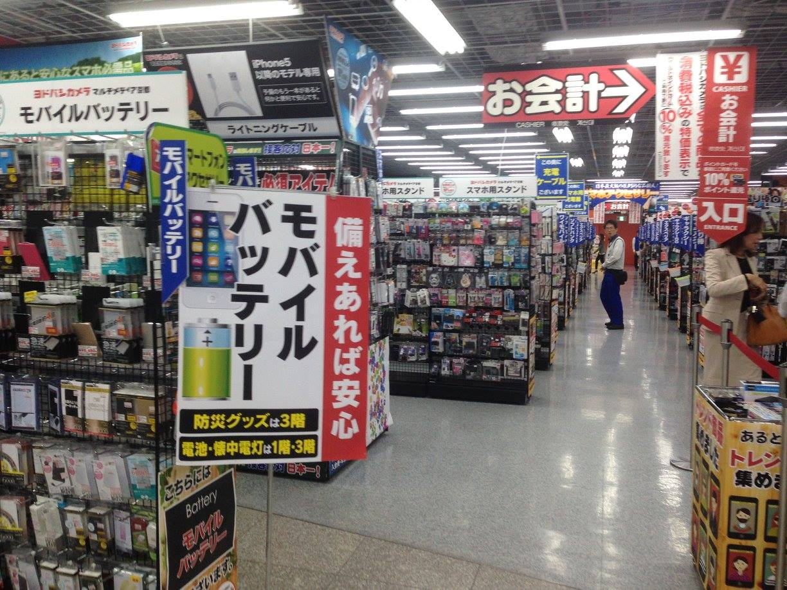

มีกาชาเป็นแถวเลย

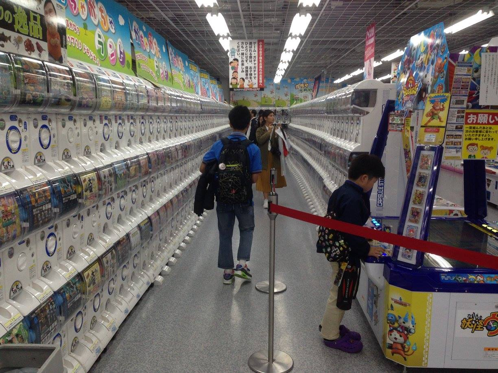

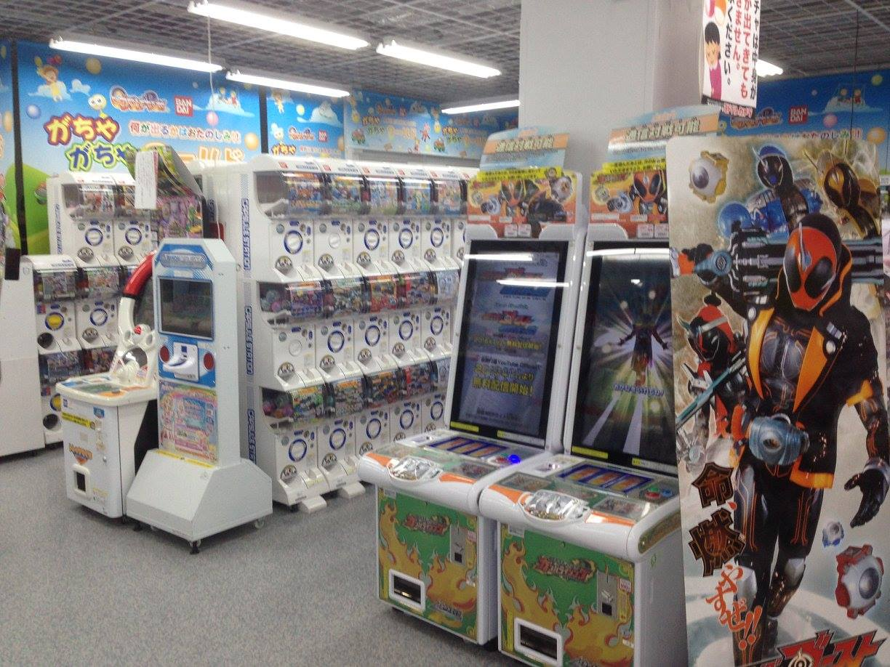

มีฟิกเกอร์ด้วย

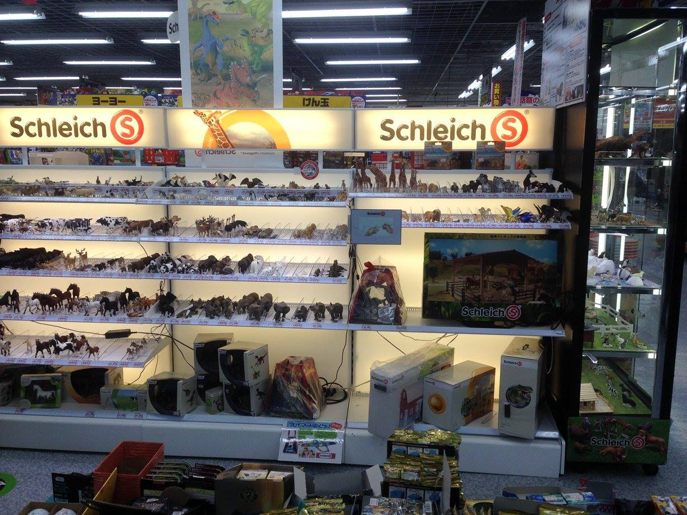

ทีแรกวันนี้จะได้ไปกินอาหารข้างนอก แต่ด้วยอุบัติเหตุนิดหน่อย (รถพ่อ Shun ยางแตก ไม่ได้ร้ายแรงอะไร) แม่ Shun เลยทำอาหารอิตาลีให้กินแทน แถมบอกว่าชอบทำอาหารอิตาลีมาก ๆ ก็แอบแปลกใจเล็กน้อยเหมือนกัน แต่อร่อยมากจริง ๆ