วันนี้เหมือนว่า Shun จะไม่มีซ้อมตอนเช้า ก็เลยมาถึงโรงเรียนประมาณ 8 โมงนิด ๆ (ที่นี่คาบแรกเริ่ม 8.30 น.) หลังจากนั้นประมาณ 9 ก็เดินทางกันอย่างทรหด (แม่*ทุกวันเลยอ่ะ เคยสงสัยเหมือนกันว่าคนญี่ปุ่นนี่เดินทางกันไกล ๆ อย่างงี้ตลอดเลยเหรอ) ไปยังสวนพฤกษศาสตร์ที่เก่าแก่ที่สุดของญี่ปุ่น ซึ่งรวบรวมพันธุ์พืชไว้ประมาณ 5% ของโลก คือคิดว่าคงเทียบไม่ได้กับสวนพฤกษศาสตร์บ้านเราอ่ะนะ คงจะชนะขาดอ่ะ แบบของเค้านี่ดีจนอยากอยู่ที่นั่นเลยอ่ะ

ระหว่างเดินทางก็เก็บภาพมาฝากเล็กน้อย

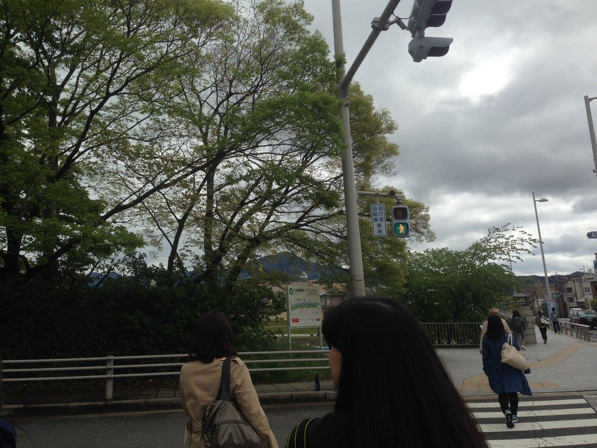

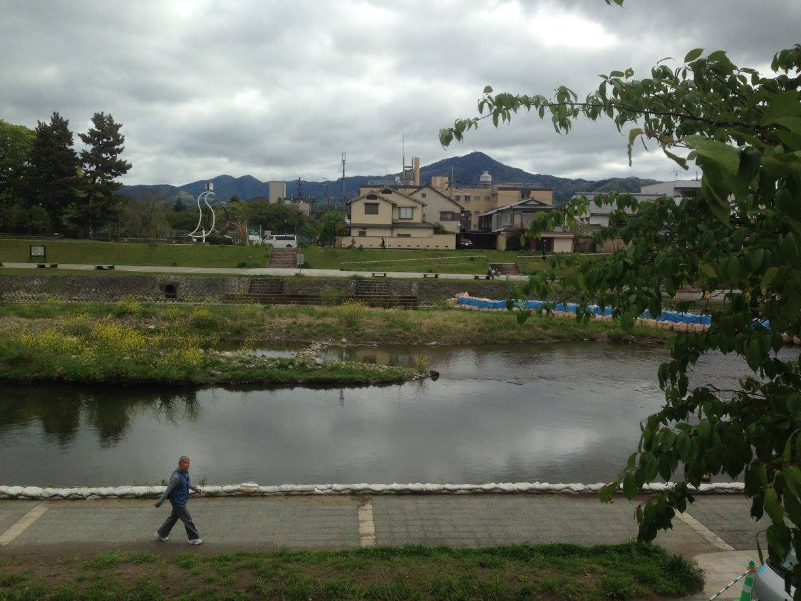

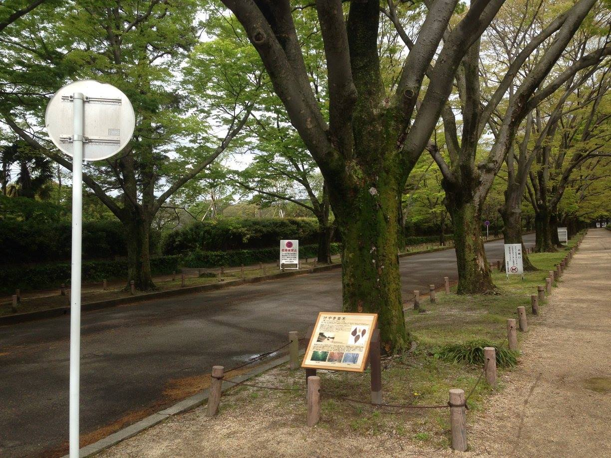

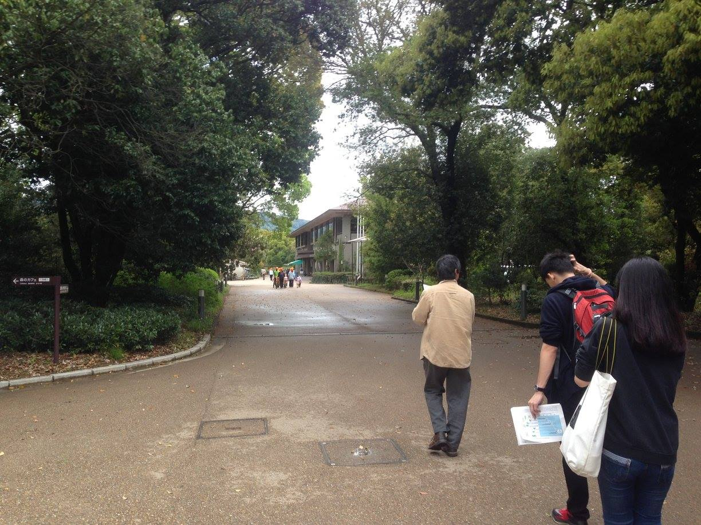

ถึงแม้วันนี้แดดจะแรง แต่ต้นไม้ก็ยังให้ความเย็นสบายมาก ๆ ดังนั้นเราควรซื้อเครื่องซักผ้าแล้วลดภาวะโลกร้อน (มาแบบลอย ๆ ไม่มี[แรงจูงใจ](https://blog.utopiabeam.dev/rits-exchange-day-4/)จริง ๆ นะ) และเนื่องจากตารางเวลาที่แน่นมาก ทำให้ต้องกินข้าวกลางวันภายใน 10 นาที แล้วทุกคนก็กินกันทันด้วย ทีแรกนึกว่าจะไม่ทันแล้วเชียว

และนี่ก็คือหน้าตาของเบนโตะตอนเที่ยง

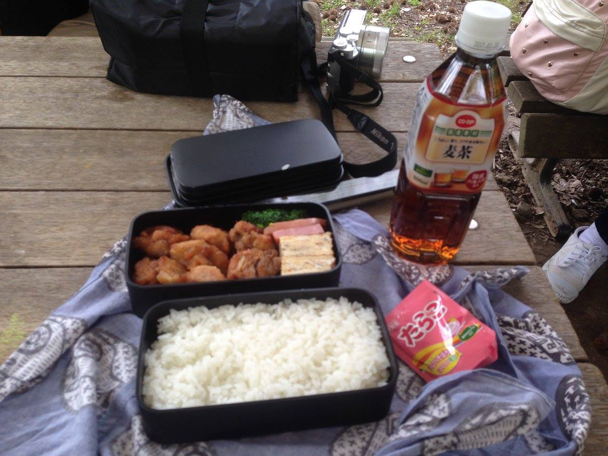

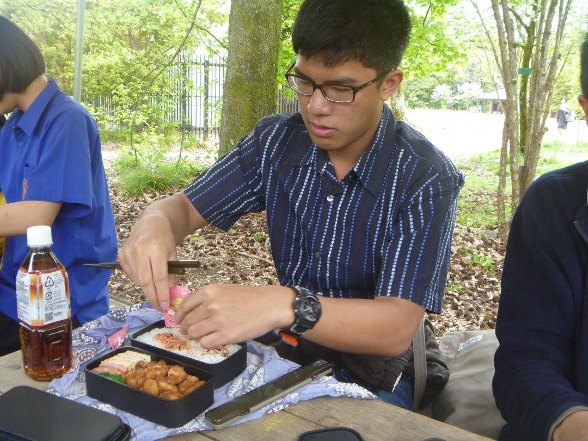

น่ากินล่ะสิครับ（´υ｀）ว่าแต่ทำไมรูปมันเบลอจังเนี่ย!

จริง ๆ ได้มาทุกวันแล้วแต่อาจจะไม่ได้เล่า มันจะมีผงโรยข้าวแบบซองสีชมพูนั่นแหละเรียกว่าฟูริคาเคะ (振り掛け / ふりかけ) โรยแล้วรสชาติอร่อยเหาะ

หลังจากกลับจากสวนพฤกษศาสตร์แล้วก็เข้าเรียนคาบชีวะกับ Grade 12/7 ที่ Shun และบัดดี้ของหลาย ๆ คนอยู่ เป็นการทำ Lab สนุก ๆ เกี่ยวกับ Transformation ของยีน (ไม่ใช่หุ่นยนต์แปลงร่างได้แต่อย่างใดนะจ้ะ) (เพิ่งเรียนไปเทอมที่แล้วเอง อาจจะตกด้วย TT) รอดูผลที่ได้วันจันทร์หน้า

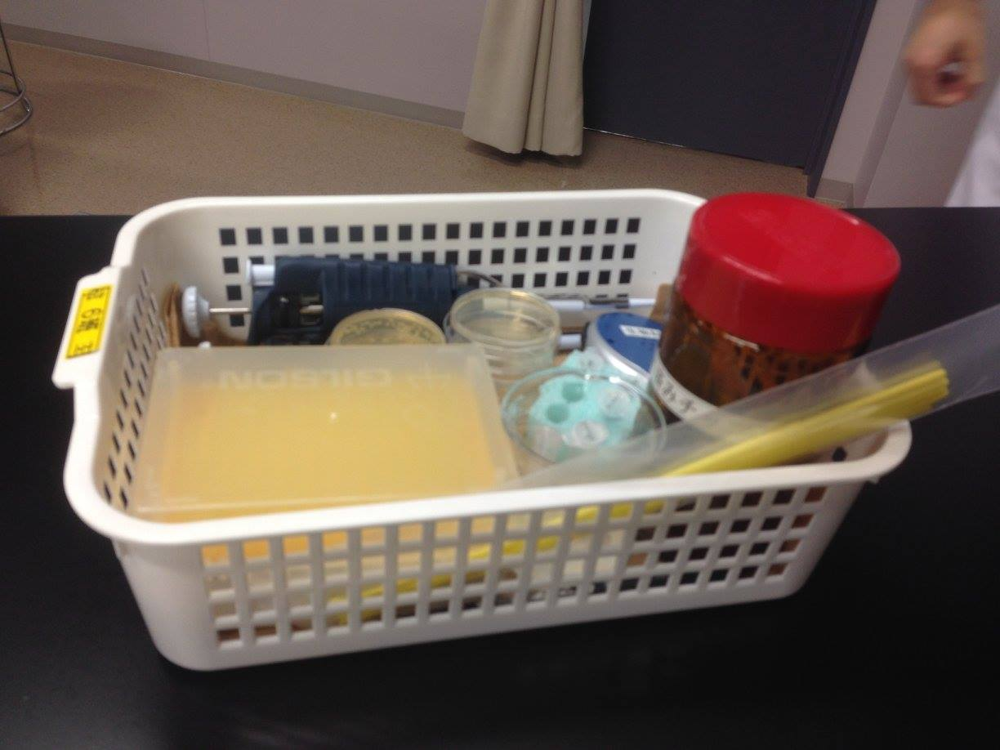

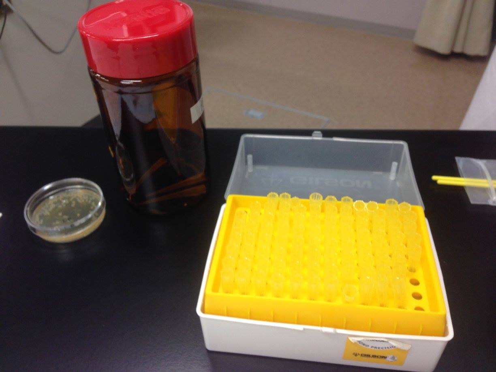

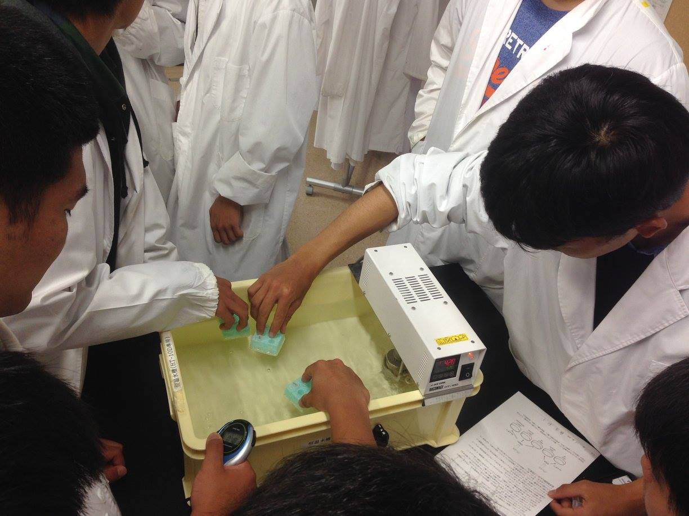

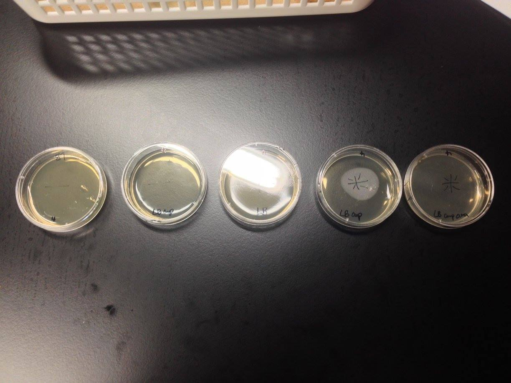

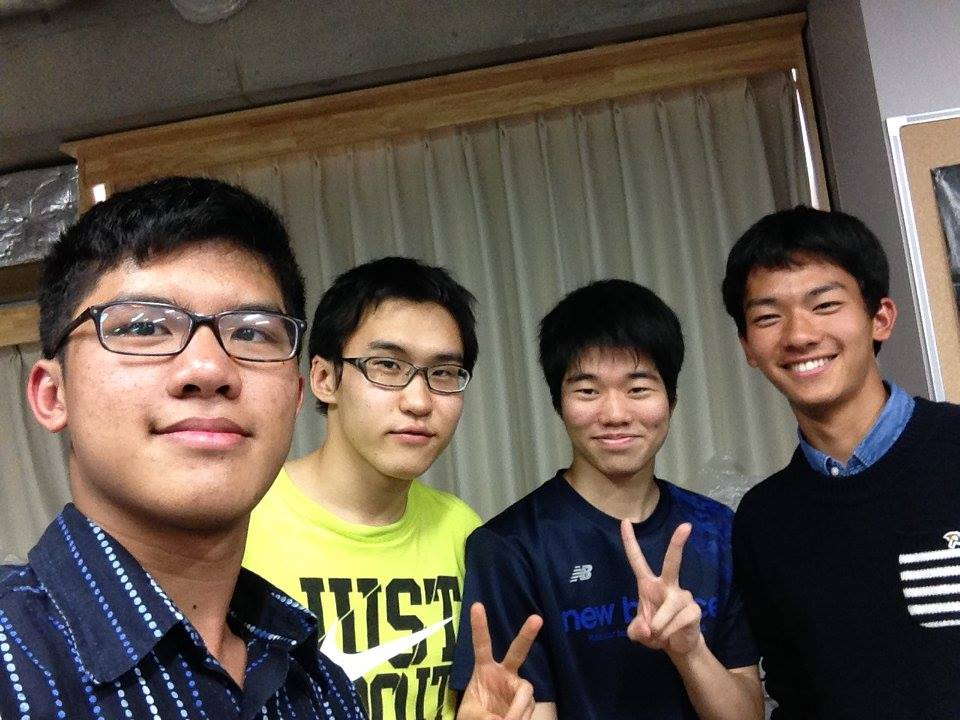

หลังจากนั้นก็เข้าร่วมชมรมเคนโด ได้ลองจับดาบเคนโดของจริงด้วยล่ะ (Woooowwwww!!!) เคยเห็นแต่ในอนิเมะ แล้วก็ดูการซ้อมแข่งกัน บอกได้เลยว่าคนละเรื่องกับตอนที่สอนเราเลย แล้วที่นี่คือเห็นความตั้งใจของทุกคนจริง ๆ อ่ะ แบบพร้อมเพรียงและเอาจริงกันมาก ๆ ถ้าไทยเป็นระบบชมรมแบบที่นี่ก็ดีเนอะ จะได้เขียนโปรแกรมไปทั้งชาติเบย...

วันนี้ตอนเย็นออกไปกินข้างนอกบ้านกัน หลังจากเมื่อวานมีเหตุฉุกเฉินนิดหน่อยเลยไปไม่ได้ ถ้าพูดถึงอาหารญี่ปุ่นก็ต้องซูชิไง ได้กินซูชิที่ญี่ปุ่นแบบจุใจมาก ๆ รสชาติก็ไม่ค่อยต่างจากของไทยมาก แต่ดูสดกว่านิดหน่อย เราว่าเรากินเยอะมาก ๆ เลย ตั้ง 13 จานแหนะ (มันเป็นซูชิสายพานจานละ 100 เยน มีทั้งหน้าแซลม่อน ทูน่า กุ้ง ปลาซาบะ ไข่ และอื่น ๆ) แต่ Shun นี่กินไปแบบบ้าคลั่งมากถึง 28 ชามเลยนะ 28 ชาม (ต้องย้ำมาก ๆ เพราะแบบมึงเอากระเพาะมาจากไหนวะฮะ กินดุมาก) และที่นี่ยังเป็นที่ที่เด็กชอบมามากเพราะถ้ากินครบ 5 จานจะได้ลุ้นของเล่นเล็ก ๆ น้อย ๆ 1 ชิ้น วันนี้กินไปรวม 55 จานเลยได้สิทธิ์ 11 ครั้ง แต่ได้รางวัลอยู่ 2 อัน

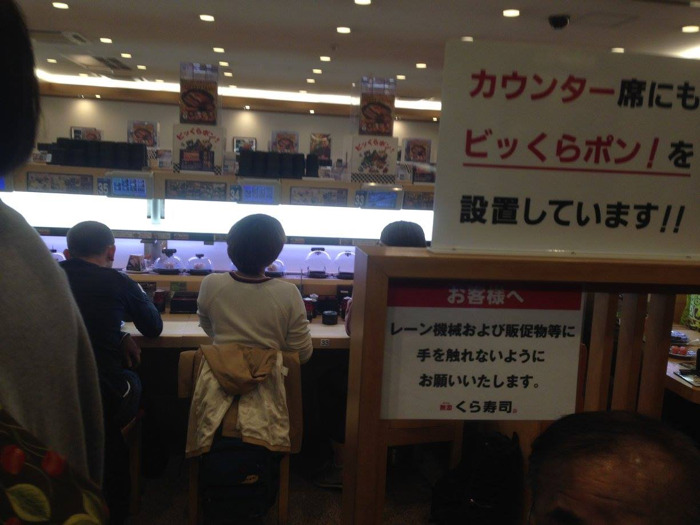

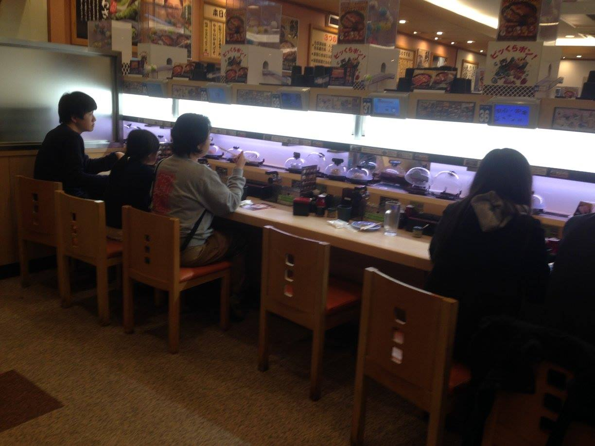

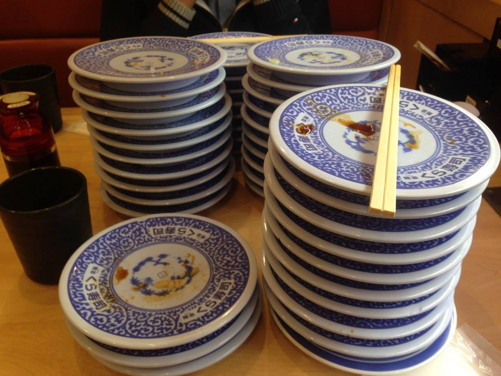

หลังจากพูดถึงมาหลายบล็อกแต่ยังไม่มีหน้าชัด ๆ ขอแนะนำให้รู้จักกับ Fujii Shun บัดดี้ของผมเองครับ

ที่เห็นจานน้อย ๆ นี่คือเก็บไปหลายครั้งแล้ว

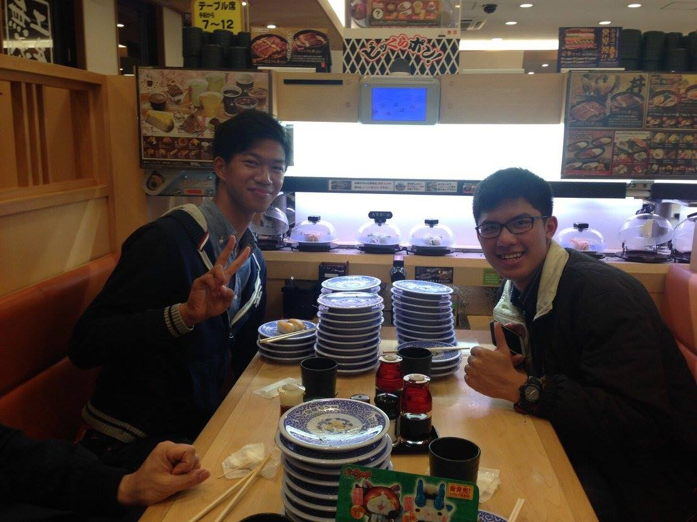

วันนี้กลับบ้านไปอิ่มยาว ๆ เลย หลังจากกลับมาถึงบ้านแล้วก็ให้ Shun สอนเล่น Duel Master ให้ เพราะ Shun เคยเล่นตอนเด็ก ๆ (ทีแรกที่ฟังก็นึกว่าเป็น Duel Monster ซะอีก แอบผิดหวังเล็กน้อย) หลังจากนั้นก็เข้านอนเลย เพราะซูชิอร่อยมาก ๆ (ไม่เกี่ยว = =)