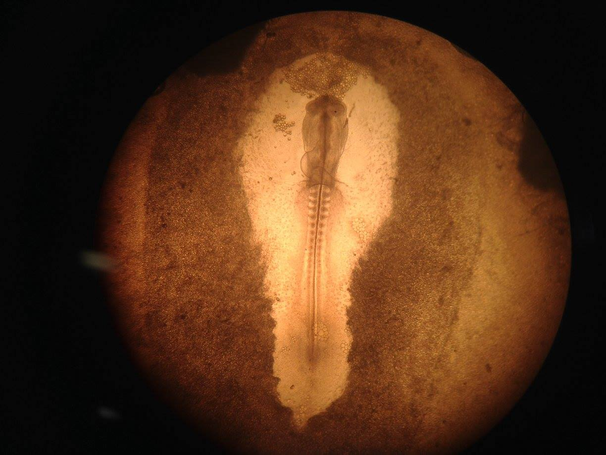
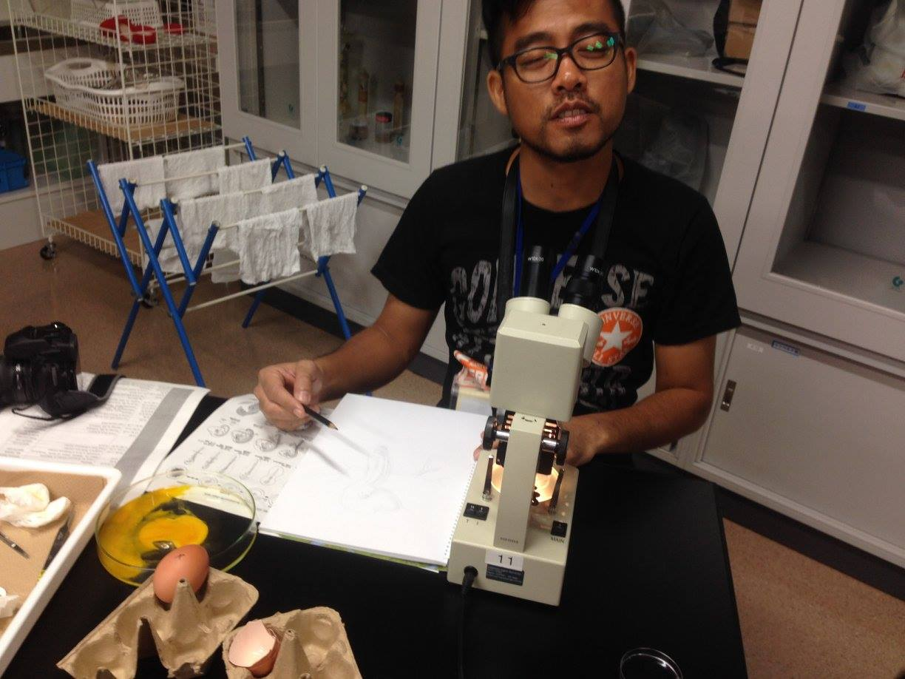
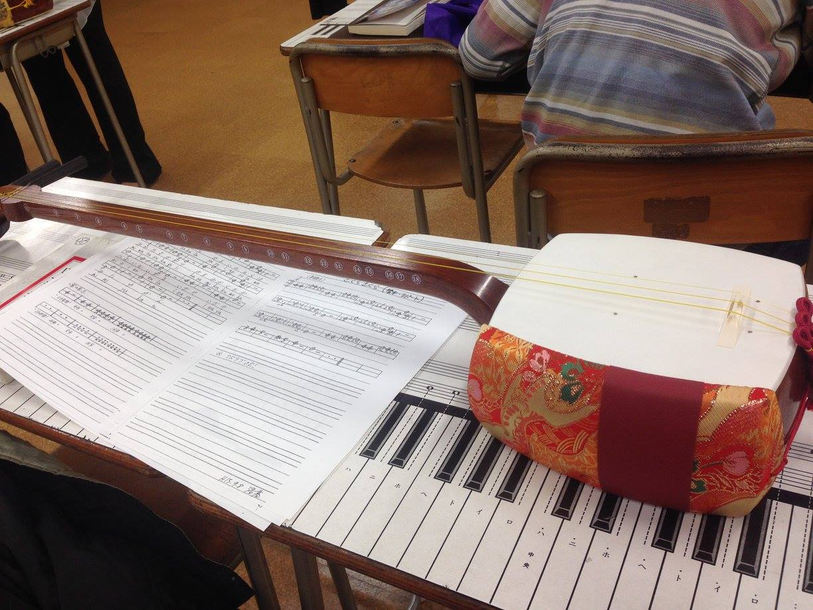
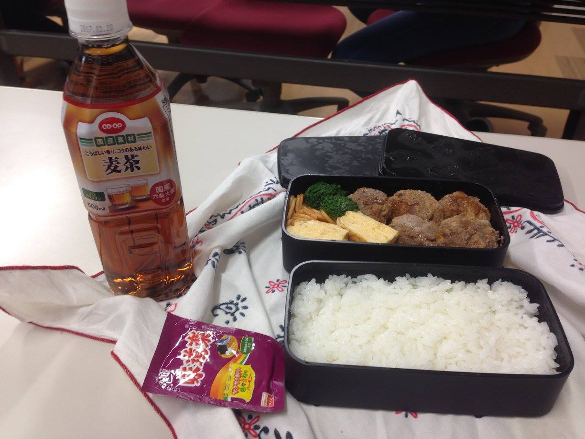
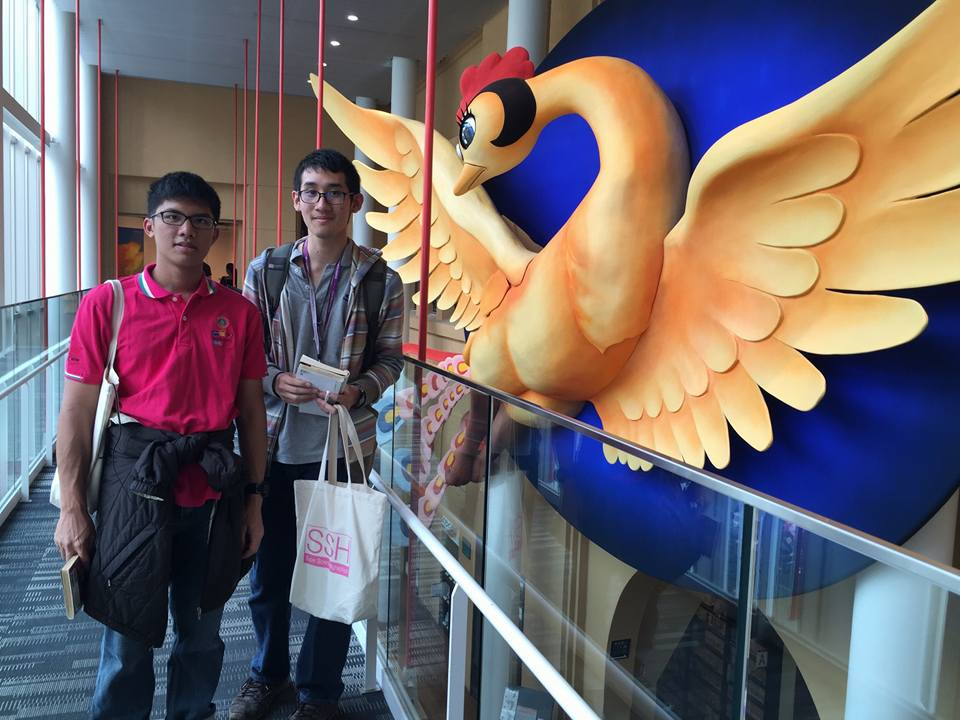
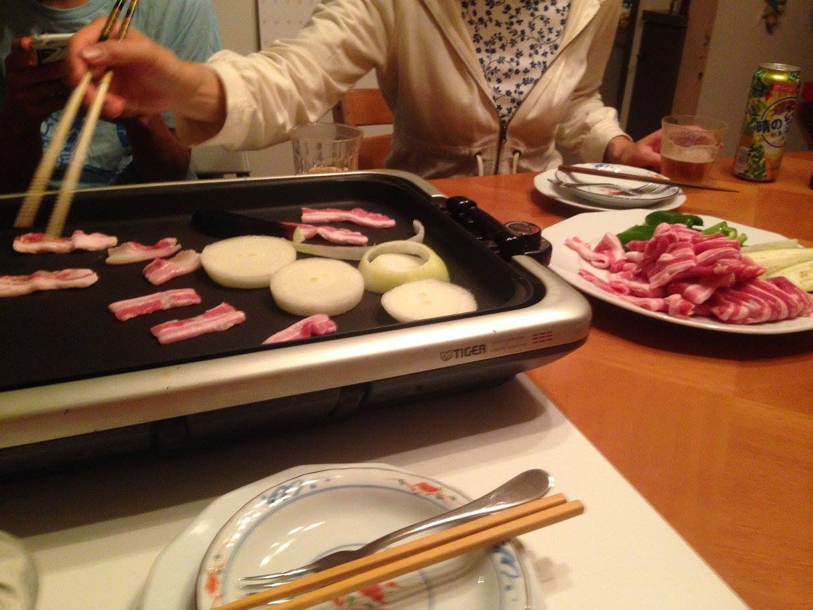
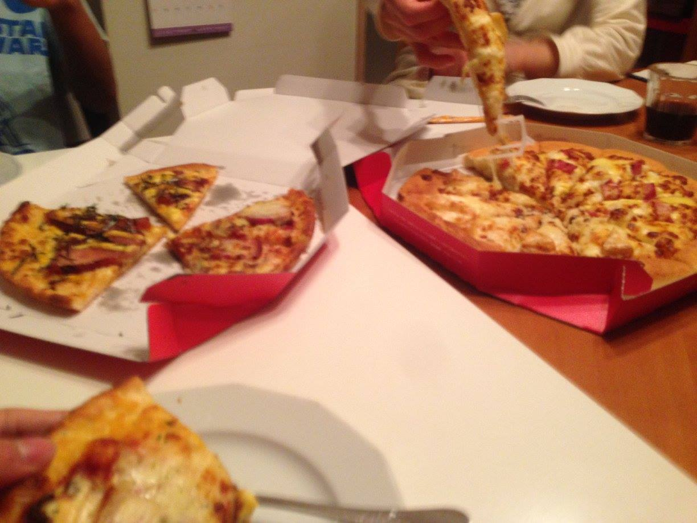
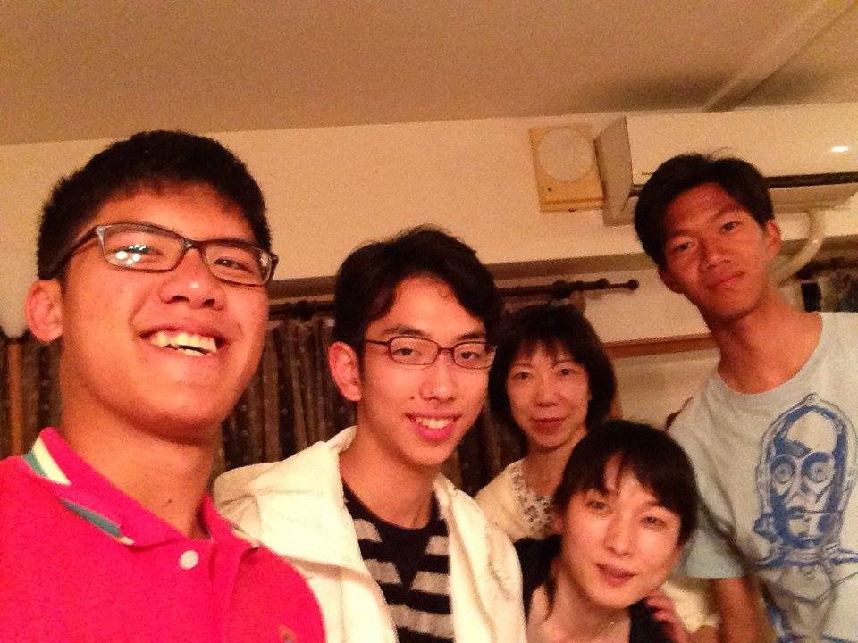

# เฮ้ย! วันนี้วันเสาร์แล้ววว

วันนี้เป็นวันเสาร์ ก็เลยอยู่บ้านสบาย ๆ ไม่ต้องตื่นเช้าอะไร... อย่างน้อยก็คิดแบบนั้น ประเด็นคือมันไม่ใช่ไง!! คือที่นี่วันเสาร์ก็ยังมีเรียนครึ่งเช้า ก็เลยต้องตื่นเช้าไปโรงเรียนกับ Shun ด้วย ช่างเป็นวันเสาร์ที่น่าเศร้าจริง ๆ

ทีแรกในตารางมีเรียนเคมี แต่เค้าดันพิมพ์ผิดหรือไงไม่รู้ สรุปได้เรียนชีวะแทน วันนี้ก็ทำ Lab เรื่องการศึกษา embryo ของไก่ เป็น Lab ที่ต้องอาศัยความมือเบามาก ๆ แต่ก็ผ่านไปได้ด้วยดี (Embryo บางคนชัดมาก บางคนก็เป็นศิษย์เอก อ มานนท์ วาดรูปสวยมาก)

ต่อมาก็ไปเรียนวิชาดนตรี ได้เล่นเครื่องดนตรีเก่าแก่ของญี่ปุ่นที่ชื่อชามิเซ็น (shamisen, 三味線) เล่นเพลงชื่อดังของญี่ปุ่น อ เค้าบอกว่าคนทั่วไปใช้เวลา 3 วัน แต่สงสัยเด็ก MWITS จะไม่ธรรมดา (ก็จริงอ่ะนะ > <) เล่นได้ภายใน 20 นาทีอย่าง(น่าจะ)ไพเราะ

และคาบสุดท้ายของวันนี้ก็คือคาบ SSG (เหมือนจะเป็นคาบวิทยาศาสตร์อะไรซักอย่าง) กับ G12/7 และก็มีเพื่อนเรา 2 คนคือตุ่ยกับฉัฏรพรีเซนต์โครงงานของตัวเอง ซึ่งก็ทำกันได้ดีมาก ๆ

หลังจากนั้่นก็กินช้าวเที่ยง และนี่คือภาพประกอบ

เพราะว่า Shun มีชมรมต่อ แม่ของ Shun ก็เลยมารับเราที่โรงเรียนตอนบ่ายโมง แล้วออกจากโรงเรียนพร้อมกับฉัฏรและแม่บัดดี้ไป Mange museum สวรรค์แห่งมังงะชัด ๆ เข้าไปนี่คือมังงะเต็มไปหมดจากทั่วทุกมุมโลก (มีของไทยด้วยนะ พวกขายหัวเราะอะไรอย่างงี้) มีการแสดงด้วย (น่าจะเป็นการแสดงนะ) มีเด็กอยู่ด้วยประมาณ 4-5 คน ดูครึกครื้นกันมาก ดูแล้วก็สนุกดีนะ

เสียดายที่ในนั้นถ่ายรูปไม่ค่อยได้ สงสัยกลัวเรื่องลิขสิทธิ์ เลยมีแค่รูปนี้แหละ

หลังจากนั้นตอนเย็นก็มีเพื่อนของ Shun และแม่ของเค้ามากินข้าวเย็นที่บ้านชื่อ Yuto ซึ่งเคยเป็นโฮสของเด็ก MWITS ด้วย ก็เลยได้คุยกันนิดหน่อยเกี่ยวกับเด็ก MWITS และเลข (Yuto เป็นสายแข่งเลข)

รูปมันเหลืองเพราะแสงไฟ และตอนนั้นแต่งรูปไม่เป็น...​(ตอนนี้ก็ขี้เกียจแต่ง)
