ตอนแรกที่เห็น[โพสประกาศ](https://www.facebook.com/scb.thailand/posts/10157188625293545/)งานนี้ก็ไม่ได้อยากมาอะไรเพราะน่าจะออกแนว business ซึ่งไม่ใช่สาย dev อย่างผม และผมก็ไม่ชอบงานแบบนี้เท่าไหร่ แต่พอโดนรุ่นพี่ล่อซื้อแบบ 100% ก็เลยคิดว่าควรจะลองก่อนที่จะไม่ชอบ สุดท้ายก็ตกลงเข้าทีมกับ[พี่ฟา](https://www.facebook.com/WhatTheFar1999) [พี่เปียว](https://www.facebook.com/piriyapong.lao) และ[พี่นัย](https://www.facebook.com/naisk133)นั่นเอง

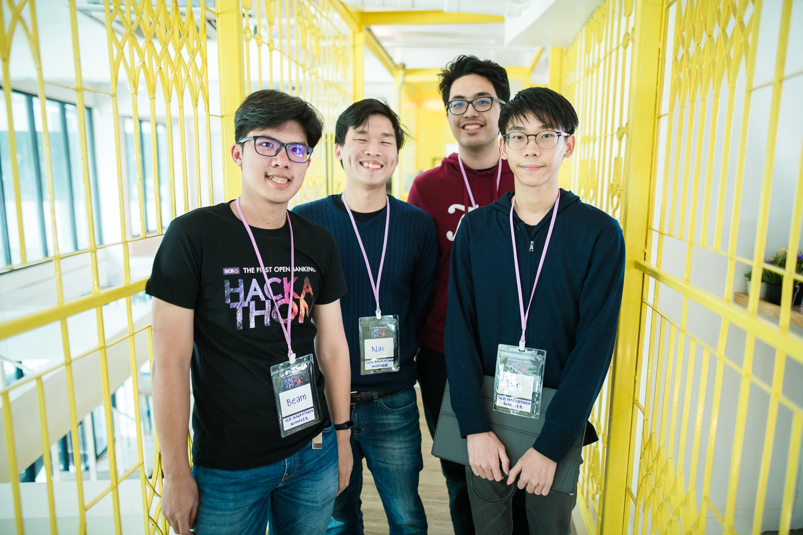

ขอข้ามเรื่องตอนสมัครเลย เพราะไม่ได้สมัครเอง (พี่ฟาสมัครให้)​ แต่เท่าที่รู้คือรอบ qualify โหดเอาเรื่อง เพราะมีทีมรุ่นน้องในชมรมหลายคนก็พลาดโอกาสไปอย่างน่าเสียดาย

# Day 1

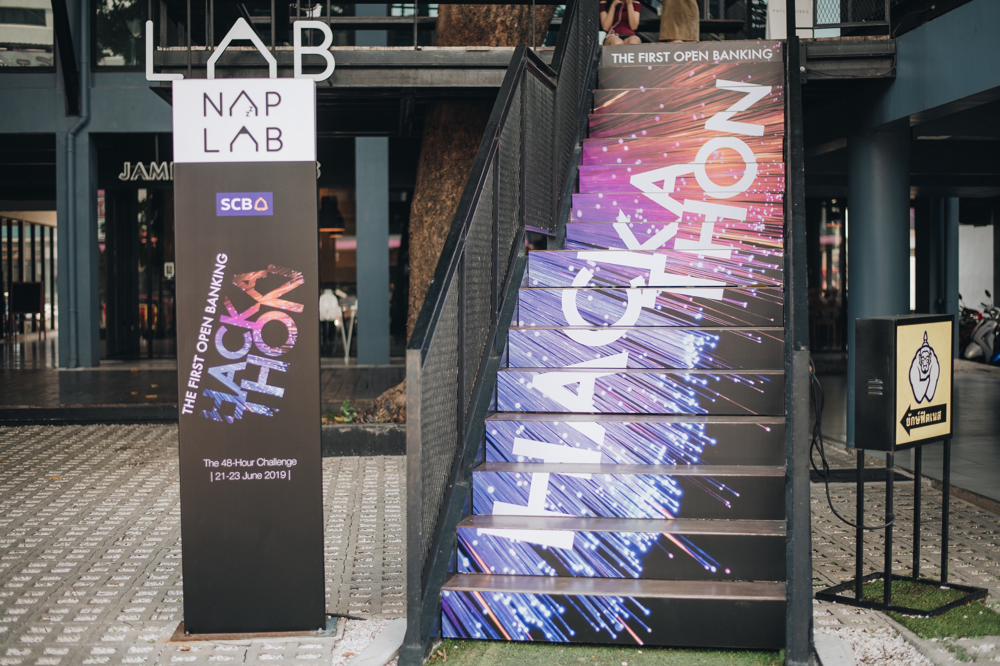

งานจัดที่ [NapLab Chula](https://www.facebook.com/NapLab-Chula-808498162583752/) ที่โดนเพื่อนขายมาหลายรอบแล้ว วันนี้ได้มาจริง ๆ ซะที

ผมมาถึงงานช่วงเริ่มลงทะเบียนประมาณ 16.30 น. แต่เพราะพี่คนอื่น ๆ ทำงานกันเลยรอถึงประมาณ 17.30 น. บอกเลยว่ายืนรอคนเดียวเหงามากกกกกกก

พอถึงเวลาพิธีกรก็เปิดงานบอกเล่าความเป็นมาและ requirement ในการแข่งขันครั้งนี้ พอรู้ criteria ของการแข่งก็กล้าพูดเลยว่าเป็นส่วนผสมระหว่าง tech กับ business ที่ลงตัว เพราะ criteria ให้คะแนนกับ tech หนักมาก หลัก ๆ คือได้ใช้ API ที่ให้มาจริง ๆ และให้คะแนนกับแนวคิดทาง business ที่น่าสนใจด้วยเหมือนกัน

หลังจากนั้นก็เริ่ม hack กันยาว ๆ แต่ด้วยความที่ทีมเราทำการบ้านมาไม่มากและเป็น dev จ๋าทั้งสี่คนทำให้ขาดไอเดียหนักมาก เพราะ API ที่ได้มาดูทำอะไรได้ไม่ค่อยเยอะ (แค่จ่ายบิลกับกู้ยืม) พอคิดไปคิดมาก็มีพ่อของคนในทีมที่ทำงานเกี่ยวกับ law firm บอกว่าน่าลองทำเกี่ยวกับวงแชร์เพราะใคร ๆ ก็เล่น รวมถึงแม่ผมด้วย… คนในทีมก็เฮฮากันใหญ่เพราะเป็นไอเดียที่ปั่นมาก แต่ก็น่าสนใจมากเหมือนกัน

พอได้ไอเดียแล้วก็ลงมือแบ่งงานและเริ่ม dev กับทำ slide ผมรับผิดชอบส่วน backend ก็เลยเริ่มทำในส่วน authentication และลองวาด wireframe และ user journey คร่าว ๆ ของระบบ จนถึงประมาณตีสามรู้สึกไม่ไหวแล้วก็เลยไปนอน

# Day 2

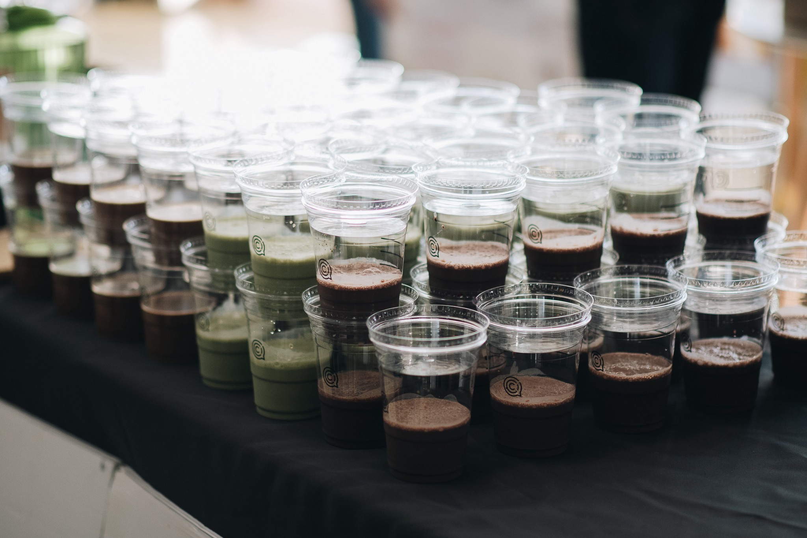

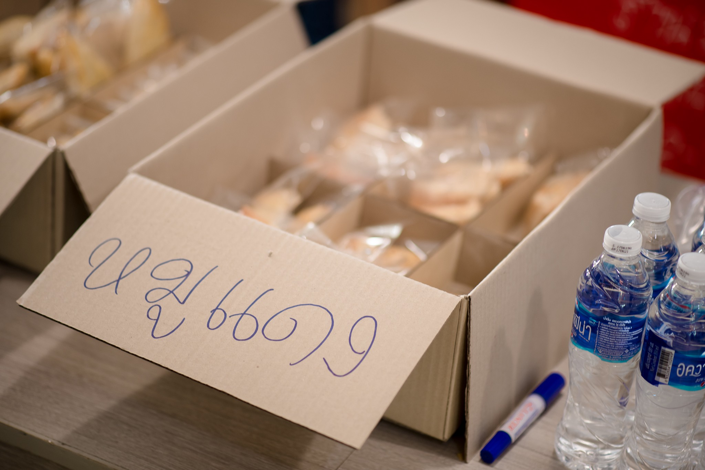

ตื่นมาประมาณ 6 โมงเช้า หร้อมเริ่มวันใหม่ด้วยช็อคโกแลตและอาหารยามเช้า พี่ ๆ ในทีมบอกว่าเมื่อคืนลองศึกษาเรื่องกฎหมายแล้วก็รู้สึกว่าไอเดียนี้สุ่มเสียงหลายประเด็น ก็เลยต้องหาทางหลบหลีกกฎหมายด้วยการเปลี่ยนไอเดียให้คล้าย ๆ เล่นแชร์ สุดท้ายกลายเป็นอีกไอเดียคือ P2P lending และเชียร์ว่าให้ไปทางนี้

หลังจากล้างขี้ตาก็เลยนั่งร่าง wireframe และ user journey ของไอเดียใหม่ แล้วก็เริ่ม dev กันไปเรื่อย ๆ จนถึงช่วง 11 โมง ซึ่งเปิดโอกาสให้จองคิวคุยกับ mentor ในงาน ทีมเราเลยจองไปสามคน และตกลงว่าจะลองเล่าไอเดียทั้งสองให้ mentor ฟัง หลังจากนั้นก็กินข้าวเที่ยงกัน

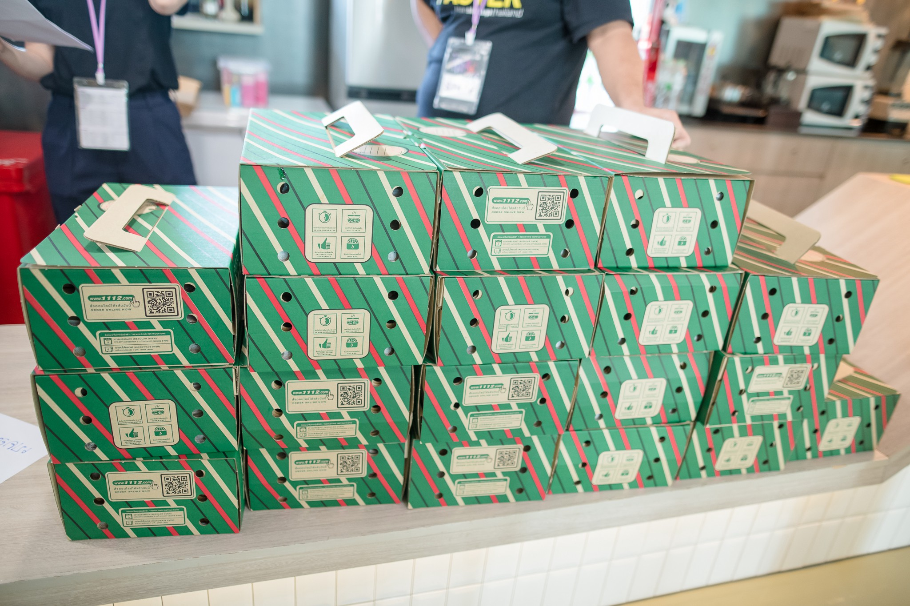

ปรากฏว่าหลังจากได้เห็น reaction จาก mentor ทั้งสามแล้วก็รู้สึกว่าไอเดียวงแชร์ดูตื่นเต้นมากกว่า จนต้องกลับมาตัดสินใจอีกครั้งว่าจะทำไอเดียไหนดี

หลังจากคุยกันอย่างเคร่งเครียดก็สรุปว่าจะทำไอเดียวงแชร์ (ทีมชอบความตื่นเต้นเร้าใจ 555) เพราะ mentor บอกว่าเป็นไอเดียที่แปลกและไม่มีคนทำ ในขณะที่ P2P ดูโหลมาก ประกอบกับหลังจากอ่านกฎหมายอย่างละเอียดอีกครั้งก็พบว่าไอเดียเราไม่ได้ผิดกฎหมายอะไร

โชคดี(?)ที่ฝั่ง demo ยังไม่ถึงไหนก็เลยเลี้ยวกลับได้ แต่ challenge ใหญ่หลวงคือต้องส่งงานตอนเที่ยงวันพรุ่งนี้ และเหลือเวลาอีกแค่ 16 ชม. ถือว่าหนักเอาการ

ระหว่างนี้มี session ที่น่าสนใจชื่อ “Picth to win!” โดย[พี่ JoeZ](https://www.facebook.com/joezcc) พิธีกรสุดหล่อของเรา session นี้ให้คำแนะนำในการทำ slide และ presentation ที่ดีมาก และสามารถนำไปใช้ได้กับทุก presentation เลย

หลังจบ session ก็เริ่มปั่น demo กันอย่างหนัก แก้บั๊ก backend ที่ไม่เข้าใจว่ามายังไงเหมือนกัน ช่วงนี้คือเดินเข้าไปหา technical support team บ่อยมาก และทีมพี่ ๆ ก็เก่งมากจริง ๆ สุดท้ายก็แก้บั๊กของ authentication/authorization เสร็จและลุยต่อ API กับ frontend จนถึงตีสามแล้วก็หลับไป

# Day 3

วันนี้ตื่นมา 6 โมงเช้ายังเห็นพี่ฟานั่งทำงานอยู่และยังไม่ได้นอนเพราะยังมีบางหน้าไม่เสร็จและต่อกับ backend นับถือในสปิริตพี่มาก ๆ ครับ (ปรบมือ)

หลังจากกินข้าวเช้าเสร็จแล้วก็ลุยแก้บั๊กระบบ deeplink ต่อ นั่งงมอยู่นานจนถามพี่ทีม tech support อีกครั้งถึงได้รู้ว่าชื่อ parameter ผิด (ต้องเปลี่ยนจาก `ref1` เป็น `Ref1`) หลังแก้ตรงนี้เสร็จก็ลอง test flow ของ demo ดู ปรากฏว่าเวิร์ค!!! งาน dev ก็เลยจบและเปลี่ยนมาเตรียม pitch แทน

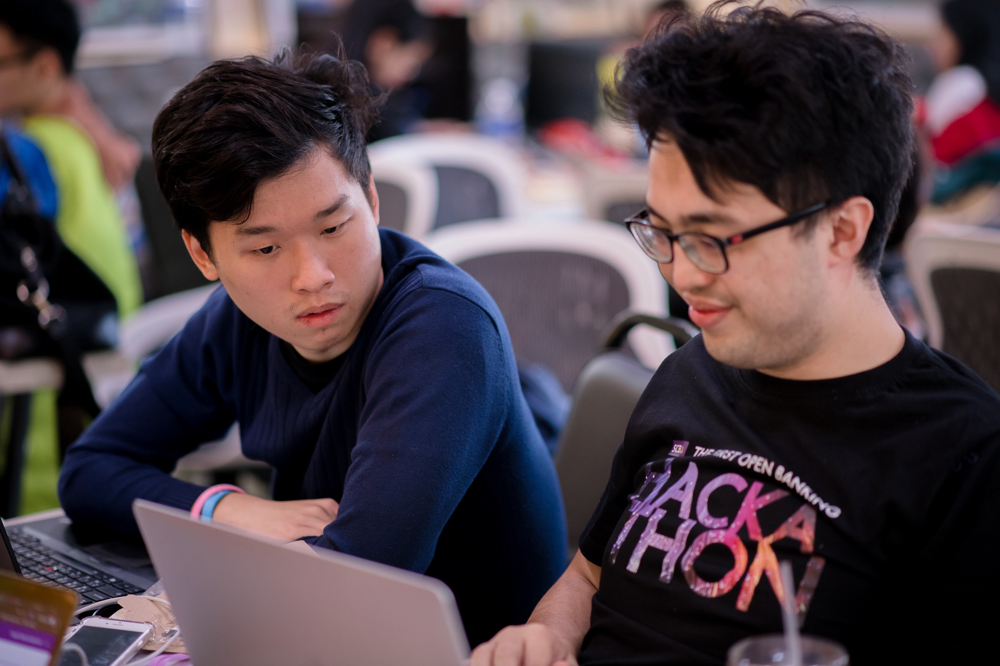

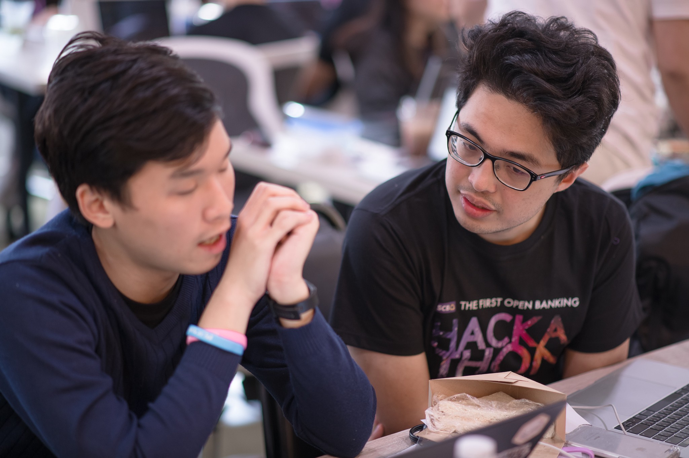

ช่วงประมาณ 11 โมงทีมงานได้สุ่มลำดับและห้องที่จะ pitch ซึ่งเป็นโชคดีหรือโชคร้ายก็ไม่รู้ที่ได้ลำดับสุดท้ายเลย

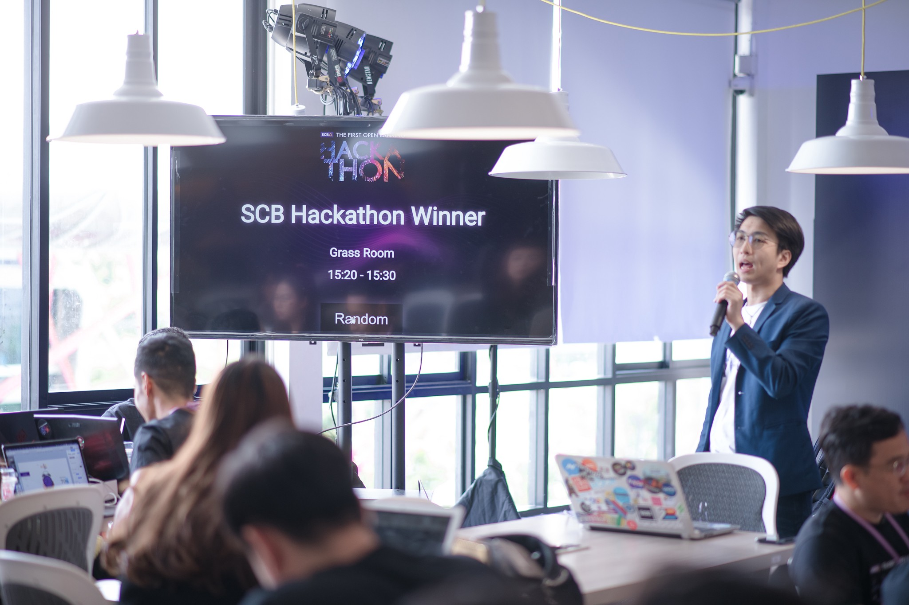

เราไปเตรียมตัวกันก่อน pitch จริงประมาณ 5 นาทีที่หน้าห้อง pitch ปรากฏว่า demo พังไปรอบนึงเลยแก้กันง่วนจนใช้ได้ เป็นลางร้ายตั้งแต่ก่อนเริ่ม…

ตอน pitch จริงผ่านไปได้ด้วยดีจนถึงตอน demo ด้วยความที่เน็ตช้ามากและไม่ได้ optimize demo เลยทำให้โหลดค้างนานมากจนไม่ได้โชว์ครบ flow แต่ feedback ดูดีทำให้รู้สึกโล่งใจมาก

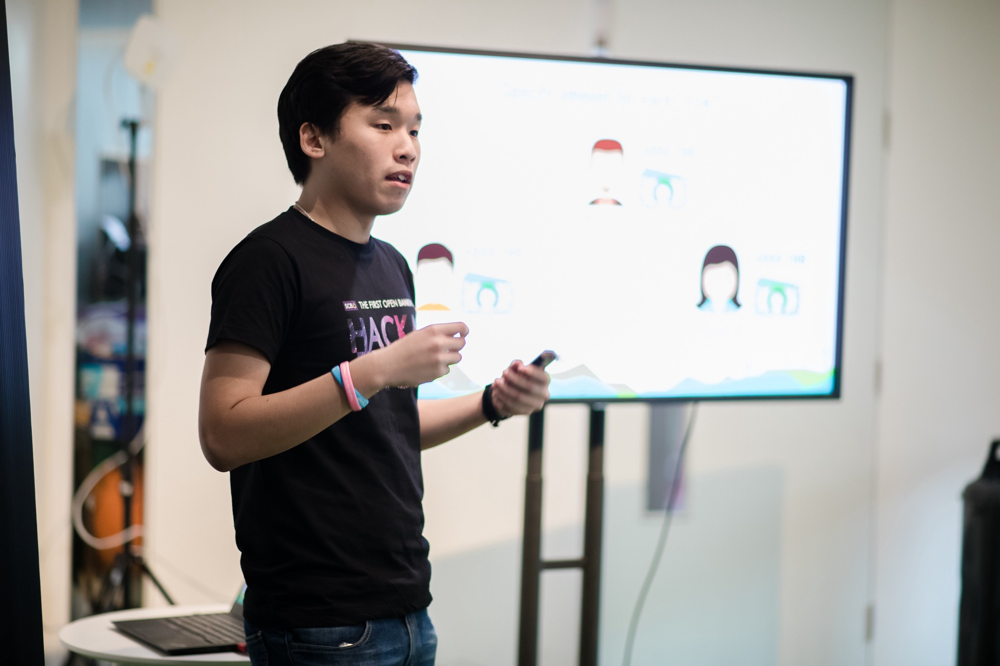

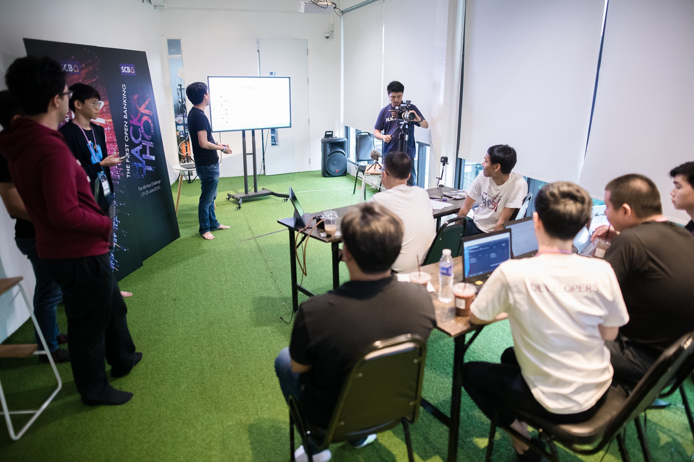

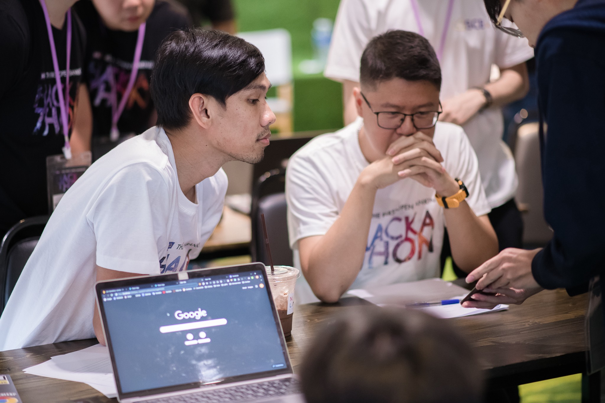

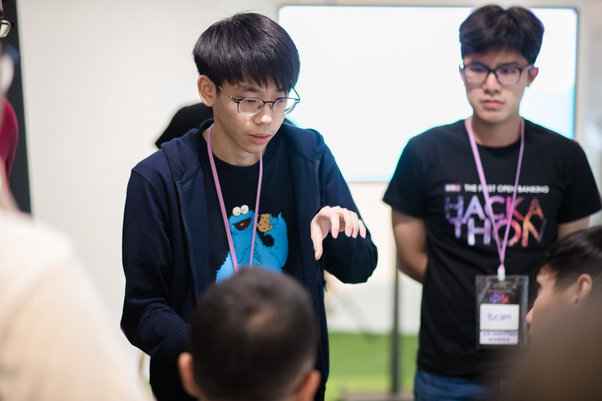

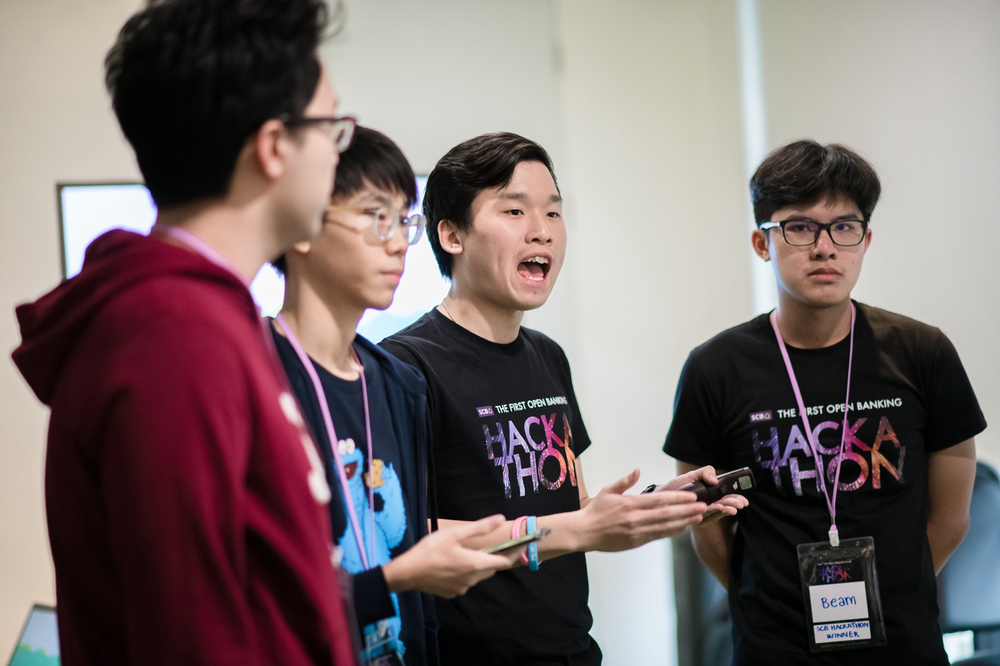

ช่วงประมาณ 16.30 น. ก็ประกาศผลผู้ชนะสามทีมและให้ออกไป pitch อีกครั้ง ผลก็คือเราไม่ได้เป็นหนึ่งในผู้ชนะ บอกตรง ๆ ว่าแอบเซ็งอยู่เหมือนกัน แต่ยอมรับและชื่นชมผลงานของทีมที่ชนะทั้งสามทีมจริง ๆ

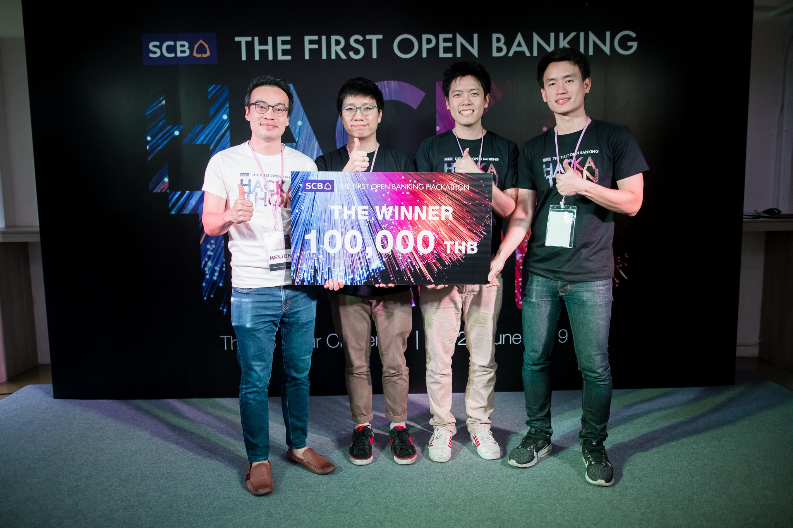

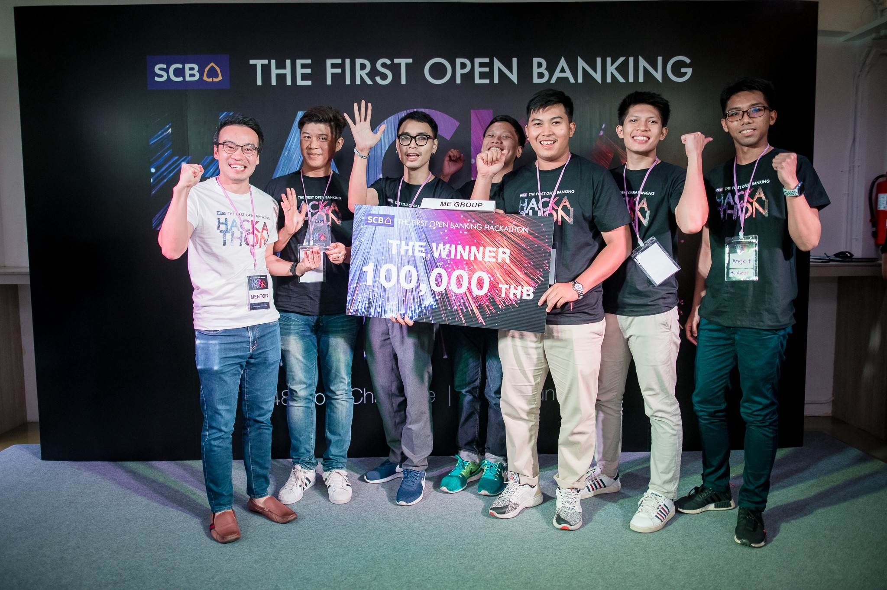

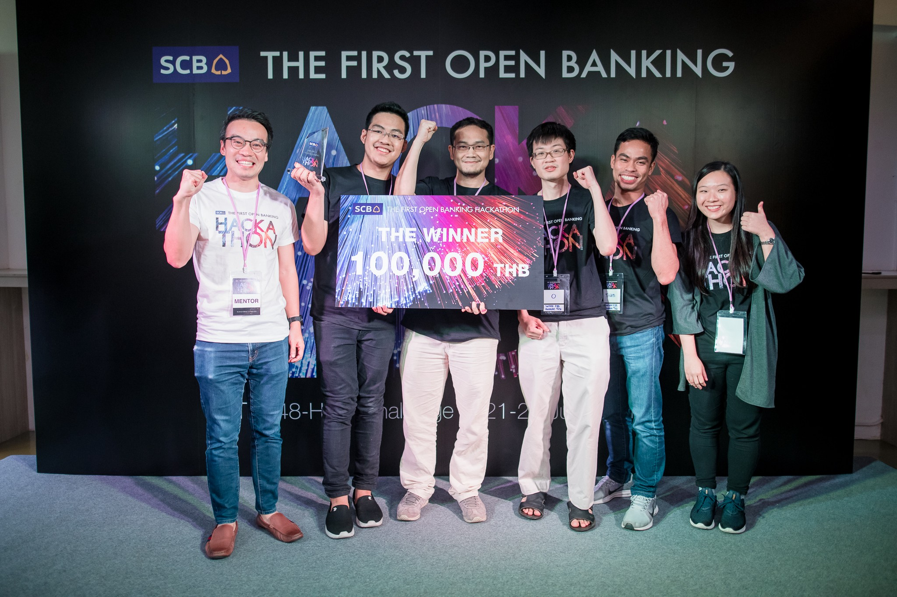

# สรุป

ครั้งนี้เป็นงาน Hackathon ครั้งที่สองในชีวิตและครั้งแรกที่เกี่ยวกับ business (Hackathon ครั้งแรกคือ Stupid Hackathon TH #3 อ่านรีวิวได้[ที่นี่](https://medium.com/@utopiabeam/review-%E0%B8%99%E0%B8%B1%E0%B9%88%E0%B8%87%E0%B9%82%E0%B8%87%E0%B9%88-%E0%B9%86-%E0%B8%81%E0%B8%B1%E0%B8%9A%E0%B8%87%E0%B8%B2%E0%B8%99-stupid-hackathon-thailand-3-d3502c536312)นะครับ ´･ᴗ･`) รู้สึกว่าเป็น hackathon ที่ให้ความสำคัญกับ technical มากกว่าที่คิดไว้เยอะเลย เพราะได้ยินว่า business hackathon ส่วนใหญ่มักจะวัดกันที่ slide มากกว่า technical

รู้สึกว่าเหนื่อยมากกกกกก นอนสองวันรวมกัน 6 ชม. กว่าจะคิดไอเดียได้ก็วันที่สองตอนเที่ยง แล้วยังต้องปั่น demo ภายใน 16 ชม. ตอนประชุมกันคือเถียงกันหนักมากจนต้องใช้ยาดม แต่บอกได้เลยว่าสนุกมาก ๆ ได้คุยกับคนที่ปกติเจอกันตามอีเวนต์แต่ไม่ได้คุยกัน (เช่น [น้องภูมิ](https://www.facebook.com/phoomparin.mano)) และคนเก่ง ๆ อีกหลายคน

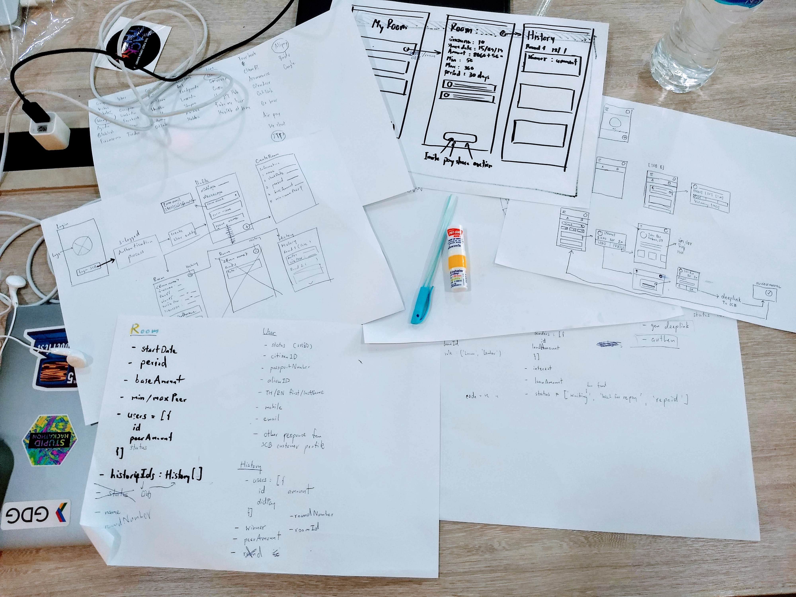

ส่วนตัวได้เรียนรู้หลาย ๆ อย่างจากงานนี้ ทั้งความรู้และแนวคิดการทำธุรกิจจาก mentor มากประสบการณ์ ความเครียดตอนประชุมไอเดียและปั่น demo แบบ 200% และความรู้ทาง technical ด้วย ได้เข้าใจ flow การ authentication/authorization ขึ้นเยอะมาก รวมถึงเรื่องของ Deep linking ด้วย

ถ้าถามว่าจะไปงานอย่างงี้อีกมั้ย? คำตอบคงเป็น “ไม่” ครับ
ไม่ใช่เพราะงานไม่ดีนะครับ งานนี้จัดมาดีมาก ๆ สำหรับผม staff ทุกคนเอาใจใส่ผู้เข้าแข่งขันมาก (โดยเฉพาะ technical support ยอมใจสปิริตพี่ ๆ จริง ๆ) สถานที่ดีมาก อาหารเยอะมาก มีเติมขนมตลอด แต่เพราะส่วนตัวไม่ชอบทำงานแนว business เท่าไหร่ ทำให้งานนี้ไม่ตอบโจทย์ dev จ๋า ๆ อย่างผมเท่าไหร่ แต่คิดว่าสำหรับสาย Fintech แล้วคงจะฟินกันไปไม่น้อย
ส่วนเรื่องที่รู้สึกไม่ชอบในงานนี้คือเน็ตกระจอกมากกกกกกกก จะทำอะไรแต่ละทีรอนานเหลือเกิน (Live share หลุดบ่อยมาก) และ API doc ไม่ค่อยละเอียดและเขียนผิดบางจุด เหมือนเขียนให้ทีม dev ของ SCB อ่านเท่านั้น

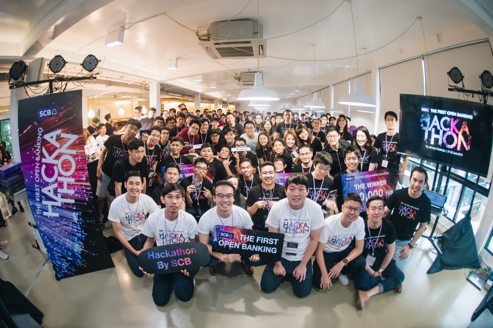

สุดท้ายนี้ ขอขอบคุณทาง SCB และ Naplab ที่จัดงานนี้ขึ้นมาให้ได้แลกเปลี่ยนไอเดียกันอย่างเมามันส์

ขอบคุณ mentor ทุกคนที่ให้คำแนะนำและจี้จุดบอดในไอเดียของเรา

ขอบคุณพี่นัยที่ทำ slide และ pitch ให้ทีม (แม้อยากจะ dev ใจจะขาด)

ขอบคุณพี่เปียวที่ทำ css และซ้อม Q&A กันอย่างดี

ขอบคุณพี่ฟา เดอะแบก frontend ที่อดหลับอดนอนคืนสองเพื่อปั่น demo

และขอบคุณผู้อ่านทุกคนที่อ่านจนจบนะครับ
