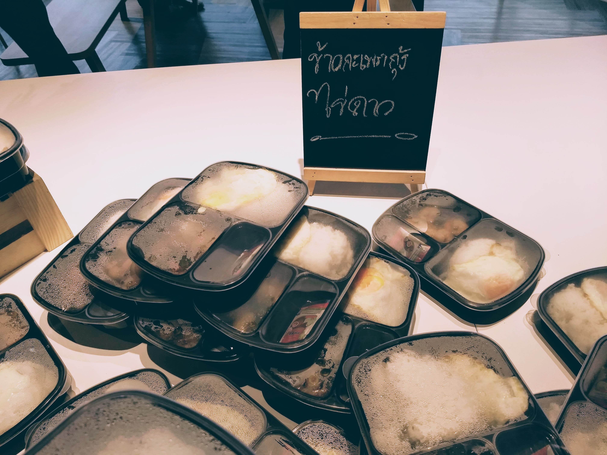

เนื่องจากในเทอมนี้มีวิชา Software Engineering ซึ่งเดี๋ยวจะรีวิวให้ฟังแบบเต็ม ๆ ในบล็อกถัด ๆ ไป แต่สรุปคือวิชานี้ให้ทำโปรเจคโดยใช้ Agile ประมาณ 80% ก็เลยมี workshop สำหรับสอนทำ Scrum ที่ภาคร่วมจัดกับ SCB

บล็อกนี้นอกจากจะมารีวิว workshop นี้แล้วยังจะสรุปความรู้ที่ได้มาอีกด้วย...ในบล็อกถัดไป ส่วนเรื่องราวจะเป็นยังไง ไปดู!

# ออกเดินทาง

อาจารย์นัดขึ้นรถที่คณะตอน 11 โมง แน่นอนว่าเราที่มีเรียน Tech writing ตอน 9.00 - 12.00 น. ก็โดดเรียนไปขึ้นรถอย่างไม่ลังเล ใช้เวลาประมาณ 20 นาทีก็ถึงที่หมาย นั่นก็คือ SCB ใหญ่นั่นเอง

เนื่องจากว่ายังไม่ได้กินข้าวกัน ก็เลยมีข้าวเลี้ยงให้นิสิตทุกคน และนี่คือเมนูอาหาร

หลังจากนั้นก็มีเวลาอีกประมาณชั่วโมงนึง เลยได้เดินเล่นดูบรรยากาศรอบ ๆ นิดหน่อย เอาจริง ๆ คือก่อนมาคิดว่าที่ทำงานของธนาคารคงแออัดเหมือนของราชการ แต่พอมาเห็นเองก็รู้สึกว่าโล่งและกว้างมาก ดู productive สุด ๆ

ทีเด็ดอยู่ที่เก้าอี้หมุนที่หมุนยังไงก็ไม่ล้ม นั่งปั่นสนุกมากเลย

หลังจากนั้นประมาณ 12.40 น. ก็มีพี่หนักงานพาพวกเราไปที่ห้องจัด workshop

# Scrum workshop begin!!

ก่อนงานเริ่มก็มีพี่ HR มาขายของนิดหน่อยว่าตอนนี้ SCB กำลังเปิดรับตำแหน่งอะไรบ้างและสัมภาษณ์เมื่อไหร่ ซึ่งก็เป็นประโยชน์สำหรับเพื่อน ๆ ที่ยังไม่มีที่ฝึกงานหลาย ๆ คนแหละนะ

เข้าสู่กิจกรรม workshop จริง ๆ ซะที โดยวิทยากรก็คือพี่กิ๊ก Tech lead ของ SCB นั่นเอง

Workshop นี้พูดตั้งแต่ Agile manifesto, รายละเอียดต่าง ๆ ของ Scrum framework และกิจกรรมจำลองการทำ Scrum จริง ๆ ในเวลาประมาณสองชั่วโมง ตั้งแต่ Sprint planning จนถึง Retrospective กันเลย ทั้งหมดใช้เวลาตั้งแต่ 13.00 - 17.30 น. แต่ก็ไม่รู้สึกเบื่อเลยซักนิด

แต่เอาจริง ๆ เนื้อหามันไม่ได้เยอะมาก ส่วนใหญ่หมดเวลาไปกับการขายของอย่างเมามันส์ของพี่ ๆ ทั้งหลาย และพวกเรา ๆ ก็ดันซื้อซะด้วย! กลายเป็นเหมือนการถาม-ตอบหางานกันซะอย่างงั้น ซึ่งมันก็ไม่ได้แย่ เอาจริง ๆ ฟังแล้วก็สนุกดีด้วย

ส่วนนี่คืออาหารว่างของพวกเราเอง

และนี่คือทีมของเราเอง (อีกสองคนไม่เข้าเฟรมอ่ะ ช่างมันละกัน)

หลังจากจบกิจกรรมก็มีการสรุปกิจกรรมเล็กน้อยแล้วก็ถ่ายรูปรวม ก่อนจะแยกย้ายกลับคณะ

# สรุป

Workshop นี้จัดขึ้นเพื่อฝึกการทำ Scrum เพื่อประกอบการเรียนวิชา Software Engineering นั่นแหละ ซึ่งมันก็มีทั้งสิ่งที่ชอบและไม่ชอบหลายอย่าง

## สิ่งที่ชอบ

เริ่มจากสิ่งที่ชอบก่อนแล้วกัน

- **กิจกรรมสนุกมาก** อันนี้ชมพี่กิ๊กว่าทำการบ้านมาดีมาก เนื้อหาละเอียด เห็นภาพตามง่าย และคิด workshop มาได้น่าสนใจมาก ๆ จนอยากเอาไปใช้ในชมรมด้วยเลย ไอเดียการจำลอง Scrum 2 sprint ภายในเวลาประมาณ 1 ชั่วโมงเป็นอะไรที่ว้าวมาก ๆ

- **บรรยากาศสนุกมาก** พอกิจกรรมมันสนุก และที่สำคัญคือทุกคนที่ร่วมกิจกรรมเล่นด้วย มันก็เลยเป็นบรรยากาศที่เฮฮามาก ๆ

- **Sprint backlog สุดปั่น** สำหรับทีมที่เซียนอยู่แล้วก็มีช่วง enjoy ด้วย Sprint backlog สุดฮา เช่น ร้องเพลงสรรเสริญพระบารมี (แค่ก ๆ), "Move on" ที่รู้เลยว่าเป็น task ของใคร และอื่น ๆ อีกเพียบ

- **ออฟฟิศดู productive มาก ๆ** น่ามานั่งทำงานจริง ๆ

## สิ่งที่ไม่ชอบ

พูดถึงสิ่งที่ชอบมาเยอะละ พูดเรื่องที่ไม่ชอบบ้างดีกว่า

- เครื่องดื่มหลาย ๆ อย่างหวานไปหน่อย

- Test มีบั๊กนิดหน่อย ซึ่งไม่ซีเรียสมาก

- ไมค์ดับบ่อย

# แถม! สิ่งที่พีคสุด ๆ

เรื่องมีอยู่ว่าหลังจากจบกิจกรรมก็ติดลมยืนคุยกับพี่กิ๊กซักพักนึงพร้อมกับ พอหันกลับมากลายเป็นว่าทุกคนหายไปหมดแล้ว เลยแซวกับเพื่อนที่อยู่ด้วยกันว่าสงสัยรถออกไปแล้วมั้งพร้อมโทรหาเพื่อนอีกคน

ปรากฏว่ารถออกไปแล้วจริง ๆ!! จังหวะนั้นคืองงและขำมาก แบบมันไม่มีเช็คคนก่อนออกรถเหรอวะ แต่โชคดีที่ BTS อยู่ไม่ไกลเลยเดินไปขึ้น BTS ได้ ไม่งั้นคงต้องเรียนแท็กซี่กลับบ้านซะแล้ว

และนี่คือโฉมหน้าผู้ร่วมชะตากรรม

ขอจบการรีวิวแต่เพียงเท่านี้ ส่วนเนื้อหาที่ได้ไว้จะเขียนเป็นอีกบล็อกนะครับ สำหรับวันนี้ไปนอนละ บาย!