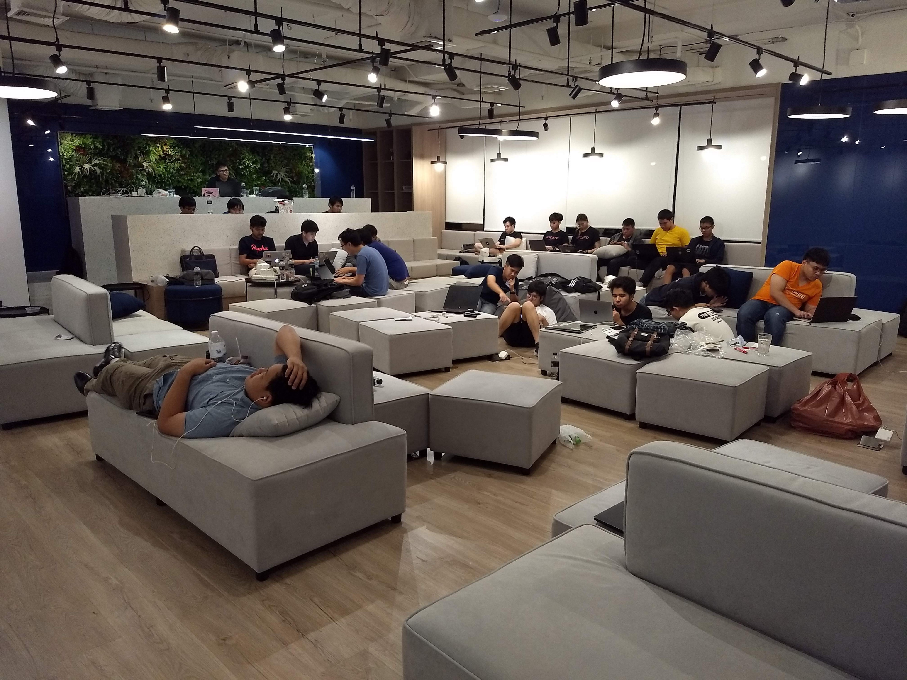
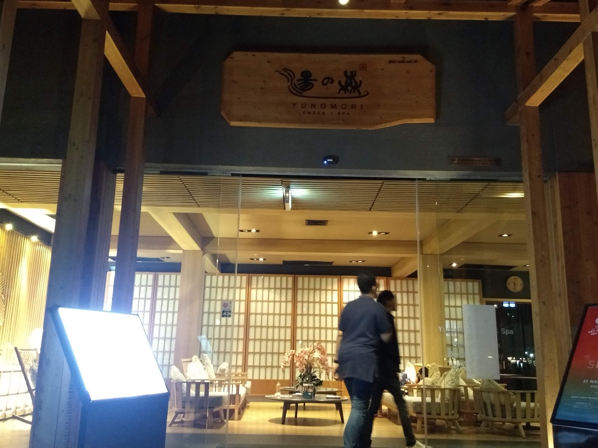

*[Note: มีศัพท์ geek ค่อนข้างเยอะ ใครไม่ใช่ dev ก็อ่านไปดมยาดมไปนะครับ]*

บอกก่อนเลยว่านี่เป็นงาน Hackathon ครั้งแรกในชีวิตเลยก็ว่าได้ (ไม่นับในชมรมอ่ะนะ) ก็เลยรู้สึกตื่นเต้นและอยากมาเล่าประสบการณ์ในงาน

# Ticket war

เริ่มจากการกดแก่งแย่งตั๋วที่ได้ข่าวว่าหมดเร็วกว่าประกาศผลเลือกตั้ง (อุ๊ปส์!) แบ่งเป็นรอบ Early bird กับรอบธรรมดา ซึ่งก็กดได้แบบ Early bird ด้วยความเร็วระดับปีศาจอ่ะนะ

พอถามเพื่อน ๆ ในชมรม [Thinc.](https://www.facebook.com/ThailandIncubator/) ก็มีหลายคนที่กดบัตรได้ เลยเหมือนยกชมรมมาถล่มงานนี้เลยทีเดียว (จริง ๆ ไม่เยอะ แค่ 7–8 คนเอง…)

# Day 1

วันแรกก็มาที่บริษัท Fastwork ซึ่งเป็นสถานที่จัดงานในครั้งนี้ ว่าแล้วก็เก็บบรรยากาศมาให้ดูคร่าว ๆ

บรรยากาศสบายเหมาะกับการทำอะไรโง่ ๆ จริง ๆ (ชมนะครับ（´υ ｀）)

โจทย์ของงานนี้ไม่มีอะไรมาก ก็แค่ให้ทำอะไรก็ได้ที่ดูโง่ ๆ ตลก ๆ และไร้สาระเท่าที่จะคิดได้ ซึ่งบอกเลยว่าของแบบนี้ถนัดมาก (ปกติก็นั่งโง่ ๆ ไร้สาระอยู่แล้วอ่ะนะ…)

ช่วงพิธีเปิดก็เป็นการบอกเล่าความเป็นมาของงานที่เตรียมมาอย่างยาวนาน (11 วัน…) และเล่าว่าปีที่แล้วมีโปรเจคอะไรบ้าง บอกเลยว่าแต่ละอันไม่รู้ดมกาวมากี่กระป๋อง

สำหรับของแจกปีนี้มีสติกเกอร์ และเสื้อที่ให้ไปทำกันเอง (แจก assets ให้ไปทำเอาเอง นอกจากใช้ไอเดียตัวเองและยังใช้เงินตัวเองด้วย ((;ﾟ Д ﾟ)))

หลังจากเปิดงานพอเป็นพิธีก็เริ่มจับกลุ่มกัน เนื่องจากชมรมมีคนมาเยอะก็เลยแบ่งเป็นทีมละสามคน ทีมผมมี[ลีโอ](https://www.facebook.com/DarknessLeo) และพี่[ณิชา](https://www.facebook.com/NichaRoj) ตอนแรกลีโอบอกจะไม่มาเพราะกลัวเป็นตัวถ่วง แต่บอกเลยว่านี่แหละเดอะแบกที่แท้ทรู

ได้กลุ่มแล้วรออะไรล่ะ คิดโปรเจคสิครับ!! หลังจากเดินหาที่ลงหลักปักฐานซักพักก็รู้สึกว่าอยากสแกนกรรมชาวบ้านเล่น ๆ ก็เลยทำมันซะเลย!! คอนเซปต์คร่าว ๆ ที่คิดไว้คือเอาชื่อ-นามสกุลและวันเกิดมาทำนายว่าถ้าตายแล้วจะไปนรกหรือสวรรค์กันนะ

## เริ่ม dev ซะที

ทีแรกคิดว่าคงไม่มีอะไรมาก แค่มี front-end ตัวนึงทำเป็น form กับแสดงผลยิงไปหา back-end ก็จบ ปรากฏว่าเกิดคันมืออยากจับ ML ขึ้นมา ก็เลยได้ฤกษ์ใช้ ML ซะเลย ปัญหาก็คือไม่มีใครทำ ML เป็นนอกจากลีโอ งานเตรียม dataset จึงตกไปอยู่กับลีโอโดยปริยาย

การเตรียม dataset ก็เหนื่อยนิดหน่อย ตอนแรกใช้วิธีพิมพ์มือเอาเลย ซักพักก็ใช้ Thai name generator หลังจากนั้นก็ใช้ [faker](https://github.com/joke2k/faker) ในการ generate ชื่อมา รวม ๆ กันได้ 1300+ ชื่อในไฟล์ `.csv` อันนึง

หลังจากได้ dataset แล้วก็ต้องเอาไป train model โชคดีที่งานนี้ได้ AutoML Table ของ Google Cloud Platform ที่อัพ `.csv` จาก Cloud Storage แล้วก็สั่ง train ได้เลย (ตอนที่เขียนนี่ยังเป็น beta อยู่เลย)

สำหรับ back-end เป็นหน้าที่ของผมเอง ใช้ Google Cloud Functions เพราะมีแค่ฟังก์ชันเดียว และเป็น stack ที่คุ้นเคยอยู่แล้วก็เลยเลือกอย่างไม่ยากเย็น แต่ตอนนี้ยังไม่เสร็จเพราะต้องรอ model train เสร็จ

ส่วน front-end ให้พี่ณิชาจัดการเพราะเคยมีพื้นอยู่บ้าง โดยพี่เค้าเลือกใช้ react เพราะที่ฝึกงานต้องใช้ แต่แล้วโชคชะตาก็เล่นตลกเมื่อผมว่างงานอยู่ ก็เลยต้องมาช่วยเขียน react ครั้งแรกในชีวิต แล้วก็เจอปัญหาหลายอย่าง ตั้งแต่การส่งข้อมูลระหว่าง form ไปจนถึงติด CORS ตอนยิง request แต่สุดท้ายก็แก้ด้วยการ set headers, ดัก `req.method` และอื่น ๆ ส่วนพี่ณิชาก็แครี่ css และกราฟฟิก บอกเลยว่ารูปอลังและสวยมาก

เขียนถึงตรงนี้ model ก็ยัง train ไม่เสร็จนะ ไม่รู้จะนานไปไหน （´ヘ｀；）ไม่รู้จะทำอะไรก็มาเขียนบล็อกนี่แหละ

## บรรยากาศในงาน

บรรยากาศสบายมากกกกกก อยากทำอะไรก็ทำ ส่วนใหญ่ก็จะนั่งเขียนโค้ด ซักพักก็เดินไปเดินมา แวะคุยกับทีมอื่น และหาของกิน มีเล่นดนตรีร้องเพลงด้วย เรียกว่าเอาให้สุดไปเลย

พอเริ่มค่ำก็มีบางคนที่กลับบ้าน แต่ส่วนนึงก็อยู่ต่อ (ทีมผมด้วย) ก็เลยเก็บบรรยากาศตอนค่ำมาให้ดูเล็กน้อย

หลังจากทำงานทั้งวันมาอย่างเหน็ดเหนื่อย พี่ ๆ ก็ชวนไปแช่ออนเซ็นที่อยู่ไม่ไกลมาก นั่งแท็กซี่ประมาณ 5 นาทีก็ถึงละ ด้วยความที่อยากลองแช่ดูก็เลยไป

## ออนเซ็นนนนน

*[คำเตือน: พาร์ทนี้จะไม่เกี่ยวกับงานและอาจมีคำบรรยายที่ทำให้จินตนาการถึงภาพที่ไม่เหมาะสม กรุณาอ่านอย่างมีสติและไม่ฟุ้งซ่านนะจ๊ะ]*

ตอนนี้เป็นเวลาประมาณสี่ทุ่ม เราก็มาอยู่ที่ Yunomori Onsen & Spa กันแล้วนะครับ บรรยากาศแค่จากที่เห็นข้างนอกก็ดูหรูหราแล้ว แต่เข้าไปข้างในนี่ยิ่งแจ่ม

แต่ก่อนจะได้ลงแช่ออนเซ็นนั้นต้องผ่านอีกหลายขั้นตอน ตั้งแต่เปลี่ยนรองเท้า รับชุดยูกาตะ และอาบน้ำล้างตัว เวลาเข้าไปในห้องอาบน้ำเค้าให้เอาผ้าเช็ดตัวผืนเล็ก ๆ เข้าไปผืนเดียว สภาพในนั้นคือทุกคนเดินล่อนจ้อนหมดเลย (มีเอาผ้าปิด ๆ ไว้บ้าง บางคนก็เดินรับลมสบาย~) ห้องอาบน้ำที่นี่มีหลายแบบ ทั้งบ่อน้ำร้อน บ่อน้ำเย็น ห้องซาวน่าและห้องไอน้ำ

ความรู้สึกเมื่อจะลงบ่อออนเซ็นแรก ๆ จะรู้สึกร้อน หลังจากนั้นจะค่อย ๆ ชินและสบายตัวไปเอง ส่วนบ่อน้ำเย็นก็จะรู้สึกเย็นตอนแรกเหมือนกัน แต่ที่พีคสุดคิดว่าน่าจะเป็นห้องไอน้ำ คือไม่เข้าใจว่าเข้าไปกันได้ยังไง แล้วนั่งกันได้ยังไง แว้บแรกที่เข้าไปคือมองไม่เห็นอะไรเลย เพราะใส่แว่น… (แต่ถอดแว่นแล้วก็มองไม่เห็นอยู่ดี ไอน้ำร้อน ๆ เต็มห้องเลย) ที่สำคัญคือมันร้อนอบอ้าวและหายใจยากมากกกกก นั่งไม่ถึงนาทีต้องออกละ ในขณะที่คนข้าง ๆ นั่งสมาธิชิว ๆ เฉยเลย ヽ(ﾟДﾟ)ﾉ

หลังจากแช่เสร็จก็จะเปลี่ยนเป็นชุดยูกาตะแล้วนั่งพักสบาย ๆ ก่อนแล้วค่อยเปลี่ยนชุดกลับ เพื่อให้ไม่เวียนหัวหลังขึ้นจากน้ำร้อน และไหน ๆ ก็ได้ใส่ยูกาตะแล้วก็ถ่ายรูปไว้ซะหน่อย (เสียดายที่รูปไม่ชัดเพราะมืดแล้ว)

หลังจากแช่ออนเซ็นรู้สึกเลยว่าเลือดสูบฉีดดีมาก มีพลังทำงานกลางคืนต่ออีกซักสองชั่วโมงละ สรุปค่าเสียหาย**ประมาณ 480 บาท** รู้สึกเจ็บมาก แต่นาน ๆ ทีก็ถือว่าคุ้มแหละ มีคุยกันว่ารอบหน้าสงสัยต้องไปแช่ที่ญี่ปุ่นแล้วล่ะ

แต่หลังจากอาบน้ำเสร็จงานก็เข้าจนได้ เมื่อ model ที่ train ไว้เกิด fail ขึ้นมาเพราะ Internal server error ก็ไม่รู้จะทำยังไงกับ 7 ชั่วโมงที่เสียไปนอกจากกด train ใหม่อีกรอบ

มาลุ้นกันว่าจะรอดมั้ย…

# Day 2

สิ้นหวังแล้ว…

หลังจากตื่นมาตอน 7 โมงนิด ๆ ก็รู้ข่าวร้ายว่า model ที่ train ทิ้งไว้ก็ Internal error อีกรอบ โชคดีที่เมื่อคืนก่อนนอนทำ API โง่ ๆ ทิ้งไว้แล้วเลยไม่ได้ร้อนขนาดนั้น

หลังจากล้างขี้ตาเสร็จแล้วก็มาหาทางทำ ML ใหม่หมด โดยให้ลีโอหาทาง train model เองแล้ว deploy ขึ้น AI Platform ซึ่งงมพักนึงก็ได้ แต่ปัญหาคือไม่รู้จะเรียกใข้ model จากเว็บยังไงก็เลยให้ export model เป็นโค้ด JavaScript แล้ว copy โค้ดมาใส่ back-end ดื้อ ๆ เลย

ส่วน front-end พี่ณิชาแก้ animation นิด ๆ หน่อย ๆ แล้วก็เลยตัดสินใจลอง deploy ขึ้น App Engine ครั้งแรกในชีวิต กว่าจะเวิร์คก็ลองผิดลองถูกอยู่หลายครั้งเหมือนกัน

ทุกอย่างเหมือนจะผ่านไปได้ด้วยดี แต่แล้ว GCP ก็เล่นตลกอีกครั้งเพราะ Cloud Functions ดันหา dependencies ตัวนึงที่ทำ MD5 hashing ไม่เจอ (ลองทั้ง `md5` และ `blueimp-md5` แล้วไม่เวิร์ค) ทั้ง ๆ ที่ก็มีใน `package.json` ตัวเบ้อเร่อเลย โชคร้ายที่เวลาหมดก็เลยต้องเลิก dev แล้วมาทำ slide เตรียม present

## Pitching time

แต่ละทีมมีเวลา pitch 5 นาที แบ่งเป็นสองช่วง ทีมผมได้ลำดับเกือบสุดท้ายเลย ในการ pitch ก็จะมีการให้คะแนนโดยเพิ่ม reaction ใน slack ให้ทีมที่นำเสนอ ซึ่งแต่ละทีมก็มีไอเดียที่ไร้สาระและบ้า ๆ บอ ๆ กันมาก (มีกลุ่มที่ออกอากาศไม่ได้ด้วย สุ่มเสี่ยงเกินไป…)

มีคนถ่ายตอนเรา present ด้วย ก็เลยเอามาให้ดูกัน

`youtube: https://youtu.be/sPPZihQRocc`

ทีมที่ชอบทีมนึงเป็นทีมรุ่นพี่ชมรม Thinc. ทำแอพที่สามารถแยกร่างคนในรูปซ้อน ๆ กันให้ดูเหมือนมีคนเยอะ ๆ โดยได้แรงบันดาลใจมาจากงานปราศรัยงานหนึ่งซึ่งขอไม่เอ่ยถึงจะดีกว่า ขอใช้ตัวอย่างเป็นรูปรวมชมรม Thinc. ในงานนี้แล้วกันครับ

ภาพบนเป็นภาพปกติ ส่วนภาพล่างเป็นภาพหลังเข้าแอพแล้ว แยกร่างแบบนารูโตะเลยทีเดียว

จริง ๆ มีอีกหลายทีมที่ชอบมาก แต่ส่วนใหญ่จะออกอากาศไม่ได้เลยไม่เล่าดีกว่า…

# สรุป

งาน Stupid Hackathon Thailand #3 เป็นงานที่สนุกมากกกกก ได้เจอคนที่มี passion เหมือน ๆ กันทำเรื่องโง่ ๆ ด้วยแล้วมันก็สนุกดี บรรยากาศเฮฮาปาร์ตี้ชิว ๆ จนนึกว่านี่มา dev หรือมาเที่ยวกันแน่

งานนี้ทำให้เรามี 1st time หลายอย่างมาก
- 1st time React (จริง ๆ คือ 1st time front-end เลยแหละ)
- 1st time App Engine
- 1st time Onsen
- 1st time AutoML Tables ที่พังไปสองรอบแล้วโว้ยยยยยย (╯°Д°)╯ ┻━┻

นอกจากนี้ยังทำให้สนใจ front-end และ ML จริงจังมาก กะว่าจบงานแล้วจะทำ project นี้ต่อให้เสร็จโดย integrate กับ ML ให้ได้ และอยากจะให้รองรับชื่อภาษาไทยด้วย (ตอนนี้ยังต้องพิมพ์เป็นภาษาอังกฤษ แต่รับชื่อไทยได้นะ)

สุดท้ายก็อยากบอกว่าถ้ารู้สึกว่า Hackathon ธรรมดามันเน้น business เกินไปแต่อยาก dev โดยไม่แคร์สื่อ งาน Stupid Hackathon คือคำตอบที่ดี เพราะงานนี้มีอะไรให้เราเรียนรู้จากคนอื่นอีกเยอะะะ

ขอบคุณลีโอและพี่ณิชาที่อดหลับอดนอนปั่น project บ้า ๆ นี้จนเป็นรูปเป็นร่าง

ขอบคุณเพื่อน ๆ พี่ ๆ ทุกคนในงานที่ให้คำแนะนำและเข้ามาพูดคุยแลกเปลี่ยนกับเรา

สุดท้าย ขอบคุณทีม Stupid Hackathon ครั้งนี้มากครับ นี่เป็นงานที่ดีที่สุดงานนึงเลย

ขอจบการรีวิวด้วยรูปที่ถ่ายกับ[พี่ไท](https://www.facebook.com/dtinth)และ[เจ้าริฟฟี่](https://www.facebook.com/rayriffy)ครับ (＾ω＾)

ปล. ใครอยากลองสแกนกรรมตัวเองลองไปเล่นในเว็บนี้ได้เลยครับ http://karmascanner.appspot.com ถ้าว่างจะพยายามปั่นให้เสร็จสมบูรณ์

ปล 2. repo link: https://github.com/UtopiaBeam/karma-scanner เข้าไปเปิด issues หรือ pr ได้นะครับ ต้องการความช่วยเหลือเรื่องการใช้ model ใน Cloud Functions มาก ๆ