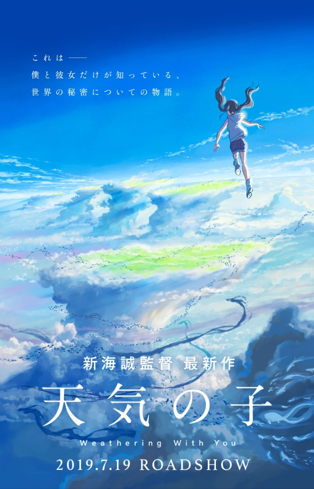
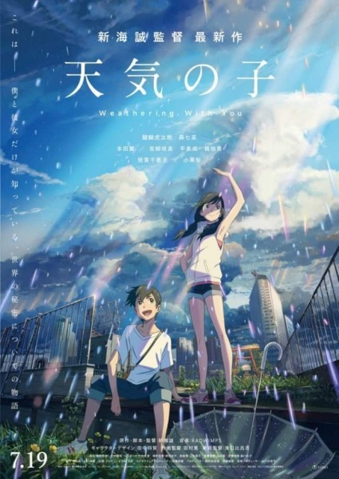
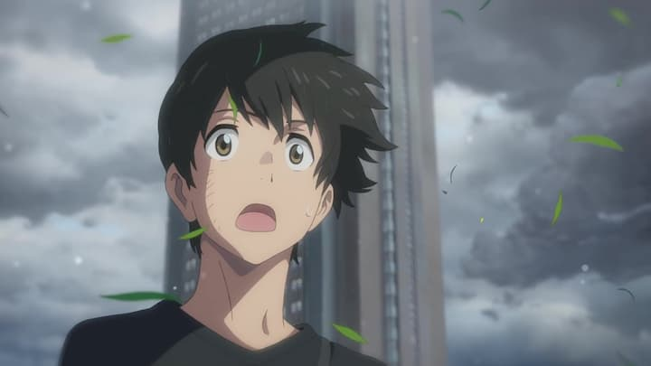
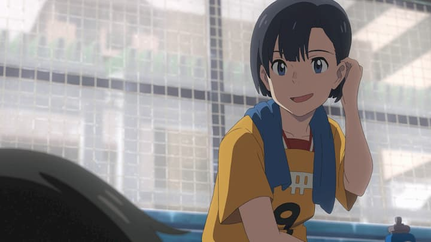
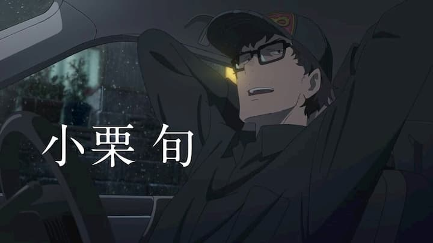
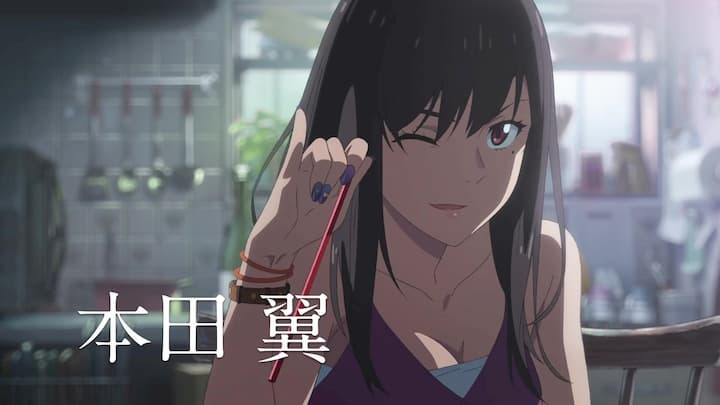

ช่วงปลายปีที่แล้วเมื่อวันที่ 13/12/2018 มีข่าวใหญ่ว่าผู้กำกับมือฉมังอย่าง "ชินไค มาโคโตะ (新海 誠)" ที่เคยสร้างผลงานดีงามอย่าง [5 cm/s (秒速5センチメートル)](https://en.wikipedia.org/wiki/5_Centimeters_per_Second) และ [Your Name (君の名は)](https://en.wikipedia.org/wiki/Your_Name) ได้[ประกาศ](http://www.toho.co.jp/movie/news/1812/01_tenkinoko_ib.html)ผลงานใหม่ล่าสุดนั่นก็คือ [Weathering with You (天気の子)](https://tenkinoko.com) ชื่อภาษาไทยคือ "ฤดูฝัน ฉันมีเธอ" ตัวผมซึ่งประทับใจกับ Your Name มากพอสมควรก็เลยตั้งใจมากว่าจะดูเรื่องนี้ให้ได้

และแล้วหนังเรื่องนี้ก็เข้าไทยเมื่อวันที่ 5/9/2019 ซึ่งจริง ๆ ทีแรกจะไปดูตั้งแต่วันแรกด้วยซ้ำ แต่เพราะมีธุระนิดหน่อยก็เลยได้ไปดูวันนี้แทน และเพื่อเป็นการแบ่งปันความคิดเห็นเกี่ยวกับเรื่องนี้จึงเกิดบล็อกนี้ขึ้นมานั่นเอง

หากใครยังไม่เคยเห็นโปสเตอร์กับ Trailer ของเรื่องนี้แล้วล่ะก็ ไม่ต้องไปหาที่ไหน เชิญรับชมก่อนครับ

`youtube: https://www.youtube.com/watch?v=VGksHFs04Rc`

ส่วนใครที่ดูแล้ว อ่านต่อเลยครับ

# เนื้อเรื่อง
ธีมของเรื่องนี้ก็คือ "ฝน" โดยเรื่องนี้เป็นเรื่องราวของเด็กหนุ่มสาวคู่หนึ่งในโตเกียวซึ่งกำลังเผชิญหน้ากับฝนตกหนักมาก ๆ ชนิดที่แทบไม่เห็นเดือนเห็นตะวันกันเลยทีเดียว ซึ่งพระเอกของเราเป็นเด็กบ้านนอกหนีเข้าเมืองหลวงได้มาพบกับนางเอกที่มีพลังควบคุมฝนฟ้าอากาศได้ เกิดเป็นเรื่องราวที่เปลี่ยนแปลงโลกไปตลอดกาล

ไม่เล่าเยอะ เดี๋ยวสปอยล์

# ตัวละคร

- โมริชิมะ โฮตากะ (森嶋 帆高, Morishima Hodaka)

เด็กหนุ่มชนบทผู้หนีจากบ้านมาแสวงโชคที่โตเกียว หารู้ไม่ว่าพาตัวเองมาตายแท้ ๆ เพราะพอเจอกับค่าครองชีพและ Lifestyle ของโตเกียวแล้วถึงกับบ่นว่า "โตเกียวนี่น่ากลัวจริง ๆ" เป็นสิบครั้งได้มั้ง ทั้งที่ความจริงโตเกียวอร่อยจะตาย (ผ่าม!)

- อามาโนะ ฮินะ (天野 陽菜, Amano Hina)

เด็กสาวโตเกียวผู้ได้รับพลังประหลาดที่สามารถควบคุมฝนฟ้าอากาศได้ บอกได้เลยว่านี่คือนางเอกผู้แบกความน่ารักทั้งมวลของหนังเรื่องนี้เลย แค่ได้มาดูตัวละครน่ารัก ๆ แบบนี้เนื้อเรื่องจะเป็นยังไงก็ช่างมันแล้วล่ะครับ

- อามาโนะ นากิ (天野 凪, Amano Nagi)

น้องชายนางเอกสุดเนื้อหอม ย้ำ!! ไอ้หมอนี่เป็น**น้องชาย**ครับ หน้าหวานจนทีแรกนึกว่าเป็นผู้หญิงเลยทีเดียว บุคคลที่พระเอกเรียกว่ารุ่นพี่ด้านความรักแม้ตัวเองจะแก่กว่าก็ตามที

- สุกะ เคย์สุเคะ (須賀 圭介, Keisuke Suga)

เจ้าของบริษัทเล็ก ๆ ที่เขียนบทความให้นิตยสาร ค่อนข้างมีเรื่องราวและบทบาทที่น่าสนใจ (ไม่เล่า เดี๋ยวสปอยล์)

- นัทซึมิ (夏美 Natsumi)

คาแรกเตอร์พี่สาวผู้มากับดาเมจจากความขี้แกล้งและอื่น ๆ... ทำงานเป็นนักเขียนให้บริษัทของตัวละครข้างบนนั่นแหละ เป็นอีกตัวแปรสำคัญในเรื่องนี้เลย

และยังมีตัวละครอีกหลายตัวที่ไม่ได้กล่าวถึง เพราะไม่รู้จะเล่าไปทำไม ไม่ได้มีบทขนาดนั้น

# ความรู้สึก

รีวิวแบบคนที่ไม่ค่อยดูหนังและไม่คิดอะไรมากละกัน ขอรีวิวเป็นข้อ ๆ ไปนะครับ

## พล็อตเรื่อง

พล็อตของเรื่องนี้ไม่มีอะไรมากเลย เป็นเส้นตรงและ simple แบบสุด ๆ นึกภาพ Your Name พล็อตแนวไหนก็แนวนั้นเลย ซึ่งตรงนี้ไม่ติดใจอะไรเพราะเข้าใจว่าเรื่องมันก็ไม่จำเป็นต้องซับซ้อนอะไรอ่ะนะ

ติดตรงแค่ช่วงแรกเนื้อเรื่องปูมาแบบเนิบ ๆ จนรู้สึกจืดจางอยู่ แต่ไม่ถึงกับเสียอรรถรสมาก

จนถึงช่วงกลาง ๆ เป็นต้นไปนี่แหละที่รู้สึกมีอะไรให้ลุ้น ช่วงนี้หนังพยายามใส่ event หลาย ๆ อย่างมาในหนังเพื่อให้ผู้ชมได้ลุ้นได้เอาใจช่วยตัวละครให้เคลียร์ event ให้สำเร็จ ถึงจะเดาได้อยู่แล้วก็เถอะ

สำหรับจังหวะการยิงมุกของเรื่องนี้อาจจะไม่ได้โดดเด่นมากสำหรับผม แต่ไม่ถือว่าพยายามยัดเยียดจนมากเกินไป

## ตัวละคร

อย่างแรกเลย รู้สึกรำคาญไอ้พระเอกมาก ๆๆๆๆๆ

รู้สึกว่าเป็นตัวละครที่ไม่สมเหตุสมผลเอาซะเลย ความนึกคิดและการกระทำไม่ make sense หลายอย่างมาก เช่น เหตุผลที่หนีออกจากบ้าน ซึ่งไม่รู้จะสปอยล์อะไรเพราะมันไม่มีสาระเอาซะเลย ช่วงแรก ๆ ที่ดูนี่คือเอามือเท้าคางแล้วบ่นว่า "อิหยังวะ" เป็นสิบ ๆ ครั้ง เอาเป็นว่าถ้าไม่อยากหงุดหงิดก็ทำหัวให้โล่ง ๆ เข้าไว้และอย่าไปคิดตามมันมากแล้วกัน

นี่เป็นเหตุผลที่ทำให้ช่วงแรก ๆ รู้สึกว่าหนังมันน่าเบื่อไปนิดนึง นอกจากการปูเรื่องที่ไม่มีอะไรมากแล้วก็เพราะไอ้พระเอกล้วน ๆ เลย

แต่ทั้งหมดนี้จะมลายหายไปด้วยออร่าความน่ารักของน้องฮินะ

อย่างที่บอกตอนแนะนำตัวละครว่า MVP ของเรื่องนี้ต้องยกให้นางเอกคนนี้จริง ๆ เป็นตัวละครที่ออกแบบคาแรกเตอร์ได้น่ารักมาก ทั้งน้ำเสียง ท่าทางและเรื่องราวของตัวละครเสริมส่งกันอย่างลงตัวจริง ๆ ถึงขั้นมีบางคนเข้าไปดูอีกรอบเพื่อเสพร่องแขนของฮินะเลยทีเดียว... (กามจริง ๆ)

ส่วนผม รอบเดียวพอแล้ว ไม่มีตังค์...

สำหรับตัวละครตัวอื่น ๆ ก็มีบทประปรายกันไป แต่ทุกตัวถือเป็นตัวแปรสำคัญที่ขาดไม่ได้เลย เพราะมีบทบาทในช่วงวินาทีสำคัญ ๆ ในเรื่องตลอด และสำหรับตัวละครบางตัวก็มีปมที่น่าสนใจอยู่เหมือนกัน

โดยรวมแล้วชอบตัวละครเรื่องนี้นะ ยกเว้นไอ้พระเอกที่หงุดหงิดกับมันจริง ๆ

## ดนตรี

จะขาดเรื่องดนตรีประกอบหนังไม่ได้ โดยหนังเรื่องนี้ก็ได้วง RADWIMPS ที่เคยฝากผลงานไว้มากมายในเรื่อง Your Name บอกเลยว่านี่คือส่วนผสมที่ทำให้หนังเรื่องนี้กลมกล่อมมาก ช่วยบิ๊วอารมณ์ในหลายฉากได้ดีเยี่ยม ถึงกับมีบางคนบอกว่าจริง ๆ แล้วหนังเรื่องนี้คือ MV เพลงที่ยาวมาก ๆ เพลงนึงนั่นเอง

เพลงที่ผมชอบ และคิดว่าหลาย ๆ คนก็ชอบเพลงนี้ คือ เพลง 愛にできることはまだあるかい (Is There Still Anything That Love Can Do?) แปลเป็นภาษาไทยว่า "มีอะไรที่ความรักยังทำได้อีกมั้ย?" ซึ่งการันตีด้วยยอด views กว่า 26 ล้านวิวและ 515K likes

`youtube: https://www.youtube.com/watch?v=EQ94zflNqn4`

# สรุป

ในความคิดของผม หนังเรื่องนี้ยังคงมาตรฐานของ Your Name ได้อย่างน่าประทับใจ มีกลิ่นอายของชินไค มาโคโตะที่สร้างเรื่องราวที่หน่วง ๆ จิตใจไว้ได้อย่างดี ถ้า Your Name ได้สร้างความประทับใจให้คุณแล้วล่ะก็ เรื่องนี้จะเป็นอีกเรื่องที่สร้างความประทับใจได้ไม่ต่างจาก Your Name อย่างแน่นอน แต่หากยังไม่เคยดู Your Name ก็ไม่เป็นไร เพราะเรื่องนี้มีพล็อตที่ย่อยง่ายเลยองค์ประกอบที่ละมุนละไมและลงตัวอย่างมาก

> ไปเปิดใจรับฝนให้หัวใจชุ่มฉ่ำกับหนังเรื่องนี้กันเถอะครับ