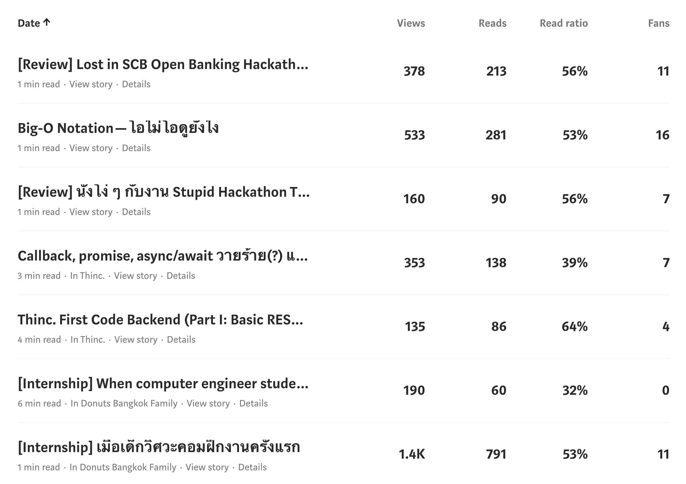

วันนี้เป็นวันสุดท้ายของปีแล้ว รู้สึกว่าเป็นปีที่ผ่านอะไรมามาก ประกอบกับช่วงนี้ไม่ได้เขียนบล็อกและเห็นเพื่อน ๆ เขียนบล็อกแนวนี้กันทุกปี ปีนี้เลยตัดสินใจเขียนบ้าง

ไปดูกันว่าปีนี้เราผ่านอะไรมาบ้าง

# งาน Part-time ครั้งแรก

เรื่องมีอยู่ว่ามีรุ่นพี่คนนึงที่สนิทกันชวนไปทำ part-time ด้วยกัน พอดีช่วงนั้นเบื่อ ๆ ด้วยก็เลยตกลง และก็ทำมาจนถึงตอนนี้เลย เป็นโรงเรียนกวดวิชาในสยามกิตติ์ที่นึง

ข้อดีของการทำ Part-time ที่นี่คือได้ทำอะไรตามใจดี อยากลองของอะไรก็ได้ใช้เต็มที่ (แถมเงินไม่ได้แย่เท่าไหร่) แต่งานก็หนักมากเหมือนกัน อีกอย่างคือที่นี่ดูแลพนักงานดี ทั้งอาหารการกินและเรื่องการเรียนของพนักงาน (ครึ่งนึงยังเป็นนิสิตอยู่เลย)

ตั้งแต่เข้ามาทำงานที่นี่ก็ได้ลองใช้อะไรใหม่ ๆ เยอะมาก เช่น

- CircleCI
- Kubernetes
- NestJS
- React
- Vue
- Docker, Docker compose
- Google Cloud Platform
- Microservice architecture
- Message queue (RabbitMQ)

# เป็นประธาน Thinc. ปีที่สอง

โดยธรรมเนียมของชมรม Thinc. จะให้ปีสองเป็นประธานชมรม แต่เพราะว่าในชมรมมีการเปลี่ยนนโยบายหลาย ๆ อย่าง ก็เลย~~ยึดอำนาจ~~เป็นประธานต่ออีกปีนึง

การเป็นประธานปีนี้ต่างจากปีก่อน ๆ ตรงที่งานเราน้อยลงอย่างเห็นได้ชัด (น้อยจนรุ่นน้องชอบบ่นว่าประธานไม่ยอมทำงาน) เพราะมีทีมปีสองจัดการชมรมอยู่แล้ว ทำให้เราเอาเวลาไปลงกับการทำโปรเจคในชมรมได้มากขึ้น ด้วยการเป็น Product owner และ Project manager ของโปรเจคซึ่งเป็นเรือธงของชมรมอันใหม่ต่อจาก CU Popbus ก็ว่าได้

นอกจากเรื่องโปรเจคในชมรมแล้ว ปีนี้รู้สึกทำหน้าที่เหมือนเป็นบอร์ดที่จริงจังของชมรมด้วย มีการประชุมหลายครั้งเพื่อกำหนดทิศทางของชมรมที่สะเปะสะปะมานาน และก็ได้ความรู้หลาย ๆ อย่างจากรุ่นพี่ที่เป็นระดับสูงในองค์กรจริง ๆ ด้วย

# Talk n' Chip

เป็นอีเวนต์ระหว่างสามชมรมจากสามมหาลัย ([Thinc.](https://www.facebook.com/ThailandIncubator/) จากจุฬา [Alchemist](https://www.facebook.com/alchemistitbangmod/) จากบางมด และ [ITForge](https://www.facebook.com/ITForgeClub/) จากลาดกระบัง) มาแลกเปลี่ยนความรู้และประสบการณ์การทำชมรม ทั้งด้าน hard skill และ soft skill ซึ่งก็เป็นงานที่สนุกมากและอยากจะจัดขึ้นอีก

# ผ่าฟันคุดครั้งแรก

ด้วยความเป็นนิสิตจุฬาเลยใช้สิทธิ์ผ่าฟันคุดราคานิสิต แต่ครั้งแรกได้ผ่ากับนิสิต ป.ตรี ปี 5 บอกเลยว่าเจ็บ_ิบหาย เพราะนอกจากนิสิตแพทย์จะผ่าไม่คล่องแล้วยังมีอาจารย์มาเล็กเชอร์อยู่ข้าง ๆ พร้อมง้างปากเราแบบไม่ปรานีเลย หลังจากนั้นเลยขอเปลี่ยนเป็นหมอ ป.โท ทำให้อีกสามซี่ที่เหลือไม่เจ็บขนาดนั้น

# เลือกตั้งครั้งแรก

หลังจากที่ประเทศไทยไม่มีเลือกตั้งมาสี่ปี ในที่สุดเราก็ได้ใช้สิทธิ์เลือกตั้งครั้งแรกในชีวิต ซึ่งมันก็ไม่ได้มีอะไรมากไปกว่าการได้เห็นความอัปยศของ กกต. ที่ขอไม่พูดถึงแล้วกัน

# Hackathon และออนเซ็น ครั้งแรกในชีวิต

ปีนี้เป็นปีที่ active เรื่องงานอีเวนต์ tech ต่าง ๆ มาก แต่งาน Hackathon ที่ประทับใจก็หนีไม่พ้นงาน The Stupid Hackathon Thailand #3 เพราะนอกจากจะได้ทำอะไรบ้า ๆ แล้วยังได้แช่ออนเซ็นครั้งแรกในชีวิตด้วย ถ้าอยากรู้เป็นยังไงตามไปอ่านได้ที่ ["นั่งโง่ ๆ กับงาน Stupid Hackathon Thailand #3"](https://blog.utopiabeam.dev/stupid-hackathon-th3/)

นอกจากงานนี้แล้วก็ยังมีอีกงานคือ SCB Open Banking Hackathon ซึ่งก็มีรีวิวไว้แล้วที่ ["Lost in SCB Open Banking Hackathon สไตล์ dev"](https://blog.utopiabeam.dev/scb-hackathon/) ตามไปอ่านได้เลยครับ

# ไปเที่ยวกันเองกับเพื่อน Gr.Dog com

ทริปล่องใต้สนับสนุนโดยเสี่ยภัทรแห่ง Gr.Dog ภาคคอม เป็นทริปช่วงเริ่มเขียนเว็บบล็อกตัวเองพอดี บอกเลยว่าการไปเที่ยวกับเพื่อนกลุ่มเล็ก ๆ มันสนุกมากจริง ๆ ได้ไปกินกุ้งและปูตัวใหญ่เท่าหน้า ล่องแพ 500 ไร่ที่เขื่อนเชี่ยวหลาน และขับรถเล่นบนเกาะสมุย ไม่รู้ชีวิตนี้จะได้ไปอย่างงี้อีกมั้ย

# เขียนเว็บบล็อกครั้งแรก

หลังจากที่ปีที่แล้วเขียนบล็อกลง [Medium](https://medium.com/@utopiabeam) ในปีนี้ก็รู้สึกอยากเขียนเว็บบล็อกของตัวเองจริงจังซะที ประกอบกับอยากลองเขียน frontend ดูก็เลยลุยเลยด้วย Gatsby.js เพราะโดนริฟฟี่ขายมา และขอขอบคุณริฟฟี่ด้วยเลยสำหรับ repo ให้ส่องตอนเริ่ม จนตอนนี้บล็อกตัวเองเหมือน clone ของมันมาเลย

อ่ะ พูดมาขนาดนี้ละ ขายเลยละกัน

- UtopiaBlog: https://blog.utopiabeam.dev ([repo](https://github.com/UtopiaBeam/blog.utopiabeam.dev))
- Riffy Blog: https://blog.rayriffy.com ([repo](https://github.com/rayriffy/rayriffy-blog))

แต่ถึงตอนนี้จะมีเว็บบล็อกของตัวเองแล้ว ก็ยังมีคนมาอ่าน Medium เก่า ๆ ของเราเรื่อย ๆ เหมือนกัน บล็อกแรกสุดที่เขียนคือ ["เมื่อเด็กวิศวะคอมฝึกงานครั้งแรก"](https://blog.utopiabeam.dev/internship-1st-time/) ซึ่งถึงแม้จะย้ายมาในบล็อกใหม่แต่ยอด View ก็เพิ่มขึ้นจนถึง 1.4K ไปแล้ว!!

# ดัดฟันแล้วโว้ยยย

หลังจากโดนรบเร้ามานาน ในที่สุดก็ตัดสินใจดัดฟันจนได้ เพราะฟันล่างซ้อนกันหนักมากจนทำความสะอาดยากเหลือเกิน แต่หลังจากใส่เหล็กแล้วก็มีเจ็บ ๆ จิ๊ด ๆ และกินอะไรไม่ค่อยสะดวกเท่าไหร่ ถึงแม้ใส่ครั้งแรกแล้วจะกินบุฟเฟ่ต์ปิ้งย่างเนื้อได้เลยก็เหอะ...

ทนไปอีกประมาณปีครึ่งแล้วกัน เพื่อฟันที่สวยงาม

# Checklist 2020

ในปีนี้มีหลายอย่างที่อยากจะทำแต่ไม่ได้ทำซะที ปีหน้าก็เลยมีเป้าที่อยากจะทำหลายอย่างเลย

- หัดใช้ Go
- ขุดเรื่อง Frontend ให้มากขึ้น
- ขุดเรื่องการเขียน test ให้ลึกขึ้น
- UtopiaBlog v2.0 (Redesign และเขียนใหม่ให้เป็น CMS ไปเลย)
- ทำหน้า CV/Resume ของตัวเอง
- ทำ Containerized grader ที่เป็น open-source ของตัวเอง
- ออกกำลังกายให้เป็นนิสัย
- เล่น Dota 2 ให้เป็นซะที!!
- RoV ถึงแรงค์คอน (ถ้ายังเล่นอ่ะนะ)
- osu! top 10k?
- หาทุนเรียนต่อหรือทำงานต่างประเทศซะ
- ฝึก public speaking

พอละ ตั้งเยอะไปก็ทำไม่หมดอยู่ดี
